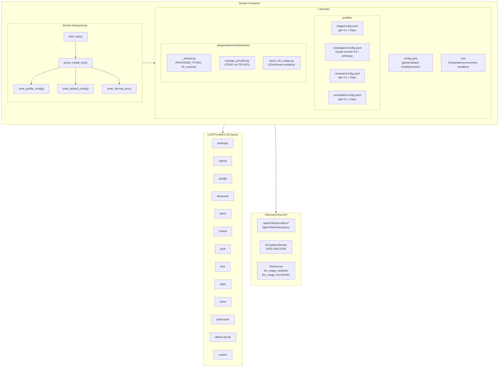
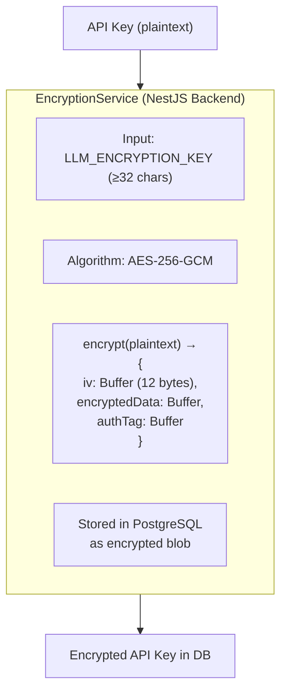
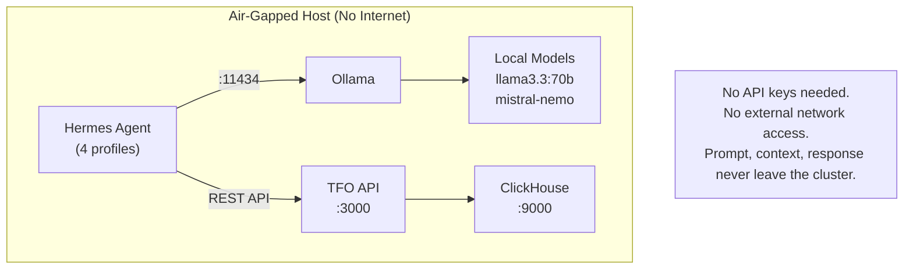
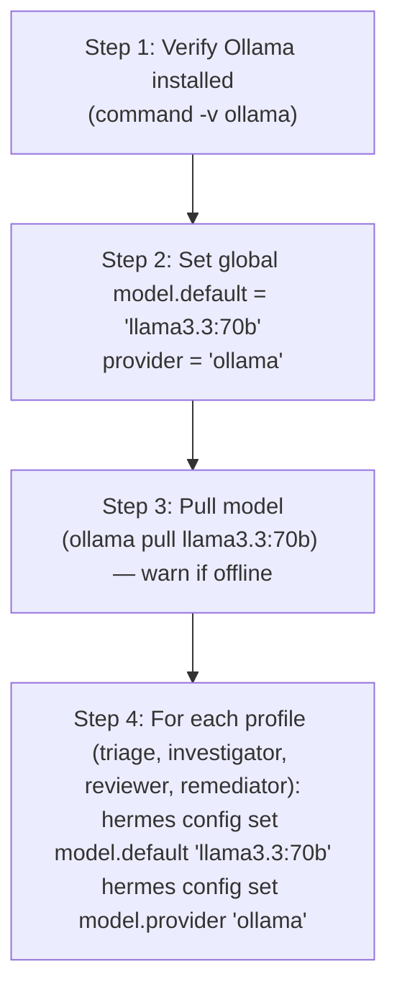

# Design — Hermes LLM Provider Integration

## Architecture Overview



---

## Provider Configuration Model

### Provider Type Registry

Defined in `_shared.py:PROVIDER_TYPES` (canonical source of truth):

```python
PROVIDER_TYPES = [
    "anthropic",    # Anthropic Claude
    "claude",       # Alias for anthropic
    "openai",       # OpenAI GPT
    "google",       # Google AI
    "gemini",       # Alias for google
    "deepseek",     # DeepSeek
    "qwen",         # Qwen (Alibaba)
    "ollama",       # Ollama (local/air-gapped)
    "mistral",      # Mistral AI
    "grok",         # xAI Grok
    "kimi",         # Moonshot Kimi
    "zhipu",        # Zhipu GLM
    "mimo",         # Xiaomi MiMo
    "openrouter",   # OpenRouter
    "custom",       # Custom endpoint
]
```

### Provider Map (Docker Entrypoint)

Maps environment variable prefixes to canonical provider identifiers:

```python
PROVIDER_MAP = {
    "anthropic": "anthropic",
    "openai": "openai",
    "google": "google",
    "gemini": "google",       # alias → google
    "deepseek": "deepseek",
    "qwen": "qwen",
    "ollama": "ollama",
    "mistral": "mistral",
    "groq": "groq",           # note: groq is distinct from grok
    "grok": "grok",
    "kimi": "kimi",
    "zhipu": "opencode-go",   # zhipu uses opencode-go driver
    "mimo": "mimo",
    "openrouter": "openrouter",
    "opencode-go": "opencode-go",
}
```

### Provider Entity (TFO API)

```json
{
  "id": "prov-1",
  "name": "Production Claude",
  "providerType": "anthropic",
  "modelId": "claude-sonnet-4-5",
  "baseUrl": null,
  "temperature": 0.7,
  "maxTokens": 4096,
  "topP": 1.0,
  "isActive": true,
  "isDefault": true,
  "apiKey": "sk-*** (encrypted at rest)"
}
```

### Create Provider Payload

```json
{
  "name": "Production Claude",
  "providerType": "anthropic",
  "apiKey": "sk-ant-...",
  "modelId": "claude-sonnet-4-5",
  "baseUrl": null,
  "temperature": 0.7,
  "maxTokens": 4096,
  "topP": 1.0,
  "isDefault": true
}
```

---

## Encryption Architecture

### AES-256-GCM Encryption Flow



### Key Management

| Layer           | Storage                | Protection                           |
| --------------- | ---------------------- | ------------------------------------ |
| TFO Platform DB | PostgreSQL             | AES-256-GCM via `LLM_ENCRYPTION_KEY` |
| Hermes Agent    | `~/.hermes/.env`       | File permissions (0600)              |
| Docker Compose  | `.env` file            | File permissions, Docker secrets     |
| CI/CD           | Vault / secret manager | External secret management           |

### Environment Variable: `LLM_ENCRYPTION_KEY`

- **Minimum length**: 32 characters
- **Used by**: NestJS backend `EncryptionService`
- **Scope**: Encrypts/decrypts all LLM provider API keys stored in the platform database
- **Generation**: `node -e "console.log(require('crypto').randomBytes(32).toString('base64'))"`
- **Location**: Passed to backend container via Docker Compose `LLM_ENCRYPTION_KEY=${LLM_ENCRYPTION_KEY}`

---

## Dynamic Provider Substitution

### Model Parsing

```python
def parse_model_env(raw):
    """Parse 'provider/model-name' from env var. Returns (model, provider)."""
    if "/" in raw:
        key, model = raw.split("/", 1)
    else:
        key, model = "zhipu", raw    # default to zhipu if no prefix
    return model, PROVIDER_MAP.get(key, key)
```

**Examples**:

| Input                         | Model               | Provider                |
| ----------------------------- | ------------------- | ----------------------- |
| `zhipu/glm-5.1`               | `glm-5.1`           | `opencode-go`           |
| `anthropic/claude-sonnet-4-5` | `claude-sonnet-4-5` | `anthropic`             |
| `openai/gpt-4o`               | `gpt-4o`            | `openai`                |
| `ollama/llama3.3:70b`         | `llama3.3:70b`      | `ollama`                |
| `glm-5.1`                     | `glm-5.1`           | `opencode-go` (default) |

### Config Template Substitution

`write_profile_config()` reads template `config.yaml` and substitutes:

```yaml
# Template (in /app/profiles/<name>/config.yaml)
model:
  default: "{{MODEL}}" # → replaced with resolved model
  provider: "{{PROVIDER}}" # → replaced with resolved provider
```

Becomes:

```yaml
# Generated (in ~/.hermes/profiles/investigator/config.yaml)
model:
  default: "claude-sonnet-4-5"
  provider: "anthropic"
```

### Substitution Flow per Profile

```
HERMES_MODEL=zhipu/glm-5.1
HERMES_INVESTIGATOR_MODEL=anthropic/claude-sonnet-4-5

triage       → write_profile_config("triage", "glm-5.1", "opencode-go")
investigator → write_profile_config("investigator", "claude-sonnet-4-5", "anthropic")
reviewer     → write_profile_config("reviewer", "glm-5.1", "opencode-go")
remediator   → write_profile_config("remediator", "glm-5.1", "opencode-go")
```

---

## Air-Gapped Deployment Architecture



### Deploy Script Flow (`scripts/deploy-air-gapped.sh`)



### Model Transfer for Air-Gapped Hosts

```bash
# On internet-connected machine
ollama pull llama3.3
ollama save llama3.3 -o llama3.3.tar

# Transfer via USB/SCP
scp llama3.3.tar air-gapped-host:~

# On air-gapped host
ollama load llama3.3 -i llama3.3.tar
```

---

## API Key Forwarding

### Environment Variable Prefix Matching

`write_hermes_env()` in `docker-entrypoint.py` forwards all environment variables matching these prefixes:

```python
ENV_FORWARD_PREFIXES = (
    "TELEMETRYFLOW_",    # Platform connection & auth
    "ANTHROPIC_",        # Claude API
    "OPENAI_",           # GPT API
    "GOOGLE_",           # Gemini API
    "GEMINI_",           # Gemini alias
    "DEEPSEEK_",         # DeepSeek API
    "QWEN_",             # Qwen API
    "ZHIPU_",            # GLM API
    "MISTRAL_",          # Mistral API
    "GROQ_",             # Groq API
    "GROK_",             # Grok API
    "KIMI_",             # Kimi API
    "MIMO_",             # MiMo API
    "OPENROUTER_",       # OpenRouter API
    "JIRA_",             # Jira integration
    "TRELLO_",           # Trello integration
    "TELEGRAM_",         # Telegram gateway
    "CLICKHOUSE_",       # ClickHouse direct queries
    "LLM_",              # LLM_ENCRYPTION_KEY, etc.
    "KUBECONFIG",        # Kubernetes access
)
```

### Forwarding Logic

```python
def write_hermes_env():
    lines = []
    for key, value in sorted(os.environ.items()):
        for prefix in ENV_FORWARD_PREFIXES:
            if key.startswith(prefix) or key == prefix:
                lines.append(f"{key}={value}")
                break
    env_file = HERMES_HOME / ".env"
    env_file.write_text("\n".join(lines) + "\n")
    return len(lines)
```

---

## Cost Tracking Architecture

### ClickHouse Schema: `llm_usage_analytics`

| Column              | Type          | Description                                         |
| ------------------- | ------------- | --------------------------------------------------- |
| `timestamp`         | DateTime64(3) | Request timestamp                                   |
| `provider_type`     | String        | Provider identifier (anthropic, openai, etc.)       |
| `model_id`          | String        | Model identifier (claude-sonnet-4-5, glm-5.1, etc.) |
| `context_type`      | String        | Context category (metrics, logs, traces, etc.)      |
| `user_id`           | String        | Requesting user ID                                  |
| `prompt_tokens`     | UInt64        | Tokens in the prompt                                |
| `completion_tokens` | UInt64        | Tokens in the completion                            |
| `total_tokens`      | UInt64        | Total tokens (prompt + completion)                  |
| `latency_ms`        | Float64       | Request latency in milliseconds                     |

### Materialized Views

| View            | Interval   | Purpose              |
| --------------- | ---------- | -------------------- |
| `llm_usage_5m`  | 5 minutes  | Real-time monitoring |
| `llm_usage_15m` | 15 minutes | Dashboard graphs     |
| `llm_usage_6h`  | 6 hours    | Historical trending  |

### Query Patterns

```sql
-- Per-provider breakdown
SELECT provider_type, count(), sum(total_tokens), avg(latency_ms)
FROM llm_usage_analytics
WHERE timestamp >= now() - INTERVAL 7 DAY
GROUP BY provider_type ORDER BY total_tokens DESC;

-- Per-model breakdown with provider
SELECT model_id, provider_type, count(), sum(total_tokens), avg(latency_ms)
FROM llm_usage_analytics
WHERE timestamp >= now() - INTERVAL 7 DAY
GROUP BY model_id, provider_type ORDER BY total_tokens DESC;

-- Time-series from materialized view
SELECT bucket, sum(total_tokens), count(), avg(avg_latency)
FROM llm_usage_5m
WHERE bucket >= now() - INTERVAL 24 HOUR
GROUP BY bucket ORDER BY bucket;
```

---

## TFO API Endpoints

### Provider Management

| Method | Endpoint                          | Description                    |
| ------ | --------------------------------- | ------------------------------ |
| `GET`  | `/llm/providers`                  | List all providers (paginated) |
| `GET`  | `/llm/providers/{id}`             | Get provider by ID             |
| `GET`  | `/llm/providers/default`          | Get default provider           |
| `POST` | `/llm/providers`                  | Create provider                |
| `POST` | `/llm/providers/{id}/validate`    | Validate stored provider       |
| `POST` | `/llm/providers/{id}/set-default` | Set as default                 |
| `POST` | `/llm/providers/test-key`         | Test API key without storing   |

### Telemetry Queries

| Method | Endpoint           | Description                  |
| ------ | ------------------ | ---------------------------- |
| `POST` | `/telemetry/query` | Execute ClickHouse SQL query |

### Authentication

All requests use `Authorization: Bearer {TELEMETRYFLOW_API_KEY}` header, set via `_shared.py:get_api_key()`.

---

## Properties

### P001: Provider Type Validation

All provider type inputs MUST be validated against `PROVIDER_TYPES` whitelist. Unknown types MUST be rejected with exit code 1.

### P002: API Key Non-Logging

API keys MUST NOT appear in logs, stdout, or stderr. The `test-key` action validates keys but returns only `{ "valid": true|false }`.

### P003: Encryption at Rest

All API keys stored in the TFO platform database MUST be encrypted using AES-256-GCM with `LLM_ENCRYPTION_KEY`.

### P004: Zero Egress (Air-Gapped)

In air-gapped mode, no data (prompts, context, responses) may leave the host cluster. All inference occurs via local Ollama.

### P005: Graceful Degradation

If the configured provider is unavailable, the system SHOULD fall back to the default provider. If no provider is available, the system MUST report the error rather than silently fail.

### P006: Template Integrity

Profile config substitution MUST preserve all non-`default`/non-`provider` lines in config.yaml templates. Only `default:` and `provider:` fields are substituted.

### P007: Environment Variable Isolation

Provider API key environment variables MUST be forwarded only to `~/.hermes/.env`. They MUST NOT be exposed to other processes or logged.

### P008: Idempotent Configuration

`docker-entrypoint.py` MUST be idempotent — running it multiple times produces the same configuration. Existing config directories are replaced, not merged.

### P009: URL Scheme Validation

All HTTP requests made by tools MUST validate URL schemes against `{http, https}` to prevent SSRF. Implemented in `_shared.py:_validate_url()`.

### P010: Request Timeout

All TFO API requests MUST use a 30-second timeout. Implemented in `_shared.py:tfo_request()` via `urllib.request.urlopen(req, timeout=30)`.
