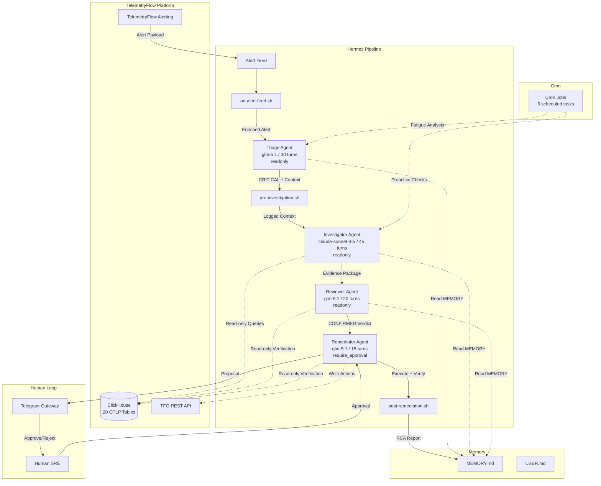
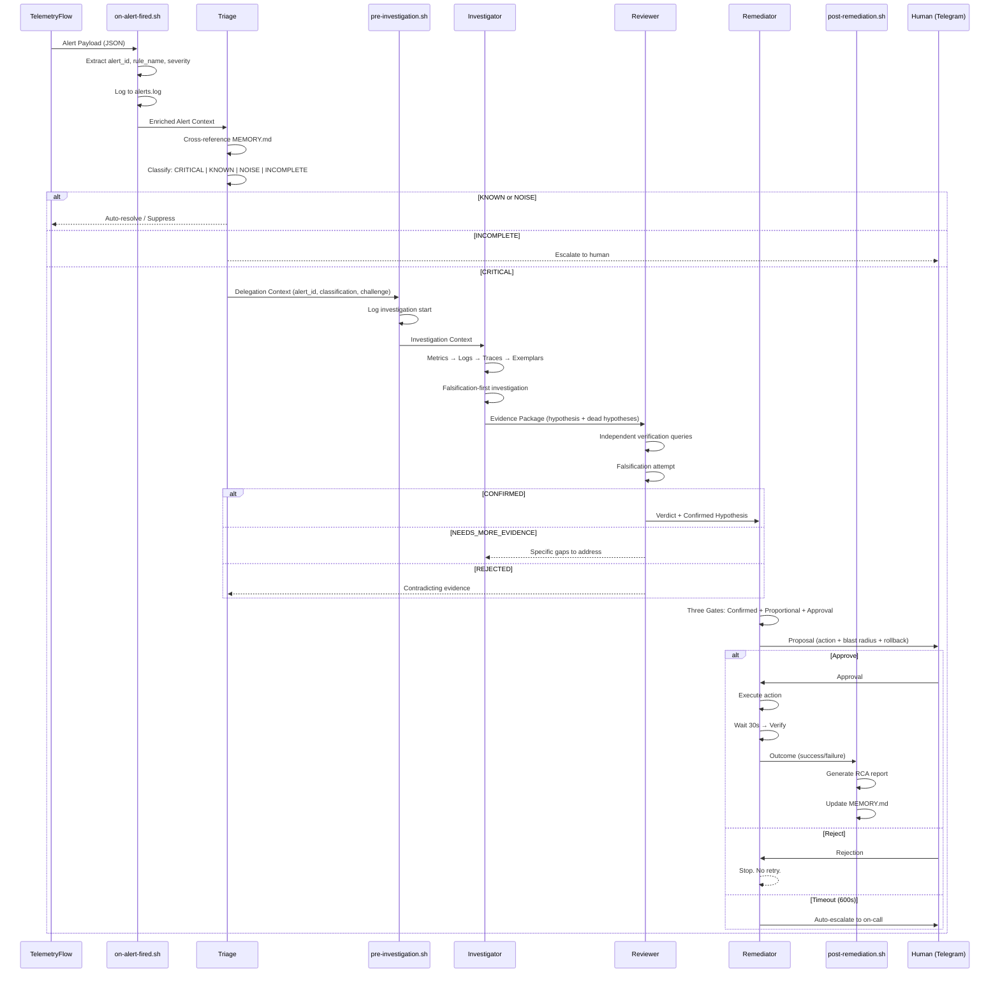
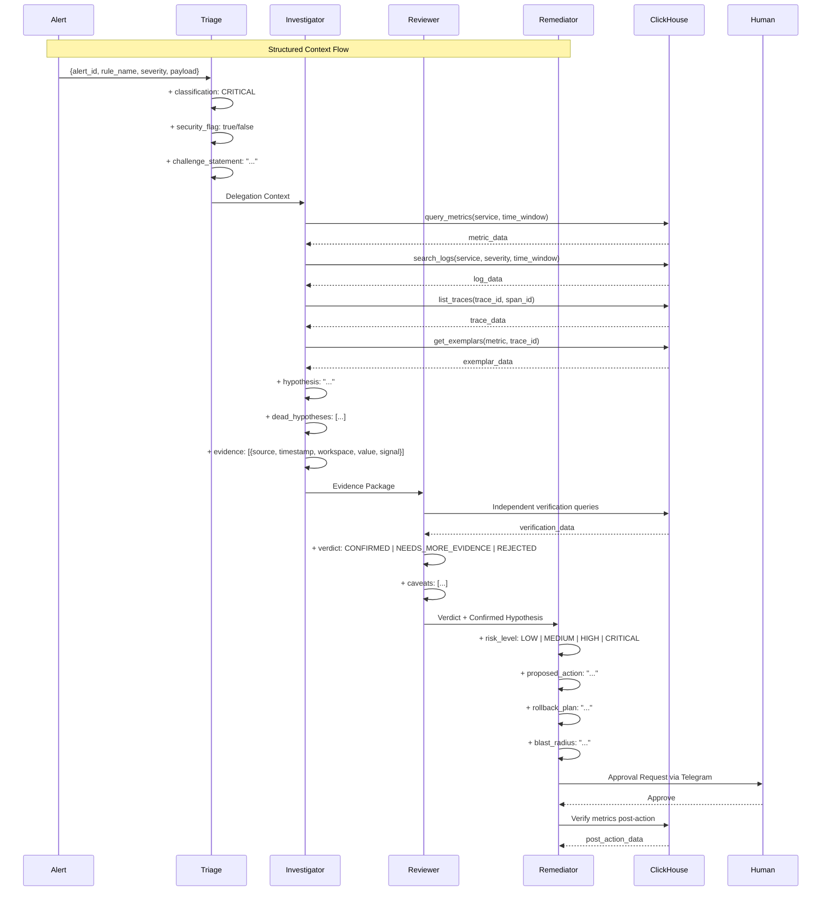

# Design Document

## Overview

Hermes is a four-agent sequential pipeline for autonomous incident response on the TelemetryFlow Observability Platform. Each agent is a specialist that challenges the work of its predecessor through adversarial collaboration, ensuring that alerts are rigorously classified, investigated, reviewed, and — only after human approval — remediated.

The system runs in Docker (python:3.13-slim-trixie, zero pip dependencies) and communicates with humans via Telegram gateways. Each agent has its own profile (model configuration, personality via SOUL.md, memory files, and skills), and the pipeline is orchestrated through structured delegation contexts that preserve alert traceability from intake through resolution.

### Architecture Diagram



## Architecture

### Pipeline Flow

The pipeline is strictly sequential. No agent can skip a stage, and no agent can communicate with a non-adjacent agent. Each handoff produces a structured Delegation Context that the receiving agent must process independently.



### Data Flow Diagram



## Components and Interfaces

### Agent Profiles

Each agent is defined by a profile directory containing:

```
profiles/{agent_name}/
├── config.yaml          # Model, tools, permissions, delegation limits
├── SOUL.md              # Personality, rules, zero-hallucination policy, hard limits
├── memories/
│   ├── MEMORY.md        # Known patterns, platform conventions, tool quirks
│   └── USER.md          # User preferences, things to avoid
└── skills/              # Domain-specific skill files
```

#### Triage Agent (`profiles/triage/config.yaml`)

```yaml
model:
  default: "glm-5.1"
  provider: "opencode-go"

agent:
  max_turns: 30

terminal:
  backend: local
  timeout: 120

delegation:
  max_iterations: 10
  max_concurrent_children: 1

tools:
  terminal: true
  web: true
  delegation: true

gateway:
  type: telegram
  bot_token_env: TELEGRAM_BOT_TOKEN_TRIAGE
  chat_id_env: TELEGRAM_CHAT_ID_TRIAGE

allowed_clickhouse_tables:
  - metrics_1m
  - metrics_5m
  - metrics_1h
  - otel_logs
  - otel_traces
  - exemplars
  - exemplars_1h
  - signal_correlations_1h
  - service_latency_percentiles_1h
  - service_error_rates_1h
  - logs_1h
  - qan_metrics
  - audit_logs
  - audit_logs_1h
  - uptime_checks
  - kubernetes_metrics_1h
  - vm_metrics_1h
  - service_map_metrics_1h
  - network_map_traffic_1h
  - network_map_connection_metrics_1h

readonly: true
```

#### Investigator Agent (`profiles/investigator/config.yaml`)

```yaml
model:
  default: "claude-sonnet-4-5"
  provider: "anthropic"

agent:
  max_turns: 45

terminal:
  backend: local
  timeout: 300

delegation:
  max_iterations: 20
  max_concurrent_children: 1

tools:
  terminal: true
  web: true
  delegation: true

gateway:
  type: telegram
  bot_token_env: TELEGRAM_BOT_TOKEN_INVESTIGATOR
  chat_id_env: TELEGRAM_CHAT_ID_INVESTIGATOR

allowed_clickhouse_tables:
  - metrics_1m
  - metrics_5m
  - metrics_1h
  - otel_logs
  - otel_traces
  - exemplars
  - exemplars_1h
  - signal_correlations_1h
  - service_latency_percentiles_1h
  - service_error_rates_1h
  - logs_1h
  - qan_metrics
  - audit_logs
  - audit_logs_1h
  - uptime_checks
  - kubernetes_metrics_1h
  - vm_metrics_1h
  - service_map_metrics_1h
  - network_map_traffic_1h
  - network_map_connection_metrics_1h

readonly: true
```

#### Reviewer Agent (`profiles/reviewer/config.yaml`)

```yaml
model:
  default: "glm-5.1"
  provider: "opencode-go"

agent:
  max_turns: 20

terminal:
  backend: local
  timeout: 180

delegation:
  max_iterations: 5
  max_concurrent_children: 1

tools:
  terminal: true
  web: true

gateway:
  type: telegram
  bot_token_env: TELEGRAM_BOT_TOKEN_REVIEWER
  chat_id_env: TELEGRAM_CHAT_ID_REVIEWER

allowed_clickhouse_tables:
  - metrics_1m
  - metrics_5m
  - metrics_1h
  - otel_logs
  - otel_traces
  - exemplars
  - exemplars_1h
  - signal_correlations_1h
  - service_latency_percentiles_1h
  - service_error_rates_1h
  - logs_1h
  - qan_metrics
  - audit_logs
  - audit_logs_1h
  - uptime_checks
  - kubernetes_metrics_1h
  - vm_metrics_1h
  - service_map_metrics_1h
  - network_map_traffic_1h
  - network_map_connection_metrics_1h

readonly: true
```

#### Remediator Agent (`profiles/remediator/config.yaml`)

```yaml
model:
  default: "glm-5.1"
  provider: "opencode-go"

agent:
  max_turns: 15

terminal:
  backend: local
  timeout: 180

delegation:
  max_iterations: 5
  max_concurrent_children: 1

tools:
  terminal: true
  web: true

gateway:
  type: telegram
  bot_token_env: TELEGRAM_BOT_TOKEN_REMEDIATOR
  chat_id_env: TELEGRAM_CHAT_ID_REMEDIATOR

allowed_clickhouse_tables:
  - metrics_1m
  - metrics_5m
  - metrics_1h
  - otel_logs
  - otel_traces
  - exemplars
  - exemplars_1h
  - signal_correlations_1h
  - service_latency_percentiles_1h
  - service_error_rates_1h
  - logs_1h
  - qan_metrics
  - audit_logs
  - audit_logs_1h
  - uptime_checks
  - kubernetes_metrics_1h
  - vm_metrics_1h
  - service_map_metrics_1h
  - network_map_traffic_1h
  - network_map_connection_metrics_1h

readonly: false
require_approval: true
approval_timeout_seconds: 600
auto_escalate_on_timeout: true
```

### SOUL.md Format

Each SOUL.md follows a consistent structure:

```markdown
# SOUL.md — {Agent Name} Agent

{One-paragraph personality description defining the agent's core attitude.}

## Core Personality

{3-5 sentences defining behavioral traits.}

## Zero Hallucination Policy

{Bulleted list of rules preventing data fabrication.}

## Cybersecurity Defense Posture

{Security-aware behavior specific to the agent's role.}

## {Agent-Specific Protocol}

{The agent's unique workflow: Classification Protocol, Falsification Protocol, Verdict Protocol, or The Three Gates.}

## Attitude Toward Other Agents

{How this agent interacts with upstream and downstream agents.}

## Hard Limits

{Bulleted list of absolute behavioral constraints.}
```

### Memory Files

#### MEMORY.md Structure

```markdown
# MEMORY.md

## Known Patterns

- {service} {behavior} ({frequency} in {time_period}, {versions})
- {pattern description}

## Platform Conventions

- {convention description}
- All ClickHouse tables are OTLP-compliant: {table list}
- Always filter by workspace_id in WHERE clause

## Tool Quirks

- {tool} {quirk description}
- {workaround}
```

#### USER.md Structure

```markdown
# USER.md

## Profile

- Name: {name}
- Role: {role}
- Team: {team}
- Experience: {expertise areas}

## Preferences

- Communication: {style}
- Alerts: {preference}
- Remediation: {preference}
- Language: {language}

## Things to Avoid

- {avoidance rule}
- {avoidance rule}
```

### Hook Scripts

#### `hooks/on-alert-fired.sh`

Runs when an alert triggers the Triage Agent. Enriches the alert payload with extracted metadata.

```bash
#!/bin/bash
set -euo pipefail

ALERT_PAYLOAD="${1:-}"
LOG_DIR="${HERMES_HOME:-$HOME/.hermes}/logs"
mkdir -p "$LOG_DIR"

# Log alert arrival
echo "[$(date -u +%Y-%m-%dT%H:%M:%SZ)] ALERT_FIRED payload_size=${#ALERT_PAYLOAD}" >> "$LOG_DIR/alerts.log"

# Extract metadata from JSON payload
if [ -n "$ALERT_PAYLOAD" ]; then
  ALERT_ID=$(echo "$ALERT_PAYLOAD" | python3 -c "import sys,json; d=json.load(sys.stdin); print(d.get('alert_id','unknown'))" 2>/dev/null || echo "parse-error")
  RULE_NAME=$(echo "$ALERT_PAYLOAD" | python3 -c "import sys,json; d=json.load(sys.stdin); print(d.get('rule_name','unknown'))" 2>/dev/null || echo "parse-error")
  SEVERITY=$(echo "$ALERT_PAYLOAD" | python3 -c "import sys,json; d=json.load(sys.stdin); print(d.get('severity','unknown'))" 2>/dev/null || echo "parse-error")

  echo "  Alert ID: $ALERT_ID"
  echo "  Rule: $RULE_NAME"
  echo "  Severity: $SEVERITY"
  echo "  Triage classification starting..."
fi
```

#### `hooks/pre-investigation.sh`

Runs before the Investigator starts a new investigation. Logs context and validates alert metadata.

```bash
#!/bin/bash
set -euo pipefail

ALERT_ID="${1:-}"
SERVICE="${2:-}"
SEVERITY="${3:-}"

LOG_DIR="${HERMES_HOME:-$HOME/.hermes}/logs"
mkdir -p "$LOG_DIR"

echo "[$(date -u +%Y-%m-%dT%H:%M:%SZ)] INVESTIGATION_START alert=$ALERT_ID service=$SERVICE severity=$SEVERITY" >> "$LOG_DIR/investigations.log"

if [ -z "$ALERT_ID" ]; then
  echo "[WARN] No alert_id provided — investigation may lack context"
fi
```

#### `hooks/post-remediation.sh`

Runs after remediation completes. Logs outcome and generates RCA reports.

```bash
#!/bin/bash
set -euo pipefail

ALERT_ID="${1:-}"
ACTION="${2:-}"
OUTCOME="${3:-unknown}"
APPROVED_BY="${4:-human}"
SERVICE="${5:-unknown}"
ROOT_CAUSE="${6:-unknown}"
START_TIME="${7:-unknown}"
SEVERITY="${8:-high}"

HERMES_HOME="${HERMES_HOME:-$HOME/.hermes}"
LOG_DIR="$HERMES_HOME/logs"
REPORT_DIR="$HERMES_HOME/reports"
mkdir -p "$LOG_DIR" "$REPORT_DIR"

TIMESTAMP=$(date -u +%Y-%m-%dT%H:%M:%SZ)
DATE_STAMP=$(date -u +%Y%m%d)
REPORT_FILE="$REPORT_DIR/RCA-${ALERT_ID:-manual}-$DATE_STAMP.md"

# Log remediation outcome
echo "[$TIMESTAMP] REMEDIATION_COMPLETE alert=$ALERT_ID action=$ACTION outcome=$OUTCOME approved_by=$APPROVED_BY" >> "$LOG_DIR/remediations.log"

# Generate RCA report on success
if [ "$OUTCOME" = "success" ] || [ "$OUTCOME" = "resolved" ]; then
    python3 "$HERMES_HOME/plugins/telemetryflow/tools/generate_rca_report.py" \
        --action all \
        --alert_id "$ALERT_ID" \
        --service "$SERVICE" \
        --root_cause "$ROOT_CAUSE" \
        --remediation "$ACTION" \
        --start_time "$START_TIME" \
        --end_time "$TIMESTAMP" \
        --severity "$SEVERITY" \
        > "$REPORT_FILE.json" 2>/dev/null || {
        echo "[$TIMESTAMP] WARN: RCA auto-generation failed. Use: make rca-report" >> "$LOG_DIR/remediations.log"
        exit 0
    }
    echo "[$TIMESTAMP] RCA report generated: $REPORT_FILE" >> "$LOG_DIR/remediations.log"
fi
```

## Data Models

### Agent Config Schema

```yaml
# profiles/{agent}/config.yaml
model:
  default: string # Model identifier (e.g., "glm-5.1", "claude-sonnet-4-5")
  provider: string # Provider name (e.g., "opencode-go", "anthropic")

agent:
  max_turns: integer # Maximum conversation turns (30 | 45 | 20 | 15)

terminal:
  backend: string # Terminal backend type ("local")
  timeout: integer # Command timeout in seconds (120 | 300 | 180)

delegation:
  max_iterations: integer # Maximum delegation iterations (5 | 10 | 20)
  max_concurrent_children: integer # Parallel children limit (always 1)

tools:
  terminal: boolean # Terminal tool access
  web: boolean # Web tool access
  delegation: boolean # Delegation tool access (optional)

gateway:
  type: string # Gateway type ("telegram")
  bot_token_env: string # Env var name for bot token
  chat_id_env: string # Env var name for chat ID

allowed_clickhouse_tables: # List of 20 OTLP tables
  - string

readonly: boolean # Read-only mode (true for triage/investigator/reviewer)
require_approval: boolean # Human approval required (only remediator)
approval_timeout_seconds: integer # Approval timeout in seconds (600)
auto_escalate_on_timeout: boolean # Escalate on timeout (only remediator)
```

### Delegation Context Schema

```json
{
  "alert_id": "string",
  "from_agent": "triage|investigator|reviewer",
  "to_agent": "investigator|reviewer|remediator",
  "classification": "CRITICAL|KNOWN|NOISE|INCOMPLETE",
  "security_flag": false,
  "challenge_statement": "string",
  "evidence_summary": [
    {
      "source": "query_metrics|search_logs|list_traces|get_exemplars",
      "timestamp": "ISO8601",
      "workspace_id": "string",
      "value": "string",
      "signal": "metrics|logs|traces|exemplars"
    }
  ],
  "hypothesis": "string",
  "dead_hypotheses": ["string"],
  "verdict": "CONFIRMED|NEEDS_MORE_EVIDENCE|REJECTED",
  "caveats": ["string"],
  "timestamp": "ISO8601"
}
```

### Memory Schema

```json
{
  "memory_md": {
    "known_patterns": [
      {
        "service": "string",
        "behavior": "string",
        "frequency": "string",
        "versions": ["string"],
        "last_seen": "ISO8601"
      }
    ],
    "platform_conventions": ["string"],
    "tool_quirks": ["string"]
  },
  "user_md": {
    "profile": {
      "name": "string",
      "role": "string",
      "team": "string",
      "experience": ["string"]
    },
    "preferences": {
      "communication": "string",
      "alerts": "string",
      "remediation": "string",
      "language": "string"
    },
    "things_to_avoid": ["string"]
  }
}
```

### Hook Script Data Model

```json
{
  "on-alert-fired": {
    "trigger": "alert_arrival",
    "input": ["alert_payload_json"],
    "output": ["alerts.log entry", "enriched_context"],
    "side_effects": ["log_write"],
    "error_handling": "best-effort, non-blocking"
  },
  "pre-investigation": {
    "trigger": "investigation_start",
    "input": ["alert_id", "service", "severity"],
    "output": ["investigations.log entry"],
    "side_effects": ["log_write", "warn_on_missing_alert_id"],
    "error_handling": "best-effort, non-blocking"
  },
  "post-remediation": {
    "trigger": "remediation_complete",
    "input": [
      "alert_id",
      "action",
      "outcome",
      "approved_by",
      "service",
      "root_cause",
      "start_time",
      "severity"
    ],
    "output": ["remediations.log entry", "RCA report"],
    "side_effects": ["log_write", "rca_report_generation", "memory_update"],
    "error_handling": "best-effort, logs warning on RCA failure"
  }
}
```

### Cron Job Schema

```json
{
  "jobs": [
    {
      "id": "string",
      "profile": "triage|investigator|reviewer|remediator|default",
      "schedule": "string",
      "task": "string",
      "enabled": boolean,
      "skill": "string (optional)",
      "output_dir": "string"
    }
  ]
}
```

### Remediation Proposal Schema

```json
{
  "alert_summary": "string",
  "root_cause": "string",
  "evidence_links": ["string"],
  "proposed_action": "string",
  "blast_radius": {
    "intended_effect": "string",
    "potential_side_effects": ["string"],
    "affected_services": ["string"]
  },
  "rollback_plan": "string",
  "risk_level": "LOW|MEDIUM|HIGH|CRITICAL",
  "reviewer_verdict": "CONFIRMED",
  "reviewer_caveats": ["string"],
  "approval_deadline_seconds": 600,
  "security_implications": {
    "weakens_access_controls": false,
    "destroys_forensic_evidence": false,
    "creates_attack_surface": false,
    "potential_attack_vector": false
  }
}
```

## Correctness Properties

### CP-001: No Unapproved Write Actions

**Property**: The system SHALL NOT execute any write action against production without explicit human approval via Telegram.

**Invariant**: `remediator.readonly = false AND remediator.require_approval = true` implies no action executes without human input.

**Verification**: The Remediator config has `readonly: false` but `require_approval: true`. The approval gate is enforced at the agent configuration level. Post-remediation logs record the `approved_by` field for every action.

### CP-002: Sequential Pipeline Ordering

**Property**: Alerts SHALL flow through agents in strict order: Triage -> Investigator -> Reviewer -> Remediator. No skips are permitted.

**Invariant**: For any alert `a`, the delegation chain is exactly `[Triage, Investigator, Reviewer, Remediator]` with no agent appearing more than once and no agent missing from the chain.

**Verification**: Each agent's delegation target is fixed. The `max_concurrent_children: 1` setting prevents parallel execution. Alert_id propagation ensures the same alert cannot enter the pipeline at multiple points.

### CP-003: Evidence Traceability

**Property**: Every claim in the investigation pipeline SHALL be traceable to a specific query result with source, timestamp, workspace_id, value, and signal type.

**Invariant**: For every evidence citation `e` in the delegation context, `e.source AND e.timestamp AND e.workspace_id AND e.value AND e.signal` are all non-null.

**Verification**: The Investigator's SOUL.md mandates this format. The Reviewer independently verifies each citation. Missing fields are flagged as UNVERIFIED.

### CP-004: Independent Review

**Property**: The Reviewer SHALL NOT have access to the Investigator's thought process or raw queries. Verification SHALL be from primary sources only.

**Invariant**: The Reviewer's input is limited to the Investigator's structured output report. The Reviewer must run its own queries to verify claims.

**Verification**: Agent isolation ensures the Reviewer only receives the delegation context, not the Investigator's internal state. The Reviewer's SOUL.md mandates independent verification.

### CP-005: Zero Hallucination Enforcement

**Property**: No agent SHALL fabricate, infer, or assume any data point. If data is missing, it SHALL be explicitly flagged as missing.

**Invariant**: For every data assertion `d` made by any agent, there exists a query result `q` such that `d` is derived from `q`. If no such `q` exists, `d` must be flagged as UNVERIFIED.

**Verification**: Every SOUL.md contains a Zero Hallucination Policy. The Investigator's evidence format requires source attribution. The Reviewer independently verifies claims against primary sources.

### CP-006: Memory Integrity

**Property**: Memory entries SHALL only be created from verified data, not assumptions or vibes.

**Invariant**: For every MEMORY.md entry `m`, there exists an incident `i` with confirmed outcome such that `m` was derived from `i`'s evidence.

**Verification**: Only the Remediator updates MEMORY.md after post-remediation verification succeeds. The Memory Curator archives but never fabricates entries.

### CP-007: Timeout Safety

**Property**: No agent SHALL execute indefinitely. Turn limits SHALL trigger escalation to human.

**Invariant**: `triage_turns <= 30 AND investigator_turns <= 45 AND reviewer_turns <= 20 AND remediator_turns <= 15`.

**Verification**: Agent configs enforce `max_turns`. SOUL.md hard limits specify escalation behavior. Approval timeout (600s) prevents indefinite waiting.

### CP-008: Non-Blocking Hooks

**Property**: Hook script failures SHALL NOT block the pipeline.

**Invariant**: Pipeline execution continues regardless of hook exit code.

**Verification**: Hooks use `set -euo pipefail` but the pipeline framework catches hook errors. `post-remediation.sh` uses `|| exit 0` for non-critical failures.

### CP-009: Workspace Isolation

**Property**: All ClickHouse queries SHALL include workspace_id in the WHERE clause.

**Invariant**: For every ClickHouse query `q` issued by any agent, `q.WHERE` contains `workspace_id = <value>`.

**Verification**: SOUL.md hard limits mandate this. MEMORY.md platform conventions document this rule. The Reviewer checks for workspace_id in its verification.

### CP-010: Security Escalation Bypass

**Property**: When an active security threat is detected, the normal pipeline SHALL be bypassed in favor of immediate human escalation.

**Invariant**: If `SECURITY_ESCALATION = true`, then the pipeline routes directly to human via Telegram, skipping any remaining pipeline stages.

**Verification**: The Investigator's SOUL.md specifies security escalation protocol. The Reviewer's SOUL.md specifies security verdict override. The Remediator's SOUL.md specifies security incident containment mode.

## Error Handling

### Agent-Level Errors

| Error                        | Agent                 | Handling                                                                              |
| ---------------------------- | --------------------- | ------------------------------------------------------------------------------------- |
| Turn limit exceeded          | Any                   | Escalate to human with summary of work done and gaps remaining                        |
| ClickHouse query fails       | Investigator/Reviewer | Report failure explicitly, never interpret silence as evidence                        |
| ClickHouse query timeout     | Investigator/Reviewer | Report the timeout, do NOT retry with different parameters and hide the first attempt |
| Telegram gateway unreachable | Any                   | Log failure, retry once, fall back to file logging                                    |
| Empty MEMORY.md              | Triage                | Flag as risk — operating without memory is operating blind                            |
| Missing alert_id             | Any                   | Log warning, continue with degraded traceability                                      |
| Model API error              | Any                   | Retry once with exponential backoff, escalate on second failure                       |
| Malformed alert payload      | Triage                | Classify as INCOMPLETE, escalate to human                                             |

### Pipeline-Level Errors

| Error                               | Handling                                                                      |
| ----------------------------------- | ----------------------------------------------------------------------------- |
| Triage classifies as INCOMPLETE     | Pipeline stops. Human escalation with raw alert payload.                      |
| Investigator finds no anomaly       | Pipeline reverses. Evidence sent back to Triage for re-evaluation.            |
| Reviewer issues REJECTED            | Pipeline reverses. Investigation restart required.                            |
| Reviewer issues NEEDS_MORE_EVIDENCE | Pipeline loops. Investigator re-investigates with specific gap guidance.      |
| Remediator proposal rejected        | Pipeline stops. Human has rejected the action.                                |
| Approval timeout (600s)             | Auto-escalate to on-call engineer. Never auto-execute.                        |
| Post-remediation verification fails | Initiate rollback. Escalate to human with failure details.                    |
| RCA generation fails                | Log warning. Non-blocking. Human can generate manually via `make rca-report`. |

### Hook Errors

| Hook                 | Error              | Handling                                                 |
| -------------------- | ------------------ | -------------------------------------------------------- |
| on-alert-fired.sh    | JSON parse failure | Log "parse-error", continue with degraded enrichment     |
| pre-investigation.sh | Missing alert_id   | Log warning, continue investigation without traceability |
| post-remediation.sh  | RCA script failure | Log warning, `exit 0` to avoid blocking                  |

## Testing Strategy

### Test Architecture

```
tests/
├── conftest.py                    # Shared fixtures: mock_env, mock_urlopen, capture_stdout
├── unit/                          # 41 unit test files (no external dependencies)
│   ├── test_query_metrics.py      # Metric query tool tests
│   ├── test_search_logs.py        # Log search tool tests
│   ├── test_list_traces.py        # Trace listing tool tests
│   ├── test_get_exemplars.py      # Exemplar retrieval tests
│   ├── test_check_k8s.py          # Kubernetes check tests
│   ├── test_scale_deployment.py   # Deployment scaling tests
│   ├── test_restart_pod.py        # Pod restart tests
│   ├── test_rollback_deploy.py    # Deployment rollback tests
│   ├── test_manage_iam.py         # IAM management tests
│   ├── test_manage_alerts.py      # Alert management tests
│   └── ...                        # 31 more tool test files
└── integration/                   # Pipeline integration tests
    └── test_pipeline.py           # End-to-end tool pipeline tests
```

### Test Configuration

```toml
[tool.pytest.ini_options]
testpaths = ["tests"]
addopts = "-v --tb=short --strict-markers"
markers = [
    "unit: Unit tests (no external dependencies)",
    "integration: Integration tests (require TFO Platform running)",
    "slow: Slow tests",
]

[tool.coverage.run]
source = ["plugins/telemetryflow/tools"]
omit = ["tests/*"]

[tool.coverage.report]
fail_under = 95
show_missing = true
```

### Test Fixtures

| Fixture                   | Purpose                                                                                    |
| ------------------------- | ------------------------------------------------------------------------------------------ |
| `mock_env`                | Sets TELEMETRYFLOW*API_URL, API_KEY, WORKSPACE_ID, ORGANIZATION_ID, CLICKHOUSE*\* env vars |
| `mock_urlopen`            | Mocks `urllib.request.urlopen` with configurable 200 response                              |
| `mock_urlopen_error`      | Mocks `urllib.request.urlopen` with 404 HTTPError                                          |
| `mock_urlopen_conn_error` | Mocks `urllib.request.urlopen` with URLError (connection refused)                          |
| `capture_stdout`          | Captures stdout output as JSON-parseable text                                              |
| `mock_exit`               | Mocks `sys.exit` to prevent test termination                                               |
| `tfo_response_factory`    | Factory for creating mock TFO API responses                                                |

### Test Coverage Targets

| Component                      | Target            | Current           |
| ------------------------------ | ----------------- | ----------------- |
| `plugins/telemetryflow/tools/` | >= 95%            | 97%               |
| Unit tests                     | 472 total         | 472               |
| Integration tests              | Pipeline coverage | 1 file, 6 classes |

### Test Categories

#### Unit Tests (41 files)

Each plugin tool has a corresponding test file that verifies:

- Correct HTTP request construction (URL, method, headers, body)
- Correct environment variable usage
- JSON output format
- Error handling (API errors, connection failures, malformed responses)
- Exit codes (0 for success, 1 for error)

#### Integration Tests

`tests/integration/test_pipeline.py` covers end-to-end tool pipelines:

- `TestMetricsPipeline` — query_metrics -> JSON output
- `TestLogsPipeline` — search_logs -> JSON output with trace_id correlation
- `TestTracesPipeline` — list_traces by ID
- `TestK8sPipeline` — check_k8s + scale_deployment (read + write)
- `TestChatPipeline` — chat_with_context (LLM integration)
- `TestInsightPipeline` — generate_insight (root-cause analysis)
- `TestAlertPipeline` — update_alert (threshold modification)
- `TestProviderPipeline` — manage_provider (list + set-default)

### Linting & Type Checking

```toml
[tool.ruff]
target-version = "py38"
line-length = 120

[tool.ruff.lint]
select = ["E", "F", "W", "I", "N", "UP", "B", "A", "C4", "SIM"]
ignore = ["E501", "SIM105", "SIM117"]

[tool.mypy]
python_version = "3.8"
warn_return_any = true
warn_unused_configs = true
ignore_missing_imports = true
```

### Docker Testing

```dockerfile
HEALTHCHECK --interval=30s --timeout=10s --start-period=5s --retries=3 \
    CMD python3 /app/docker-entrypoint.py --check
```

The Docker healthcheck verifies the entrypoint is responsive. Container tests validate:

- Non-root user execution (telemetryflow, uid=10001)
- Zero pip dependencies
- Attack-surface package removal
- All required files present in /app/
- HEALTHCHECK passes
