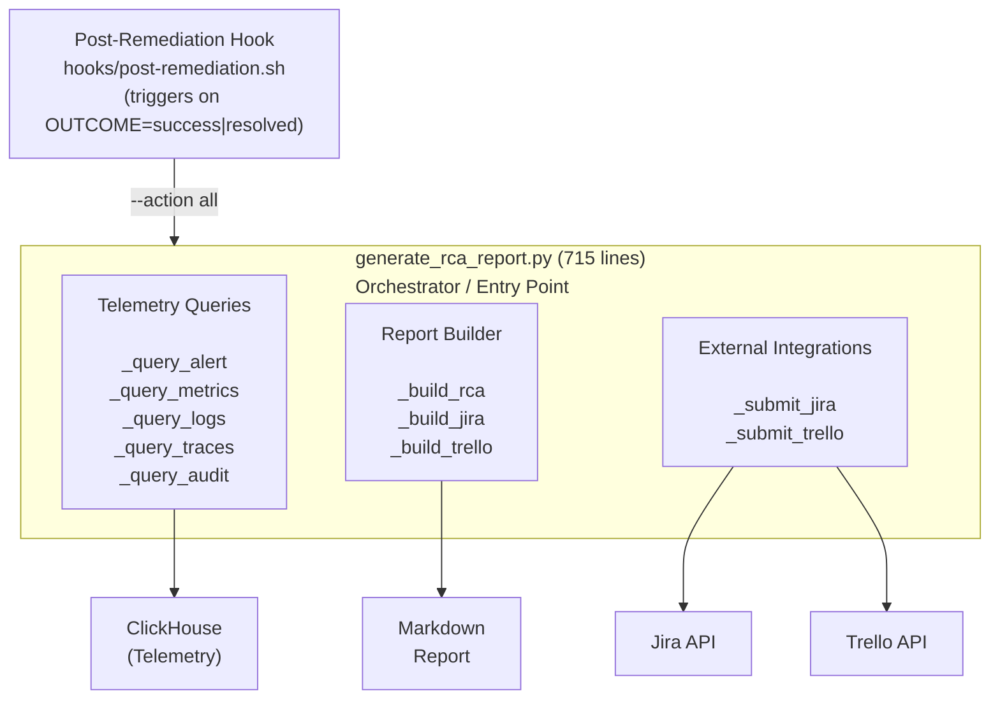
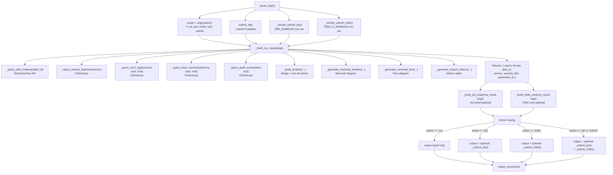
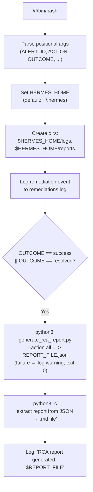
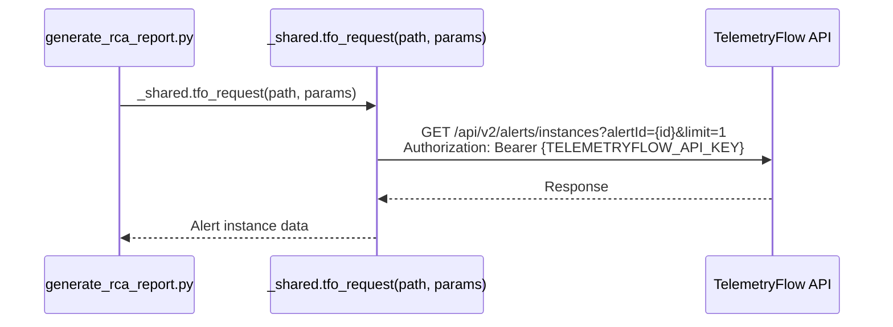
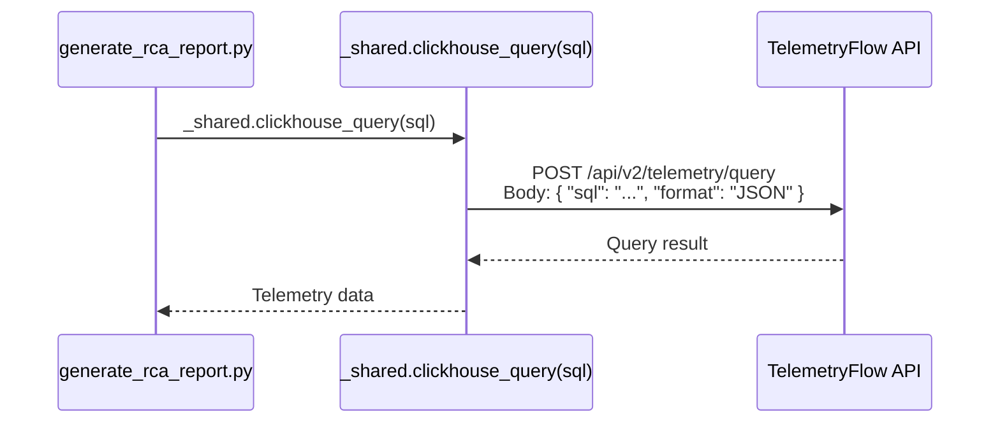
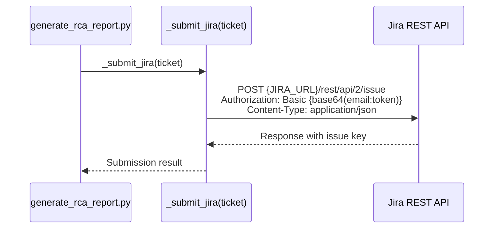
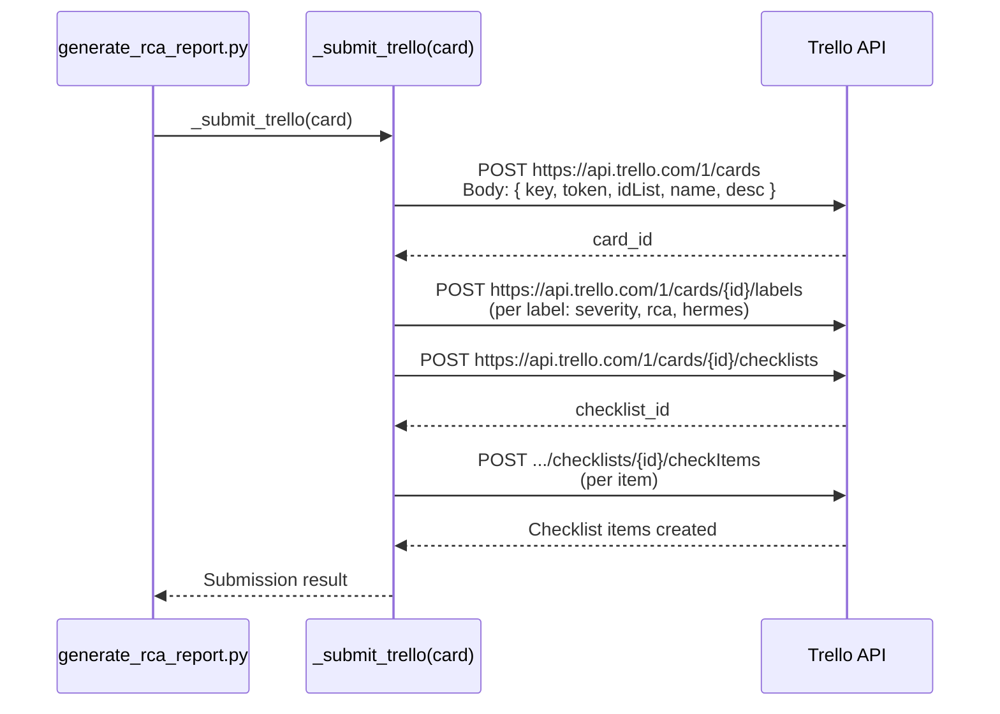
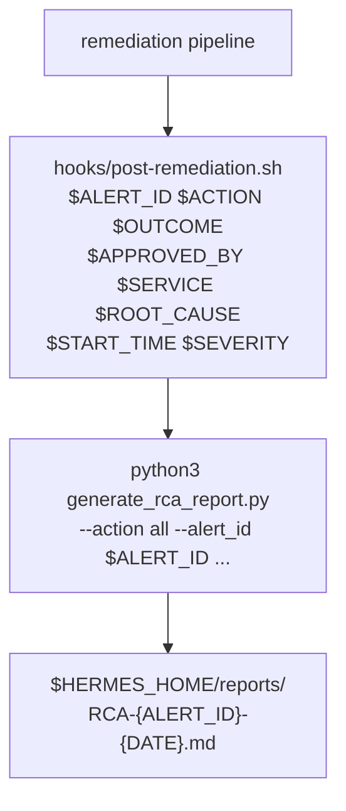

# Hermes RCA Generation — Design

## Architecture Overview



## Component Design

### C1: generate_rca_report.py — RCA Orchestrator

**Responsibility**: Primary tool that queries telemetry, builds the RCA report, and optionally submits to Jira/Trello.

**Entry point**: `main()`

**Data flow**:



**Query isolation**: Each `_query_*` function is wrapped in try/except SystemExit so that one query failure does not prevent others from executing. Failed queries return `None` and the report builder handles missing data with fallback content.

### C2: generate_postmortem.py — Postmortem Generator

**Responsibility**: Generates postmortem reports with broader incident narrative, lessons learned, and structured appendices.

**Entry point**: `main()`

**Actions**:

- `postmortem` — Generate filled postmortem from parameters
- `template` — Return blank template with `{{PLACEHOLDER}}` variables

**Key design decisions**:

- Accepts pipe-delimited string inputs (`went_well`, `improve`, `lucky`) for multi-item lists
- Supports custom `timeline_events` as JSON string for flexible timeline construction
- Includes default agent pipeline events when no custom timeline provided
- Remediation events are conditionally included based on whether remediation is provided

### C3: generate_rca_template.py — Template Generator

**Responsibility**: Generates blank RCA templates for manual incident review.

**Design**: Pure template generation — no telemetry queries, no external API calls. Accepts optional pre-fill parameters (`title`, `service`, `severity`, `author`). All other fields use `{{VARIABLE_NAME}}` placeholder syntax.

### C4: post-remediation.sh — Automation Hook

**Responsibility**: Automatically triggers RCA generation after successful remediation.

**Execution flow**:



**Graceful degradation**: The hook wraps RCA generation in `|| { echo WARN; exit 0; }` so that failures never block the remediation workflow.

## Report Structure

### RCA Report Layout

````mermaid
graph TD
    Root["# Root Cause Analysis Report"]
    Root --> Meta["Metadata header<br/>(incident, date, author, severity,<br/>service, workspace, status)"]
    Root --> HR1["---"]
    Root --> Exec["## Executive Summary"]
    Root --> HR2["---"]
    Root --> Impact["## Impact Assessment"]
    Impact --> Metrics["### Affected Service Metrics<br/>(table: Metric | Value)"]
    Impact --> Blast["### Blast Radius<br/>(service, duration, user impact)"]
    Root --> HR3["---"]
    Root --> FiveW["## 5W Analysis"]
    FiveW --> What["### What Happened?"]
    FiveW --> Where["### Where Did It Happen?"]
    FiveW --> When["### When Did It Happen?"]
    FiveW --> Why["### Why Did It Happen?"]
    FiveW --> How["### How Was It Resolved?"]
    Root --> HR4["---"]
    Root --> Timeline["## Incident Timeline"]
    Timeline --> TimelineMermaid["```mermaid timeline``` diagram"]
    Timeline --> TimelineDetails["### Timeline Details<br/>(table: Timestamp | Event | Source | Detail | Severity)"]
    Root --> HR5["---"]
    Root --> ResponseFlow["## Incident Response Flow"]
    ResponseFlow --> FlowMermaid["```mermaid flowchart TD``` diagram"]
    Root --> HR6["---"]
    Root --> RootCause["## Root Cause Details"]
    Root --> Contributing["## Contributing Factors<br/>(table: Factor | Contribution | Evidence)"]
    Root --> HR7["---"]
    Root --> ActionItems["## Action Items<br/>(table: # | Action | Owner | Priority | Status)"]
    Root --> HR8["---"]
    Root --> Lessons["## Lessons Learned"]
    Lessons --> WentWell["What went well"]
    Lessons --> Improve["What could be improved"]
    Lessons --> Lucky["Where we got lucky"]
    Root --> HR9["---"]
    Root --> Footer["*Generated by TelemetryFlow Hermes Agent on {timestamp}*"]
````

### Postmortem Report Layout

````mermaid
graph TD
    Root["# Postmortem: {title}"]
    Root --> Header["Header table<br/>(Date, Authors, Status, Severity,<br/>Services, Duration, Alert ID)"]
    Root --> HR1["---"]
    Root --> Summary["## Summary"]
    Root --> HR2["---"]
    Root --> Timeline["## Timeline (All Times UTC)"]
    Timeline --> TimelineMermaid["```mermaid timeline``` diagram"]
    Timeline --> TimelineDetails["### Detailed Timeline<br/>(table: Time | Event | Owner | Detail)"]
    Root --> HR3["---"]
    Root --> RCA["## Root Cause Analysis"]
    RCA --> WhatHappened["### What Happened"]
    RCA --> WhyHappened["### Why It Happened"]
    RCA --> WhyNotCaught["### Why It Was Not Caught Sooner"]
    RCA --> FiveWTable["### 5W Analysis (table)"]
    Root --> HR4["---"]
    Root --> Resolution["## Resolution"]
    Resolution --> RemediationFlow["### Remediation Flow<br/>(```mermaid flowchart TD```)"]
    Root --> HR5["---"]
    Root --> Lessons["## Lessons Learned"]
    Lessons --> WentWell["What Went Well"]
    Lessons --> Improve["What Could Be Improved"]
    Lessons --> Lucky["Where We Got Lucky"]
    Root --> HR6["---"]
    Root --> ActionItems["## Action Items (table)"]
    Root --> HR7["---"]
    Root --> Appendix["## Appendix"]
    Appendix --> AlertPayload["### Alert Payload (```json```)"]
    Appendix --> RelatedResources["### Related Resources"]
    Root --> HR8["---"]
    Root --> Footer["*Postmortem generated by TelemetryFlow Hermes Agent on {timestamp}*"]
````

## Integration Patterns

### P1: TelemetryFlow API Integration



- Uses `tfo_request()` from `_shared.py` for authenticated API calls
- API URL from `TELEMETRYFLOW_API_URL` env var (default: `http://localhost:3000/api/v2`)
- API key from `TELEMETRYFLOW_API_KEY` env var (required)
- URL validation via `_validate_url()` (blocks non-http/https schemes)

### P2: ClickHouse Query Integration



Queries:
| Function | Table | Purpose |
|----------|-------|---------|
| `_query_metrics_baseline` | `metrics_1m` | avg, P95, P99 for service over 60 min |
| `_query_error_logs` | `otel_logs` | ERROR/FATAL/CRITICAL logs for service in window |
| `_query_trace_summary` | `otel_traces` | span count, avg duration, P95 duration, error spans |
| `_query_audit_events` | `audit_logs` | Actions, resources, users in time window |

SQL injection prevention: All user inputs use `.replace("'", "''")` for single-quote escaping.

### P3: Jira API Integration



Payload structure:

```json
{
  "fields": {
    "project": { "key": "OPS" },
    "summary": "[RCA] {title}",
    "description": "h2. Root Cause Analysis...",
    "issuetype": { "name": "Incident" },
    "priority": { "id": "2" },
    "labels": ["rca", "hermes-agent", "severity-high", "service-name"],
    "components": [{ "name": "service-name" }]
  }
}
```

Feature flag: `JIRA_ENABLED` env var (true/1/yes enables submission).

### P4: Trello API Integration



Multi-step enrichment:

1. Create card → get `card_id`
2. Add labels (color-mapped by severity)
3. Add "Incident Response Checklist" with 7 items

Feature flag: `TRELLO_ENABLED` env var (true/1/yes enables submission).

### P5: Shell Hook Integration



## Properties

### Error Handling Strategy

| Layer                 | Strategy                            | Behavior                                 |
| --------------------- | ----------------------------------- | ---------------------------------------- | --------------- | ---------------------------- |
| Telemetry queries     | try/except SystemExit per query     | Failed query → `None` → fallback content |
| Report builder        | Defensive `isinstance()` checks     | Missing data → placeholder tables        |
| Jira/Trello           | HTTP error + URL error catching     | `submitted: false` + error details       |
| Post-remediation hook | `                                   |                                          | exit 0` pattern | Failure logged, never blocks |
| Trello enrichment     | try/except per label/checklist item | Individual failures counted, not fatal   |

### Configuration (Environment Variables)

| Variable                     | Required    | Default                        | Purpose                         |
| ---------------------------- | ----------- | ------------------------------ | ------------------------------- |
| `TELEMETRYFLOW_API_URL`      | No          | `http://localhost:3000/api/v2` | TelemetryFlow API base URL      |
| `TELEMETRYFLOW_API_KEY`      | Yes         | —                              | API authentication key          |
| `TELEMETRYFLOW_WORKSPACE_ID` | No          | `""`                           | Workspace context               |
| `JIRA_URL`                   | Conditional | —                              | Jira instance base URL          |
| `JIRA_EMAIL`                 | Conditional | —                              | Jira user email                 |
| `JIRA_API_TOKEN`             | Conditional | —                              | Jira API token                  |
| `JIRA_ENABLED`               | No          | `false`                        | Enable Jira ticket submission   |
| `TRELLO_API_KEY`             | Conditional | —                              | Trello API key                  |
| `TRELLO_API_TOKEN`           | Conditional | —                              | Trello API token                |
| `TRELLO_BOARD_ID`            | No          | —                              | Trello board ID (reference)     |
| `TRELLO_LIST_ID_INCIDENTS`   | Conditional | —                              | Target list for incident cards  |
| `TRELLO_ENABLED`             | No          | `false`                        | Enable Trello card submission   |
| `HERMES_HOME`                | No          | `~/.hermes`                    | Base directory for reports/logs |

### Output Artifacts

| Artifact        | Format        | Location                                         |
| --------------- | ------------- | ------------------------------------------------ |
| RCA report      | Markdown      | `$HERMES_HOME/reports/RCA-{id}-{date}.md`        |
| RCA raw         | JSON          | `$HERMES_HOME/reports/RCA-{id}-{date}.json`      |
| Postmortem      | Markdown      | `$HERMES_HOME/reports/POSTMORTEM-{id}-{date}.md` |
| Remediation log | Text          | `$HERMES_HOME/logs/remediations.log`             |
| Jira ticket     | JSON → Jira   | `{JIRA_URL}/browse/{key}`                        |
| Trello card     | JSON → Trello | `{card_url}`                                     |

### CLI Parameter Contract

All three tools use `_shared.parse_args()` which parses `--key value` pairs from `sys.argv`.

**generate_rca_report.py parameters**:
| Parameter | Default | Description |
|-----------|---------|-------------|
| `action` | `rca` | Action: rca, jira, trello, all, submit |
| `alert_id` | `""` | Alert identifier |
| `service` | `unknown` | Affected service name |
| `root_cause` | `Under investigation` | Root cause description |
| `remediation` | `None` | Remediation action taken |
| `start_time` | `""` | Incident start (ISO 8601) |
| `end_time` | `now_iso()` | Incident end (ISO 8601) |
| `severity` | `high` | Incident severity |
| `author` | `Hermes Agent` | Report author |
| `title` | Auto-generated | Report title |
| `submit` | `false` | Enable external submissions |
| `project_key` | `OPS` | Jira project key |
| `issue_type` | `Incident` | Jira issue type |

**generate_postmortem.py parameters**:
| Parameter | Default | Description |
|-----------|---------|-------------|
| `action` | `postmortem` | Action: postmortem, template |
| `alert_id` | `""` | Alert identifier |
| `service` | `unknown` | Affected service |
| `root_cause` | `Under investigation` | Root cause |
| `remediation` | `None` | Remediation action |
| `severity` | `high` | Incident severity |
| `author` | `Hermes Agent` | Author |
| `title` | Auto-generated | Postmortem title |
| `what` | root_cause | 5W: What |
| `where` | Auto-derived | 5W: Where |
| `why` | root_cause | 5W: Why |
| `how` | remediation | 5W: How |
| `summary` | Auto-derived | Narrative summary |
| `went_well` | Default | Pipe-delimited positives |
| `improve` | Default | Pipe-delimited improvements |
| `lucky` | Default | Pipe-delimited luck factors |
| `timeline_events` | `""` | JSON array of custom events |

**generate_rca_template.py parameters**:
| Parameter | Default | Description |
|-----------|---------|-------------|
| `title` | `RCA Template — {date}` | Template title |
| `service` | `{{SERVICE_NAME}}` | Service name |
| `severity` | `{{SEVERITY}}` | Severity |
| `author` | `{{AUTHOR}}` | Author |
