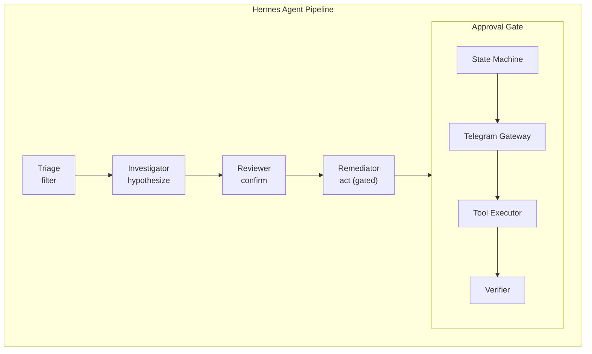
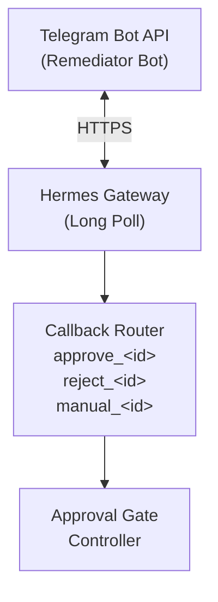
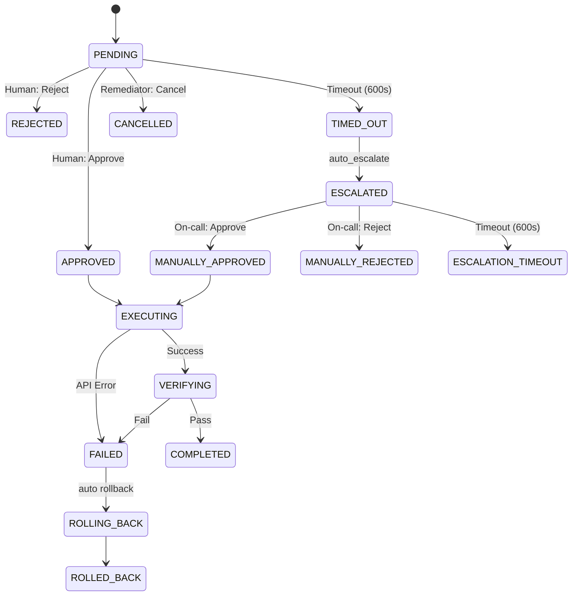

# Hermes Remediation Gate — Design

## Architecture Overview



---

## Component Design

### 1. Approval Gate Controller

The central orchestrator that intercepts tool calls, manages the state machine,
and coordinates between the Telegram gateway and tool executor.

**Location**: `profiles/remediator/gate/` (new module)

**Responsibilities**:

- Intercept `requires_approval` tool invocations before API calls.
- Validate Three Gates (confirmed root cause, proportional response, human
  approval readiness).
- Create and persist approval state records.
- Route approval requests to the Telegram gateway.
- Process human responses and drive state transitions.
- Coordinate tool execution on approval.
- Initiate verification and rollback on failure.

**Interface**:

```python
class ApprovalGate:
    def propose_action(self, tool: str, params: dict, context: ApprovalContext) -> str
    def handle_response(self, request_id: str, response: HumanResponse) -> None
    def check_timeout(self) -> list[str]
    def cancel_request(self, request_id: str, reason: str) -> None
    def get_active_requests(self) -> list[ApprovalRequest]
    def get_request_history(self, limit: int) -> list[ApprovalRequest]
```

### 2. Telegram Gateway

Handles all Telegram Bot API interactions for the approval workflow.

**Location**: `profiles/remediator/gate/telegram_gateway.py`

**Responsibilities**:

- Format and send approval request messages with inline keyboards.
- Handle callback queries from inline keyboard button presses.
- Send timeout warnings, escalation notifications, and execution results.
- Manage retry logic for Telegram API failures.
- Deduplicate messages using approval request IDs.

**Message Templates**:

**Approval Request**:

```
🔴 REMEDIATION APPROVAL REQUIRED

Alert: <alert_summary>
Root Cause: <root_cause>
Risk Level: <risk_level>

Proposed Action:
  Tool: <tool_name>
  Parameters: <formatted_params>

Blast Radius: <blast_radius>
Rollback Plan: <rollback_plan>

Reviewer Verdict: CONFIRMED <caveats>
Timeout: <deadline_formatted>

[Approve] [Reject] [Manual Review]
```

**Timeout Warning**:

```
⚠️ APPROVAL TIMEOUT WARNING

Request <request_id_short> has been pending for 5 minutes.
Action will auto-escalate in 5 minutes if no response.

Proposed: <tool_name> <params_summary>
```

**Execution Result**:

```
✅ REMEDIATION COMPLETED / ❌ REMEDIATION FAILED

Action: <tool_name> <params_summary>
Result: <outcome>
Verification: <verification_summary>
```

### 3. Approval State Machine

Finite state machine governing the lifecycle of each approval request.

**Location**: `profiles/remediator/gate/state_machine.py`

**States**:

```
PENDING → APPROVED → EXECUTING → VERIFYING → COMPLETED
PENDING → REJECTED
PENDING → TIMED_OUT → ESCALATED → MANUALLY_APPROVED → EXECUTING
PENDING → TIMED_OUT → ESCALATED → MANUALLY_REJECTED
PENDING → CANCELLED
EXECUTING → FAILED → ROLLING_BACK → ROLLED_BACK
VERIFYING → FAILED → ROLLING_BACK → ROLLED_BACK
```

**State Record Schema**:

```python
@dataclass
class ApprovalRequest:
    request_id: str              # UUID v4
    tool: str                    # scale_deployment | restart_pod | rollback_deploy | update_alert
    params: dict                 # Tool-specific parameters
    context: ApprovalContext     # Evidence, root cause, reviewer verdict
    risk_level: RiskLevel        # LOW | MEDIUM | HIGH | CRITICAL
    state: ApprovalState         # Current state machine state
    created_at: datetime         # Proposal timestamp
    updated_at: datetime         # Last state transition timestamp
    timeout_at: datetime         # Approval deadline
    approver_id: str | None      # Telegram user ID of approver
    escalation_target: str | None # Escalation chat ID
    transitions: list[StateTransition]  # Full transition history
    outcome: str | None          # Final result description
```

```python
@dataclass
class ApprovalContext:
    alert_summary: str
    root_cause: str
    evidence_links: list[str]
    blast_radius: str
    rollback_plan: str
    reviewer_verdict: str
    reviewer_caveats: list[str]
```

```python
@dataclass
class StateTransition:
    from_state: ApprovalState
    to_state: ApprovalState
    timestamp: datetime
    actor: str                   # "human:<user_id>", "system:timeout", "system:auto"
    reason: str
```

### 4. Tool Executor

Wraps the four remediation tool scripts with pre/post hooks.

**Location**: `profiles/remediator/gate/tool_executor.py`

**Pre-execution checks** (per tool):

| Tool               | Pre-check                                             |
| ------------------ | ----------------------------------------------------- |
| `scale_deployment` | Verify deployment exists, current replicas != target  |
| `restart_pod`      | Verify deployment/pod exists, warn on security events |
| `rollback_deploy`  | Verify revision history exists, check CVE context     |
| `update_alert`     | Verify rule ID exists, snapshot current rule state    |

**Post-execution verification** (standardized):

```python
class VerificationSuite:
    async def verify_scale(name: str, namespace: str, target_replicas: int) -> VerificationResult
    async def verify_restart(target: str, namespace: str) -> VerificationResult
    async def verify_rollback(name: str, namespace: str) -> VerificationResult
    async def verify_alert_update(rule_id: str, expected_state: dict) -> VerificationResult
```

Each verification method:

1. Waits 30 seconds for propagation.
2. Queries the relevant ClickHouse materialized view or K8s API.
3. Compares results to expected state.
4. Checks `otel_logs` for new errors in the affected namespace.
5. Returns a `VerificationResult` with pass/fail and evidence.

### 5. State Persistence

**Location**: `sessions/approvals/` (one JSON file per request)

**File naming**: `{request_id}.json`

**Why JSON files**:

- Simple, no external dependencies.
- Human-readable for debugging.
- One file per request avoids contention.
- survives process restarts.

**Cleanup**: Completed/terminal-state records older than 30 days are archived
by the Memory Curator.

---

## Telegram Integration Architecture

### Bot Setup



### Callback Data Format

Inline keyboard buttons use callback data in the format:

```
action:request_id
```

Examples:

- `approve:550e8400-e29b-41d4-a716-446655440000`
- `reject:550e8400-e29b-41d4-a716-446655440000`
- `manual:550e8400-e29b-41d4-a716-446655440000`

### Long Polling vs Webhook

The gate uses **long polling** (Telegram `getUpdates`) rather than webhooks
because:

- Hermes agents run locally or in containers without guaranteed public endpoints.
- Long polling requires no ingress configuration.
- The Remediator is the only consumer of its bot's updates.

**Polling configuration**:

- Poll interval: 2 seconds.
- Timeout parameter: 30 seconds (Telegram long-poll timeout).
- Allowed updates: `["callback_query"]` (only process button presses).

### Environment Variables

```bash
TELEGRAM_BOT_TOKEN_REMEDIATOR=<bot_token>    # From @BotFather
TELEGRAM_CHAT_ID_REMEDIATOR=<chat_id>        # Target chat/user ID
```

Optional escalation target:

```bash
TELEGRAM_CHAT_ID_ONCALL=<chat_id>            # On-call escalation target
```

---

## State Machine Diagram (Detailed)



---

## Properties

### Safety Properties

1. **No Auto-Execute**: The system SHALL NEVER execute a remediation action
   without an explicit human approval response. Timeout always escalates, never
   auto-executes.

2. **Single Action**: At most one remediation action is in `EXECUTING` state at
   any time. The approval gate serializes all write operations.

3. **Idempotent Approval**: Processing the same approval response twice SHALL
   NOT cause duplicate tool executions. Once a state transitions past
   `APPROVED`, further responses for the same request are ignored.

4. **Crash Recovery**: If the Remediator process crashes during `EXECUTING`
   state, on restart the gate SHALL query the TFO API to determine whether the
   action completed, and transition to `VERIFYING` or `FAILED` accordingly.

5. **Rollback Guarantee**: If a remediation action enters `FAILED` state, the
   rollback action specified in the approval request SHALL be automatically
   attempted. The rollback itself does NOT require human approval (it is
   pre-approved as part of the original proposal).

### Liveness Properties

1. **Timeout Progress**: Every `PENDING` request SHALL eventually transition
   (to `APPROVED`, `REJECTED`, `TIMED_OUT`, or `CANCELLED`) within
   `approval_timeout_seconds`.

2. **Notification Delivery**: Approval requests SHALL be delivered to Telegram
   within 2 seconds of creation, or an error SHALL be logged and the request
   treated as if it were immediately timed out.

3. **Verification Completion**: Every `EXECUTING` request SHALL eventually
   reach `COMPLETED`, `FAILED`, or `ROLLED_BACK` (bounded by verification
   timeout of 120 seconds).

### Data Properties

1. **Audit Completeness**: Every state transition is recorded with timestamp,
   actor identity, and reason. The full transition history is retrievable for
   any request.

2. **State Consistency**: The persisted state file is the source of truth. The
   in-memory state is always reconciled from disk on startup.

3. **No Secret Leakage**: Approval request messages sent to Telegram SHALL NOT
   contain API keys, tokens, or other secrets. Parameters are limited to
   resource names, namespaces, and numeric values.

---

## Error Handling

| Error Scenario               | Handling                                                             |
| ---------------------------- | -------------------------------------------------------------------- |
| Telegram API unreachable     | Retry 3x with backoff. On total failure, treat as immediate timeout. |
| Invalid callback data        | Log warning, ignore. Do not transition state.                        |
| Duplicate approval response  | Idempotent — ignore if already past `APPROVED` state.                |
| Tool execution API error     | Transition to `FAILED`, auto-initiate rollback.                      |
| Verification timeout (120s)  | Transition to `FAILED`, auto-initiate rollback.                      |
| Rollback also fails          | Log as `ROLLBACK_FAILED`, escalate to human immediately.             |
| State file corruption        | Log error, recreate from last known good state or start fresh.       |
| Concurrent state file writes | File-level locking (fcntl/flock) per request file.                   |

---

## Configuration Schema

```yaml
# profiles/remediator/config.yaml (additions)

gate:
  enabled: true # Master switch for approval gate
  persistence_dir: "sessions/approvals" # Directory for state files
  queue_depth: 5 # Max queued approval requests
  verification_timeout: 120 # Seconds for post-action verification

  telegram:
    poll_interval: 2 # Seconds between getUpdates calls
    poll_timeout: 30 # Telegram long-poll timeout
    retry_attempts: 3 # Max retries for failed sends
    retry_backoff: [1, 2, 4] # Seconds between retries
    escalation_chat_id_env: TELEGRAM_CHAT_ID_ONCALL # Optional escalation target

  risk_overrides:
    CRITICAL:
      require_manual_review: true # Disable one-click approve for CRITICAL
    SECURITY_ESCALATION:
      require_manual_review: true # Force Manual Review for security incidents
```

---

## Directory Structure (New Files)

```
profiles/remediator/
├── SOUL.md                    # Existing — agent personality
├── config.yaml                # Existing — agent configuration (add gate: section)
└── gate/                      # NEW — approval gate module
    ├── __init__.py
    ├── controller.py          # ApprovalGate — main orchestrator
    ├── state_machine.py       # ApprovalState, state transitions
    ├── telegram_gateway.py    # Telegram Bot API integration
    ├── tool_executor.py       # Remediation tool wrapper with pre/post hooks
    ├── verifier.py            # Post-action verification suite
    ├── persistence.py         # JSON file-based state storage
    └── models.py              # Data classes: ApprovalRequest, ApprovalContext, etc.

sessions/
└── approvals/                 # NEW — persisted approval state files
    └── {request_id}.json      # One file per approval request

tests/
└── test_gate/                 # NEW — approval gate tests
    ├── test_state_machine.py
    ├── test_controller.py
    ├── test_telegram_gateway.py
    ├── test_tool_executor.py
    ├── test_verifier.py
    └── test_persistence.py
```
