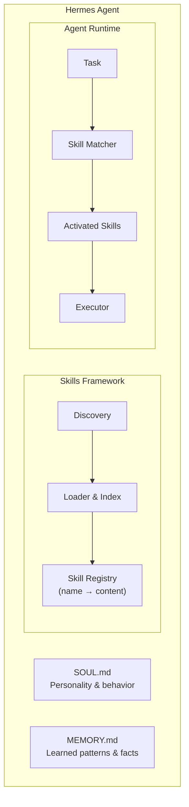
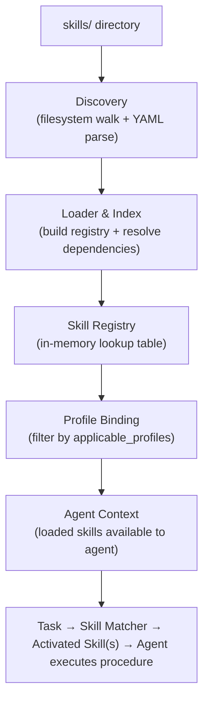

# Hermes Skills Framework — Design

## 1. Architecture Overview

The skills framework is a static, file-based system that provides domain expertise to Hermes agents at runtime. There is no database, no server, and no API for skills — they are Markdown files loaded from the filesystem into the agent's context window.



### 1.1 Components

| Component          | Responsibility                                                                                                          |
| ------------------ | ----------------------------------------------------------------------------------------------------------------------- |
| **Discovery**      | Walk `skills/` directory, find all `SKILL.md` files, parse frontmatter.                                                 |
| **Loader & Index** | Build in-memory index of skills by name, category, tags, and applicable profiles. Resolve `depends_on` into load order. |
| **Skill Registry** | Key-value store mapping skill name to parsed skill content. Provides lookup by name, category, tag, or profile.         |
| **Skill Matcher**  | Given a task description, find the most relevant skills by matching against `description` trigger conditions.           |
| **Executor**       | Present activated skill procedures to the agent as structured context. The agent follows the procedure steps.           |

### 1.2 Data Flow



---

## 2. Directory Structure

### 2.1 Physical Layout

```
skills/
├── ai-intelligence/
│   └── SKILL.md
├── alerting/
│   └── SKILL.md
├── audit/
│   └── SKILL.md
├── dashboard/
│   └── SKILL.md
├── database-monitoring/
│   ├── qan-analysis/
│   │   └── SKILL.md
│   └── slow-query-detection/
│       └── SKILL.md
├── iam/
│   └── SKILL.md
├── monitoring/
│   ├── agent/
│   │   └── SKILL.md
│   ├── kubernetes/
│   │   └── SKILL.md
│   ├── network-map/
│   │   └── SKILL.md
│   ├── service-map/
│   │   └── SKILL.md
│   ├── status-page/
│   │   └── SKILL.md
│   ├── uptime/
│   │   └── SKILL.md
│   └── vm/
│       └── SKILL.md
├── observability/
│   ├── alert-triage/
│   │   └── SKILL.md
│   ├── clickhouse-query-patterns/
│   │   └── SKILL.md
│   ├── cross-signal-correlation/
│   │   └── SKILL.md
│   ├── k8s-pod-debug/
│   │   └── SKILL.md
│   ├── memory-pressure-investigation/
│   │   └── SKILL.md
│   ├── payments-api-oom-rca/
│   │   └── SKILL.md
│   ├── remediation-gate/
│   │   └── SKILL.md
│   └── tfql-natural-language/
│       └── SKILL.md
├── query/
│   └── SKILL.md
├── reporting/
│   └── SKILL.md
├── retention/
│   └── SKILL.md
├── sso/
│   └── SKILL.md
├── subscription/
│   └── SKILL.md
└── tenancy/
    └── SKILL.md
```

### 2.2 Path-to-Category Mapping

The category is derived from the first directory level under `skills/`:

```python
def extract_category(skill_path: str) -> str:
    parts = skill_path.removeprefix("skills/").split("/")
    if len(parts) == 2:
        return parts[0]
    return parts[0]
```

### 2.3 Path-to-Name Mapping

The skill name is derived from the frontmatter `name` field, which MUST match the directory name:

| Path                                               | Category              | Skill Name              |
| -------------------------------------------------- | --------------------- | ----------------------- |
| `skills/alerting/SKILL.md`                         | `alerting`            | `alerting-management`   |
| `skills/monitoring/kubernetes/SKILL.md`            | `monitoring`          | `kubernetes-monitoring` |
| `skills/observability/alert-triage/SKILL.md`       | `observability`       | `alert-triage`          |
| `skills/database-monitoring/qan-analysis/SKILL.md` | `database-monitoring` | `qan-analysis`          |

For flat categories, the skill name MAY differ from the category name (e.g., category `alerting` → name `alerting-management`).

---

## 3. Skill Format Specification

### 3.1 Parsed Skill Model

After parsing, each skill is represented as a structured object:

```typescript
interface Skill {
  meta: SkillMeta;
  category: string;
  path: string;
  body: SkillBody;
}

interface SkillMeta {
  name: string;
  description: string;
  version: string;
  author: "agent" | "human";
  platforms: string[];
  depends_on?: string[];
  tools_used?: string[];
  applicable_profiles?: string[];
  tags?: string[];
}

interface SkillBody {
  procedure: ProcedureStep[];
  sections: Map<string, string>;
  verification: string[];
}

interface ProcedureStep {
  number: number;
  text: string;
  codeBlocks: CodeBlock[];
}

interface CodeBlock {
  language: string | null;
  code: string;
}
```

### 3.2 Frontmatter Parsing

Frontmatter is parsed as YAML between the first two `---` delimiters. Parsing rules:

1. The file MUST start with `---` on line 1.
2. The frontmatter ends at the second `---`.
3. YAML is parsed with standard YAML 1.2 rules.
4. The `description` field supports multi-line strings using `>` (folded) or `|` (literal) YAML syntax.
5. Unknown fields are ignored (forward compatibility).

### 3.3 Body Parsing

After frontmatter extraction, the body is parsed into sections:

1. Split by `## ` headings (level 2).
2. First heading becomes the first section key.
3. Content between headings becomes the section body.
4. Special handling:
   - `## Procedure` is further parsed into numbered steps.
   - `## Verification` is parsed into bullet points.
   - Other sections are stored as raw Markdown strings.

### 3.4 Procedure Step Parsing

Steps are extracted from the `## Procedure` section:

````
1. Step text
   ```bash
   code here
````

2. Next step text

````

Rules:
- Steps start with `\d+\.` pattern.
- Code blocks within a step are associated with that step.
- Sub-steps (a., b., c.) are part of the parent step's text.
- Indented content after a step number belongs to that step until the next numbered step or a new `##` heading.

---

## 4. Loading Mechanism

### 4.1 Discovery Algorithm

```python
def discover_skills(skills_root: str) -> list[Skill]:
    skills = []
    for dirpath, dirnames, filenames in os.walk(skills_root):
        if "SKILL.md" in filenames:
            skill_path = os.path.join(dirpath, "SKILL.md")
            skill = parse_skill(skill_path)
            validate_skill(skill)
            skills.append(skill)
    return skills
````

Complexity: O(n) where n = number of directories in the skills tree.

### 4.2 Dependency Resolution

After discovery, resolve `depends_on` to determine load order:

```python
def resolve_load_order(skills: list[Skill]) -> list[Skill]:
    graph = build_dependency_graph(skills)
    assert_no_cycles(graph)
    return topological_sort(graph)
```

Uses Kahn's algorithm for topological sort. If cycles are detected, raise a validation error with the cycle path.

### 4.3 Profile Filtering

Filter skills applicable to a given profile:

```python
def filter_for_profile(skills: list[Skill], profile: str) -> list[Skill]:
    result = []
    for skill in skills:
        if skill.meta.applicable_profiles is None:
            result.append(skill)
        elif profile in skill.meta.applicable_profiles:
            result.append(skill)
    return result
```

### 4.4 Context Window Assembly

For an agent with a given profile, the skills are assembled into the context window as:

```
[SOUL.md content]

## Loaded Skills

### Category: alerting
[alerting SKILL.md content]

### Category: monitoring
[agent SKILL.md content]
[kubernetes SKILL.md content]
...

### Category: observability
[alert-triage SKILL.md content]
[cross-signal-correlation SKILL.md content]
...
```

Ordering: skills are grouped by category (alphabetical), then by skill name (alphabetical) within category.

### 4.5 Lazy vs Eager Loading

Current design: **eager loading** — all applicable skills are loaded at agent startup and included in the context.

Future optimization: **lazy loading** — only skill metadata (name, description) is loaded at startup. Full skill content is loaded on-demand when matched to a task. This reduces context window usage when many skills are applicable.

---

## 5. Skill Properties

### 5.1 Identity Properties

| Property   | Source            | Uniqueness                        |
| ---------- | ----------------- | --------------------------------- |
| `name`     | Frontmatter       | Globally unique across all skills |
| `path`     | Filesystem        | Unique by filesystem constraint   |
| `category` | Derived from path | Shared by skills in same category |

### 5.2 Applicability Properties

| Property              | Source                 | Purpose                     |
| --------------------- | ---------------------- | --------------------------- |
| `description`         | Frontmatter            | Activation trigger matching |
| `applicable_profiles` | Frontmatter (optional) | Profile-based filtering     |
| `tags`                | Frontmatter (optional) | Tag-based search            |
| `depends_on`          | Frontmatter (optional) | Load ordering and context   |

### 5.3 Quality Properties

| Property    | Source      | Purpose                           |
| ----------- | ----------- | --------------------------------- |
| `version`   | Frontmatter | Change tracking and compatibility |
| `author`    | Frontmatter | Attribution and trust level       |
| `platforms` | Frontmatter | Platform compatibility            |

### 5.4 Derived Properties

These are computed at load time, not stored in frontmatter:

| Property             | Computation                           |
| -------------------- | ------------------------------------- |
| `category`           | First directory level under `skills/` |
| `depth`              | Flat (1 level) or nested (2 levels)   |
| `section_count`      | Number of `##` headings in body       |
| `line_count`         | Total lines in file                   |
| `procedure_steps`    | Number of numbered steps in Procedure |
| `verification_count` | Number of bullets in Verification     |

---

## 6. Skill Registry

### 6.1 Registry Interface

```typescript
interface SkillRegistry {
  getByName(name: string): Skill | undefined;
  getByCategory(category: string): Skill[];
  getByTag(tag: string): Skill[];
  getByProfile(profile: string): Skill[];
  getDependents(skillName: string): Skill[];
  getDependencies(skillName: string): Skill[];
  getAll(): Skill[];
  search(query: string): Skill[];
}
```

### 6.2 Index Structure

The registry maintains multiple indexes for fast lookup:

```typescript
interface RegistryIndexes {
  byName: Map<string, Skill>;
  byCategory: Map<string, Skill[]>;
  byTag: Map<string, Skill[]>;
  byProfile: Map<string, Skill[]>;
  dependencyGraph: AdjacencyList;
}
```

All indexes are built at discovery time and are immutable after construction.

### 6.3 Search Algorithm

Skill search uses a simple scoring model:

```python
def search(query: str, registry: SkillRegistry) -> list[Skill]:
    scores = {}
    query_lower = query.lower()
    query_tokens = set(query_lower.split())

    for skill in registry.getAll():
        score = 0
        desc_tokens = set(skill.meta.description.lower().split())
        name_tokens = set(skill.meta.name.lower().split("-"))
        tag_tokens = set(t.lower() for t in (skill.meta.tags or []))

        score += len(query_tokens & name_tokens) * 3
        score += len(query_tokens & desc_tokens) * 2
        score += len(query_tokens & tag_tokens) * 1

        if score > 0:
            scores[skill] = score

    return sorted(scores.keys(), key=lambda s: scores[s], reverse=True)
```

---

## 7. Error Handling

### 7.1 Parse Errors

| Error                       | Handling                                          |
| --------------------------- | ------------------------------------------------- |
| Missing frontmatter         | Log warning, skip skill, continue discovery.      |
| Invalid YAML in frontmatter | Log error with path and parse error, skip skill.  |
| Missing required field      | Log error with field name, skip skill.            |
| Duplicate skill name        | Log error, keep first occurrence, skip duplicate. |

### 7.2 Validation Errors

| Error                                                               | Handling                                                      |
| ------------------------------------------------------------------- | ------------------------------------------------------------- |
| Circular dependency                                                 | Log error with cycle path, break cycle by removing last edge. |
| Missing dependency (skill referenced in `depends_on` doesn't exist) | Log warning, remove from dependency list, continue.           |
| Name/directory mismatch                                             | Log warning, use frontmatter name as canonical.               |
| Empty section                                                       | Log warning, include skill but flag for review.               |

### 7.3 Runtime Errors

| Error                                          | Handling                                  |
| ---------------------------------------------- | ----------------------------------------- |
| Skill file not found at registered path        | Log error, remove from registry.          |
| Skill content changed since load (filewatcher) | Log info, reload skill, update registry.  |
| Agent fails to follow procedure                | Agent's responsibility (not framework's). |

---

## 8. Configuration

### 8.1 Framework Configuration

The skills framework behavior can be configured via environment variables or a config file:

```yaml
skills:
  root: "skills/"
  max_file_lines: 300
  validation_strict: true
  load_strategy: "eager"
  log_activations: true
  allowed_authors:
    - agent
    - human
```

### 8.2 Per-Profile Configuration

Profile `config.yaml` can include skill overrides:

```yaml
skills:
  include:
    - alert-triage
    - cross-signal-correlation
  exclude:
    - payments-api-oom-rca
  extra_context:
    - "profiles/investigator/skills/custom-check.md"
```

When `include` is specified, ONLY listed skills are loaded (whitelist mode). When `exclude` is specified, listed skills are removed from the applicable set. Both can be combined. `extra_context` loads additional Markdown files beyond the standard skills tree.
