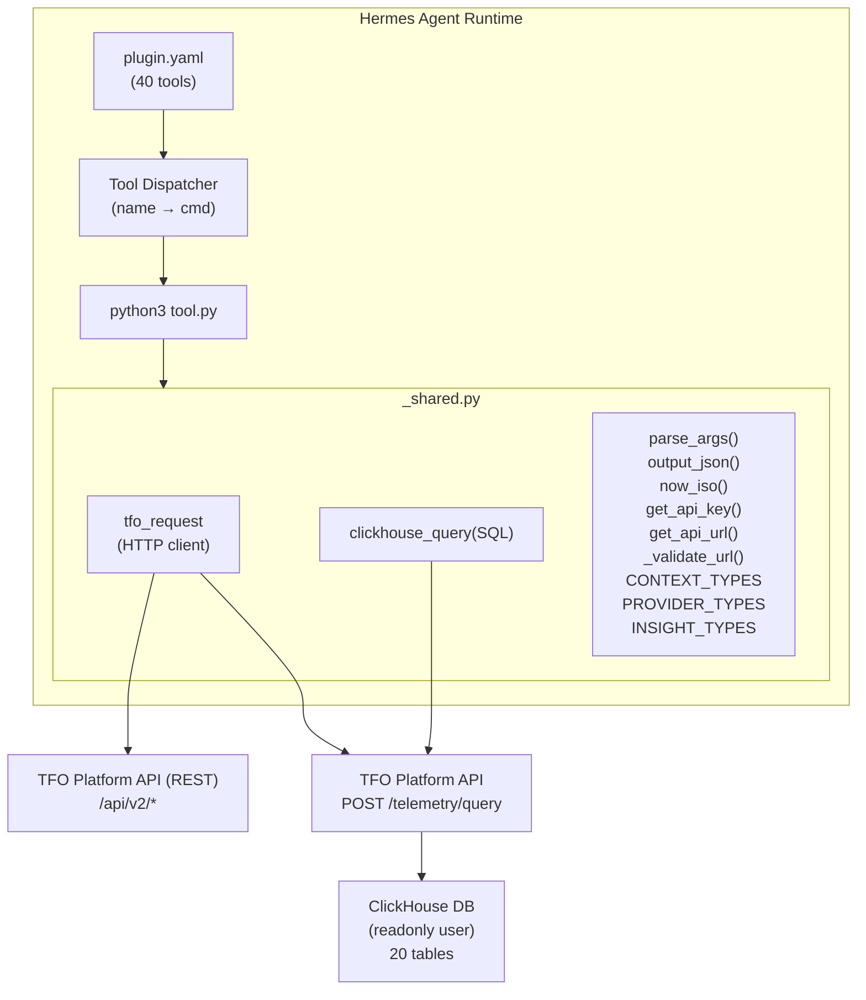
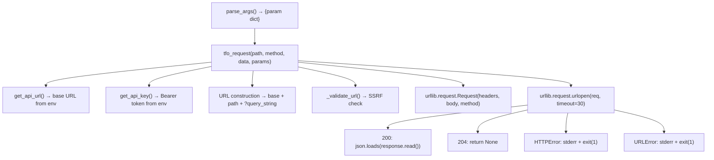
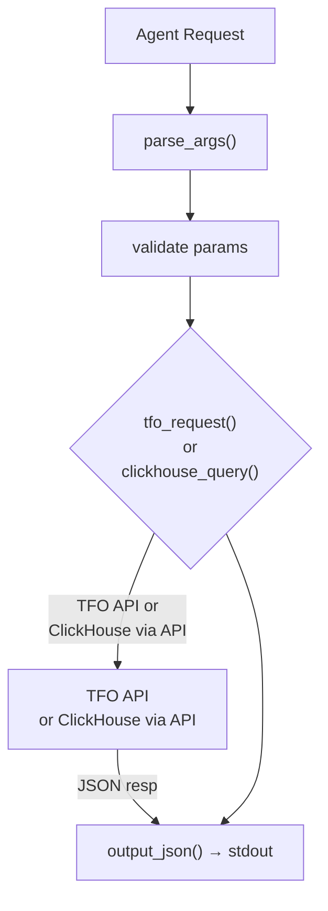
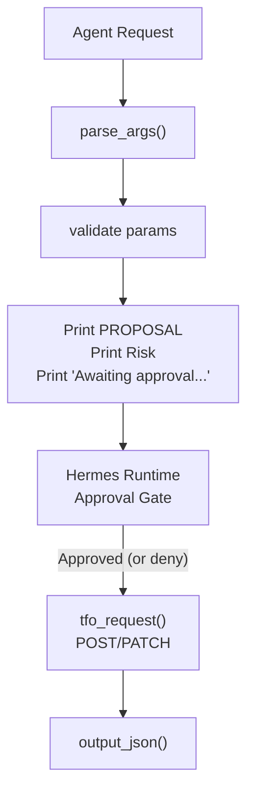
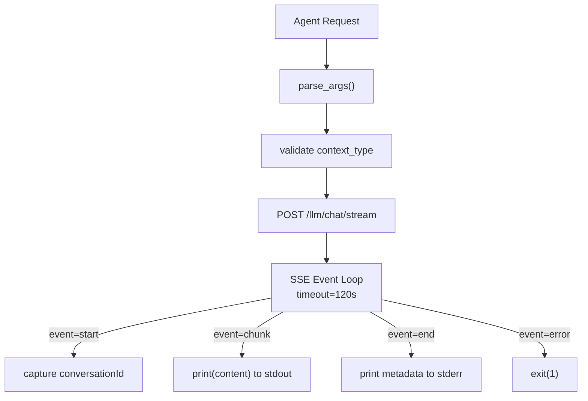
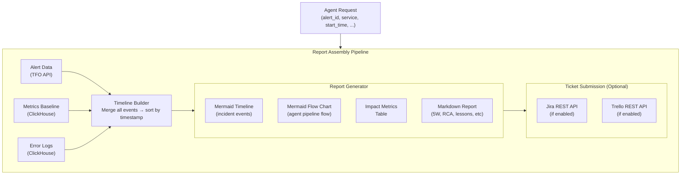
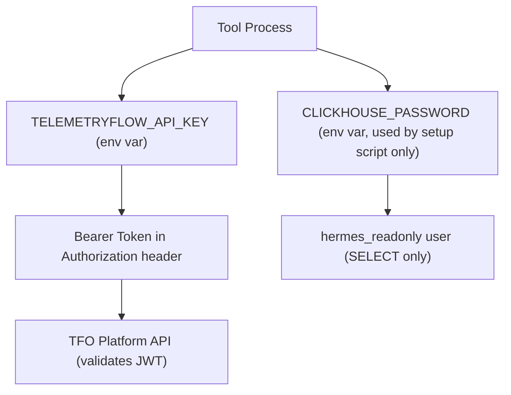
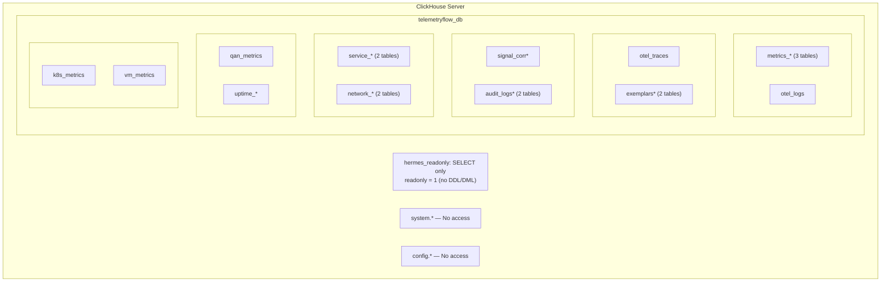
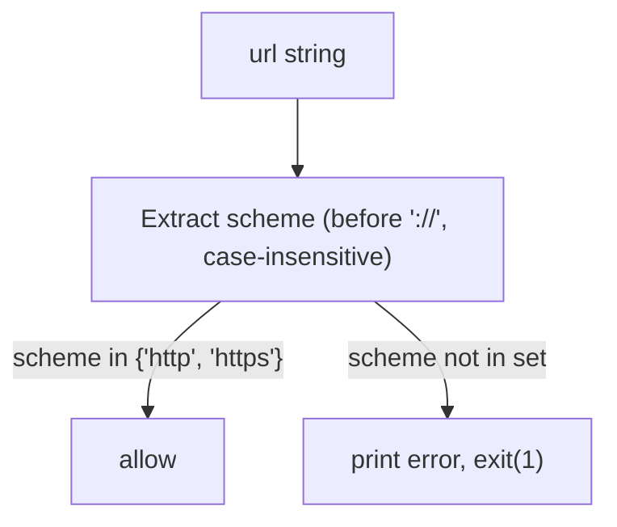

# Hermes TelemetryFlow Plugin Tools — Design

## Architecture Overview



---

## Component Design

### 1. Plugin Registration Layer (`plugin.yaml`)

The plugin manifest declares all 40 tools to the Hermes runtime. Each tool entry specifies:

| Field               | Purpose                                                         |
| ------------------- | --------------------------------------------------------------- |
| `name`              | Unique tool identifier (e.g., `query_metrics`)                  |
| `description`       | Human-readable capability description for LLM tool selection    |
| `command`           | Always `python3`                                                |
| `args`              | `["${PLUGIN_DIR}/tools/<name>.py"]` — path expansion by runtime |
| `requires_approval` | `true` for 4 remediation tools; absent otherwise                |
| `environment`       | Required/optional env vars with descriptions                    |

The Hermes runtime reads `plugin.yaml` at startup, registers each tool name in its tool registry, and when the agent invokes a tool, spawns a subprocess: `python3 ${PLUGIN_DIR}/tools/<name>.py --arg1 val1 --arg2 val2`.

### 2. Shared Module (`_shared.py`)

The shared module provides all cross-cutting concerns for the 40 tool implementations. It is imported via `sys.path.insert(0, os.path.dirname(__file__))` — a local import mechanism that avoids requiring pip installation.

#### 2.1 HTTP Client Design



**Design Decisions:**

- Exit on error (no exception propagation) — tools are subprocesses; exit code is the error signal.
- 30-second timeout balances responsiveness against slow ClickHouse aggregations.
- JSON request/response only — no form-encoded bodies.

#### 2.2 ClickHouse Query Router

```python
clickhouse_query(sql, fmt="JSON")
    → tfo_request("/telemetry/query", method="POST", data={"sql": sql, "format": fmt})
```

**Critical Design Decision:** ClickHouse is never accessed directly. All SQL queries route through the TFO Platform API's `/telemetry/query` endpoint. This provides:

- API-layer query validation and rate limiting
- Unified authentication via API key
- No direct ClickHouse network exposure to tool processes
- Audit trail of all queries

#### 2.3 Argument Parser

Custom `--key value` parser instead of `argparse`:

- Minimal overhead for subprocess invocation
- No validation logic in the parser — all validation in tool `main()` functions
- Flags without values default to `"true"` string

### 3. Tool Implementation Pattern

Every tool follows the same architectural pattern:

```python
#!/usr/bin/env python3
import os, sys
sys.path.insert(0, os.path.dirname(__file__))
from _shared import <imports>

def main():
    args = parse_args()
    # Extract and validate parameters
    param = args.get("param", "default")
    if not required_param:
        print("ERROR: ...", file=sys.stderr)
        sys.exit(1)

    # Dispatch to appropriate API endpoint or ClickHouse query
    if condition_a:
        result = tfo_request("/endpoint/a")
    elif condition_b:
        result = tfo_request("/endpoint/b", method="POST", data={...})
    else:
        result = clickhouse_query(sql)

    output_json(result)

if __name__ == "__main__":
    main()
```

**Two Data Source Strategies:**

| Strategy              | Tools                                                                              | Mechanism                                                  |
| --------------------- | ---------------------------------------------------------------------------------- | ---------------------------------------------------------- |
| **REST API**          | Platform, Monitoring, IAM, SSO, Alerts, Dashboards, Reports, Subscriptions, AI/LLM | `tfo_request()` → TFO REST API                             |
| **ClickHouse Direct** | Core Telemetry, DB Monitoring, LLM Usage                                           | `clickhouse_query()` → TFO `/telemetry/query` → ClickHouse |
| **Hybrid**            | DB Monitoring, RCA Report                                                          | Both strategies in the same tool                           |

### 4. Tool Categories

#### 4.1 Core Telemetry Tools (7)

Query ClickHouse materialized views for metrics, logs, traces, exemplars, and correlations. These are the primary observability data tools.

```
query_metrics ─────▶ metrics_1m / metrics_5m / metrics_1h
search_logs   ─────▶ otel_logs
list_traces   ─────▶ otel_traces
get_exemplars ─────▶ exemplars
query_correlations ─▶ signal_correlations_1h
query_tfql    ─────▶ /query/signals/* (TFO REST API)
query_ai_intelligence ▶ /ai-intelligence/* (TFO REST API)
```

#### 4.2 Monitoring Tools (8)

Query TFO REST API for monitoring data across infrastructure layers.

```
check_k8s        ──▶ /kubernetes/*
check_vm         ──▶ /monitoring/vms/*
check_agent      ──▶ /monitoring/agents/*
check_infra      ──▶ /monitoring/vm/{resource}
check_uptime     ──▶ /monitoring/uptime/* + /monitoring/status-pages/*
check_service_map──▶ /monitoring/service-map/*
check_network_map─▶ /monitoring/network-map/*
check_db_monitoring──▶ /db-monitoring/* + ClickHouse engine tables
```

#### 4.3 Platform Tools (8)

Manage platform configuration and query platform state.

```
manage_alerts     ──▶ /alert-rules/*, /alert-instances/*, /notification-channels/*
manage_dashboards ──▶ /dashboards/*
manage_reports    ──▶ /reports/*
manage_data_masking──▶ /data-masking/*
query_platform    ──▶ /iam/*, /tenancy/*, /audit/*, /retention/*, /subscription/*, /api-keys, /notification/*
query_account     ──▶ /account/*
query_audit       ──▶ /audit/logs
query_subscription──▶ /subscription/*
```

#### 4.4 Infrastructure Tools (4)

Manage multi-tenancy, access control, and data lifecycle.

```
manage_retention ──▶ /retention/policies/*
manage_tenancy   ──▶ /tenancy/*
manage_iam       ──▶ /iam/*
manage_sso       ──▶ /sso/*
```

#### 4.5 AI & LLM Tools (7)

Interact with TFO's LLM capabilities and manage provider configurations.

```
chat_with_context   ──▶ /llm/chat/message (POST)
stream_chat         ──▶ /llm/chat/stream (SSE)
manage_conversation ──▶ /llm/chat/conversations/*
generate_insight    ──▶ /llm/insights/{type} (POST)
query_llm_usage     ──▶ llm_usage_analytics (ClickHouse)
manage_provider     ──▶ /llm/providers/*
query_ai_intelligence──▶ /ai-intelligence/* (listed in core telemetry)
```

#### 4.6 Remediation Tools (4, gated)

Execute infrastructure changes with human approval gates.

```
scale_deployment ──▶ /kubernetes/deployments/scale (POST)
restart_pod      ──▶ /kubernetes/deployments/restart | /kubernetes/pods/restart (POST)
rollback_deploy  ──▶ /kubernetes/deployments/rollback (POST)
update_alert     ──▶ /alerts/rules/{id} (PATCH)
```

All four have `requires_approval: true` in `plugin.yaml` and print PROPOSAL/Risk/Awaiting messages.

#### 4.7 RCA Tools (3)

Generate structured incident analysis reports.

```
generate_rca_report   ──▶ ClickHouse + TFO API + Jira/Trello APIs
generate_postmortem   ──▶ TFO API (alert data)
generate_rca_template ──▶ Pure template generation (no API calls)
```

---

## Data Flow

### 5.1 Query Flow (Read-Only Tools)



### 5.2 Remediation Flow (Approval-Gated Tools)



### 5.3 SSE Streaming Flow (`stream_chat`)



### 5.4 RCA Report Generation Flow



---

## Security Model

### 6.1 Authentication Chain



### 6.2 Authorization Layers

| Layer              | Mechanism                                                 | Scope                  |
| ------------------ | --------------------------------------------------------- | ---------------------- |
| **Process Level**  | `requires_approval: true` in plugin.yaml                  | 4 remediation tools    |
| **API Level**      | TFO Platform API JWT validation                           | All 40 tools           |
| **Database Level** | ClickHouse `hermes_readonly` user                         | 20 tables, SELECT only |
| **Network Level**  | `_validate_url()` SSRF protection                         | All outbound HTTP      |
| **Data Level**     | Data masking policies (managed via `manage_data_masking`) | PII fields             |

### 6.3 ClickHouse Access Control



### 6.4 SSRF Protection

Every URL used in `urllib.request.Request` passes through `_validate_url()`:



This blocks: `file://`, `ftp://`, `javascript:`, `data://`, `gopher://`, and any other non-HTTP scheme.

---

## Properties

### 7.1 Reliability Properties

| Property                    | Mechanism                                                |
| --------------------------- | -------------------------------------------------------- |
| **No zombie processes**     | 30s HTTP timeout, 120s SSE timeout                       |
| **Clean error propagation** | stderr for errors, exit code 1 on failure                |
| **Graceful degradation**    | RCA report catches `SystemExit` from failed data queries |
| **Idempotent reads**        | All GET tools are read-only, no side effects             |
| **Atomic writes**           | Remediation tools execute single API calls               |

### 7.2 Performance Properties

| Property         | Value                                          |
| ---------------- | ---------------------------------------------- |
| **Cold start**   | <100ms (pure Python, no imports beyond stdlib) |
| **HTTP timeout** | 30s (standard), 120s (SSE streaming)           |
| **Memory**       | <10MB per tool invocation                      |
| **Concurrency**  | Each tool is an independent subprocess         |
| **No pip deps**  | Zero external dependency resolution time       |

### 7.3 Extensibility Properties

| Extension                    | How                                                    |
| ---------------------------- | ------------------------------------------------------ |
| **Add new tool**             | Create `tools/new_tool.py`, add entry in `plugin.yaml` |
| **Add new resource**         | Add `elif` branch in tool's `main()`                   |
| **Add new DB type**          | Add entry to `ENGINE_METRIC_TABLES` dict               |
| **Add new context type**     | Add string to `CONTEXT_TYPES` list                     |
| **Add new provider**         | Add string to `PROVIDER_TYPES` list                    |
| **Add new ClickHouse table** | Add `GRANT SELECT` in `clickhouse-readonly.sql`        |

### 7.4 Testing Properties

| Property                    | Mechanism                                                           |
| --------------------------- | ------------------------------------------------------------------- |
| **Unit test isolation**     | `mock_urlopen` patches `urllib.request.urlopen` globally            |
| **Module reloading**        | `importlib.reload()` ensures fresh state per test                   |
| **No network calls**        | All HTTP and ClickHouse calls mocked                                |
| **Exit code capture**       | `mock_exit` patches `sys.exit`                                      |
| **Stdout capture**          | `capture_stdout` wraps `capsys`                                     |
| **Error scenario coverage** | `mock_urlopen_error` (HTTP) and `mock_urlopen_conn_error` (network) |

---

## Directory Structure

```
plugins/telemetryflow/
├── plugin.yaml                          # Tool registry (40 tools + env vars)
├── tools/
│   ├── _shared.py                       # Shared utilities (198 lines)
│   ├── query_metrics.py                 # Core: metrics query
│   ├── search_logs.py                   # Core: log search
│   ├── list_traces.py                   # Core: trace analysis
│   ├── get_exemplars.py                 # Core: exemplar lookup
│   ├── query_correlations.py            # Core: cross-signal correlation
│   ├── query_tfql.py                    # Core: unified query engine
│   ├── query_ai_intelligence.py         # Core: AI intelligence modules
│   ├── check_k8s.py                     # Monitor: Kubernetes
│   ├── check_vm.py                      # Monitor: VMs
│   ├── check_agent.py                   # Monitor: TFO agents
│   ├── check_infra.py                   # Monitor: infrastructure
│   ├── check_uptime.py                  # Monitor: uptime/SSL/status pages
│   ├── check_service_map.py             # Monitor: service topology
│   ├── check_network_map.py             # Monitor: network topology
│   ├── check_db_monitoring.py           # Monitor: 15+ DB engines
│   ├── manage_alerts.py                 # Platform: alerting
│   ├── manage_dashboards.py             # Platform: dashboards
│   ├── manage_reports.py                # Platform: reporting
│   ├── manage_data_masking.py           # Platform: PII masking
│   ├── query_platform.py               # Platform: legacy multi-resource
│   ├── query_account.py                # Platform: account data
│   ├── query_audit.py                  # Platform: audit trails
│   ├── query_subscription.py           # Platform: billing/subscriptions
│   ├── manage_retention.py             # Infra: data retention
│   ├── manage_tenancy.py               # Infra: multi-tenancy
│   ├── manage_iam.py                   # Infra: identity/access
│   ├── manage_sso.py                   # Infra: SSO providers
│   ├── chat_with_context.py            # AI: LLM chat
│   ├── stream_chat.py                  # AI: streaming LLM chat
│   ├── manage_conversation.py          # AI: conversation management
│   ├── generate_insight.py             # AI: AI insight generation
│   ├── query_llm_usage.py              # AI: LLM usage analytics
│   ├── manage_provider.py             # AI: LLM provider management
│   ├── scale_deployment.py             # Remediate: K8s scale (gated)
│   ├── restart_pod.py                  # Remediate: K8s restart (gated)
│   ├── rollback_deploy.py             # Remediate: K8s rollback (gated)
│   ├── update_alert.py                # Remediate: alert update (gated)
│   ├── generate_rca_report.py         # RCA: full RCA + Jira/Trello
│   ├── generate_postmortem.py         # RCA: postmortem report
│   └── generate_rca_template.py       # RCA: blank template
tests/
├── conftest.py                          # Shared fixtures + sample data
└── unit/
    ├── __init__.py
    ├── test_shared.py                   # _shared.py tests (450 lines)
    ├── test_query_metrics.py
    ├── test_search_logs.py
    ├── test_list_traces.py
    ├── test_get_exemplars.py
    ├── test_query_correlations.py
    ├── test_query_tfql.py
    ├── test_query_ai_intelligence.py
    ├── test_check_k8s.py
    ├── test_check_vm.py
    ├── test_check_agent.py
    ├── test_check_infra.py
    ├── test_check_uptime.py
    ├── test_check_service_map.py
    ├── test_check_network_map.py
    ├── test_check_db_monitoring.py
    ├── test_manage_alerts.py
    ├── test_manage_dashboards.py
    ├── test_manage_reports.py
    ├── test_manage_data_masking.py
    ├── test_query_platform.py
    ├── test_query_account.py
    ├── test_query_audit.py
    ├── test_query_subscription.py
    ├── test_manage_retention.py
    ├── test_manage_tenancy.py
    ├── test_manage_iam.py
    ├── test_manage_sso.py
    ├── test_chat_with_context.py
    ├── test_stream_chat.py
    ├── test_manage_conversation.py
    ├── test_generate_insight.py
    ├── test_query_llm_usage.py
    ├── test_manage_provider.py
    ├── test_scale_deployment.py
    ├── test_restart_pod.py
    ├── test_rollback_deploy.py
    ├── test_update_alert.py
    ├── test_generate_rca_report.py
    ├── test_generate_postmortem.py
    └── test_generate_rca_template.py
security/
├── clickhouse-readonly.sql              # hermes_readonly user + grants
└── setup-readonly-user.sh              # Automated setup script
```

---

## Tool-to-API Endpoint Mapping

| Tool                    | Primary Endpoints                                                              | Method          | Data Source                   |
| ----------------------- | ------------------------------------------------------------------------------ | --------------- | ----------------------------- |
| `query_metrics`         | (ClickHouse)                                                                   | —               | `metrics_1m/5m/1h`            |
| `search_logs`           | (ClickHouse)                                                                   | —               | `otel_logs`                   |
| `list_traces`           | (ClickHouse)                                                                   | —               | `otel_traces`                 |
| `get_exemplars`         | (ClickHouse)                                                                   | —               | `exemplars`                   |
| `query_correlations`    | (ClickHouse)                                                                   | —               | `signal_correlations_1h`      |
| `query_tfql`            | `/query/signals/metrics/*`, `/query/signals/logs/*`, `/query/signals/traces/*` | GET/POST        | TFO API                       |
| `query_ai_intelligence` | `/ai-intelligence/*`                                                           | GET/POST        | TFO API                       |
| `check_k8s`             | `/kubernetes/*`                                                                | GET             | TFO API                       |
| `check_vm`              | `/monitoring/vms/*`                                                            | GET             | TFO API                       |
| `check_agent`           | `/monitoring/agents/*`                                                         | GET             | TFO API                       |
| `check_infra`           | `/monitoring/vm/*`                                                             | GET             | TFO API                       |
| `check_uptime`          | `/monitoring/uptime/*`, `/monitoring/status-pages/*`                           | GET             | TFO API                       |
| `check_service_map`     | `/monitoring/service-map/*`                                                    | GET             | TFO API                       |
| `check_network_map`     | `/monitoring/network-map/*`                                                    | GET             | TFO API                       |
| `check_db_monitoring`   | `/db-monitoring/*` + (ClickHouse)                                              | GET + CH        | Hybrid                        |
| `manage_alerts`         | `/alert-rules/*`, `/alert-instances/*`, `/notification-channels/*`             | GET/POST        | TFO API                       |
| `manage_dashboards`     | `/dashboards/*`                                                                | GET             | TFO API                       |
| `manage_reports`        | `/reports/*`                                                                   | GET/POST        | TFO API                       |
| `manage_data_masking`   | `/data-masking/policies/*`                                                     | GET/POST/PATCH  | TFO API                       |
| `query_platform`        | `/iam/*`, `/tenancy/*`, `/audit/*`, `/retention/*`, etc.                       | GET             | TFO API                       |
| `query_account`         | `/account/*`                                                                   | GET             | TFO API                       |
| `query_audit`           | `/audit/logs`                                                                  | GET             | TFO API                       |
| `query_subscription`    | `/subscription/*`                                                              | GET             | TFO API                       |
| `manage_retention`      | `/retention/policies/*`                                                        | GET/POST        | TFO API                       |
| `manage_tenancy`        | `/tenancy/*`                                                                   | GET             | TFO API                       |
| `manage_iam`            | `/iam/*`                                                                       | GET             | TFO API                       |
| `manage_sso`            | `/sso/*`                                                                       | GET             | TFO API                       |
| `chat_with_context`     | `/llm/chat/message`                                                            | POST            | TFO API                       |
| `stream_chat`           | `/llm/chat/stream`                                                             | POST (SSE)      | TFO API                       |
| `manage_conversation`   | `/llm/chat/conversations/*`                                                    | GET/POST/DELETE | TFO API                       |
| `generate_insight`      | `/llm/insights/{type}`                                                         | POST            | TFO API                       |
| `query_llm_usage`       | (ClickHouse)                                                                   | —               | `llm_usage_analytics` + views |
| `manage_provider`       | `/llm/providers/*`                                                             | GET/POST        | TFO API                       |
| `scale_deployment`      | `/kubernetes/deployments/scale`                                                | POST            | TFO API                       |
| `restart_pod`           | `/kubernetes/deployments/restart`, `/kubernetes/pods/restart`                  | POST            | TFO API                       |
| `rollback_deploy`       | `/kubernetes/deployments/rollback`                                             | POST            | TFO API                       |
| `update_alert`          | `/alerts/rules/{id}`                                                           | PATCH           | TFO API                       |
| `generate_rca_report`   | ClickHouse + TFO API + Jira + Trello                                           | Mixed           | Multi-source                  |
| `generate_postmortem`   | `/alerts/instances`                                                            | GET             | TFO API                       |
| `generate_rca_template` | None (pure generation)                                                         | —               | Local                         |
