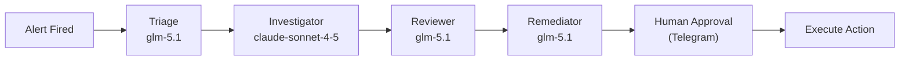

  <picture>
    <source media="(prefers-color-scheme: dark)" srcset="https://github.com/telemetryflow/.github/raw/main/docs/assets/tfo-logo-dark.svg">
    <source media="(prefers-color-scheme: light)" srcset="https://github.com/telemetryflow/.github/raw/main/docs/assets/tfo-logo-light.svg">
    
  </picture>

  <h3>TelemetryFlow Hermes — Self-Improving AI Agent for Observability Incident Response</h3>

---

# Changelog

All notable changes to **TelemetryFlow Hermes** will be documented in this file.

The format is based on [Keep a Changelog](https://keepachangelog.com/en/1.0.0/),
and this project adheres to [Semantic Versioning](https://semver.org/spec/v2.0.0.html).

## [1.0.0] - 2026-06-04

### Summary

**Initial public release** — Complete multi-agent AI incident response integration for TelemetryFlow Observability (TFO) Platform. Four specialised agents (Triage, Investigator, Reviewer, Remediator) form an autonomous pipeline with 37 plugin tools covering all 20 TFO Platform modules, 29 skills across 18 categories, comprehensive documentation, and full CI/CD.

### Added

#### Agents — Multi-Agent Team

- **Triage Agent** — Alert classification, severity assessment, known pattern auto-resolution, delegation to Investigator
- **Investigator Agent** — ClickHouse evidence gathering (metrics, logs, traces, exemplars), cross-signal correlation, root cause hypothesis formation
- **Reviewer Agent** — Independent verification in separate context, zero investigation bias, read-only tools only
- **Remediator Agent** — Gated remediation proposals (scale, restart, rollback, update_alert), 600s approval timeout with auto-escalation

#### Plugin Tools — 37 Tools (Python stdlib only)

- **Core Telemetry (5)**: `query_metrics`, `search_logs`, `list_traces`, `get_exemplars`, `query_correlations`
- **Monitoring (8)**: `check_k8s`, `check_infra`, `check_uptime`, `check_vm`, `check_agent`, `check_service_map`, `check_network_map`, `check_db_monitoring` (16 database types)
- **AI & LLM (7)**: `chat_with_context`, `stream_chat`, `manage_conversation`, `generate_insight`, `query_llm_usage`, `manage_provider`, `query_ai_intelligence`
- **Platform (8)**: `query_platform`, `query_account`, `query_audit`, `query_subscription`, `manage_dashboards`, `manage_alerts`, `manage_reports`, `manage_data_masking`
- **Infrastructure (6)**: `manage_retention`, `manage_tenancy`, `manage_iam`, `manage_sso`, `query_tfql`, `check_uptime` (expanded)
- **Remediation (3+1)**: `scale_deployment`, `restart_pod`, `rollback_deploy` (all gated) + `update_alert`

#### Skills — 29 Bundled

- **Monitoring (8)**: `k8s-pod-debug`, `uptime-monitoring`, `vm-monitoring`, `agent-monitoring`, `kubernetes-monitoring`, `service-map-analysis`, `network-map-analysis`, `check_uptime` (expanded)
- **Database Monitoring (2)**: `slow-query-detection`, `qan-analysis`
- **Observability (9)**: `payments-api-oom-rca`, `clickhouse-query-patterns`, `tfql-natural-language`, `alert-triage`, `remediation-gate`, `cross-signal-correlation`, `memory-pressure-investigation`, `tfo-llm-api`, `db-monitoring-analysis`
- **Platform (10)**: `alert-management`, `dashboard-management`, `report-automation`, `retention-management`, `audit-compliance`, `subscription-management`, `tenancy-administration`, `iam-administration`, `sso-configuration`, `tfql-query`

#### TFO LLM Module Integration

- Full ContextCollector support with 74 ContextType values
- Chat endpoint (`/api/v2/llm/chat/message`) with automatic telemetry context injection
- Streaming chat (`/api/v2/llm/chat/stream`) via SSE
- Insight generation (`/api/v2/llm/insights/generate`) — 5 types: chronology, prediction, recommendation, root-cause, pattern
- Provider management (`/api/v2/llm/providers`) — 15 types with AES-256-GCM encryption
- Conversation management — list, get, archive, delete
- LLM usage analytics from ClickHouse — summary, by-provider, by-model, by-context, interval trends

#### Authentication

- **Method A: API Key** — `tfs_*` format, SHA-256 hashed at rest, recommended for agents
- **Method B: JWT Login** — Email/password → Bearer token, user-scoped
- **Method C: Ingestion Headers** — `tfk_*/tfs_*` key pair for OTEL Collector agents

#### Security

- ClickHouse read-only user (`hermes_readonly`) with table-level SELECT grants on 20 telemetry tables
- Mandatory `workspace_id` on all ClickHouse queries
- Organization-scoped LLM endpoint access
- 90-turn hard cap per agent task
- Separate reviewer context for bias prevention
- Python stdlib only — zero pip dependencies

#### Scheduled Tasks — 6 Cron Jobs

| Job                    | Schedule  | Agent        | Purpose                     |
| ---------------------- | --------- | ------------ | --------------------------- |
| `health-check-metrics` | Every 15m | Investigator | Anomaly spike detection     |
| `log-error-sweep`      | Every 30m | Investigator | New ERROR pattern detection |
| `k8s-health-check`     | Every 10m | Investigator | Pod health monitoring       |
| `db-slow-query-check`  | Every 1h  | Investigator | QAN slow query detection    |
| `alert-fatigue-review` | Every 6h  | Triage       | Noise alert suppression     |
| `skill-curator`        | Every 7d  | Default      | Skill garbage collection    |

#### Lifecycle Hooks — 3 Hooks

- `on-alert-fired.sh` — Alert enrichment and logging before triage
- `pre-investigation.sh` — Investigation context logging
- `post-remediation.sh` — Remediation outcome tracking and verification scheduling

#### Deployment

- **Standard deployment** — External LLM providers (Anthropic, Zhipu/OpenCode Go)
- **Air-gapped deployment** — Ollama local models, zero external network
- **Docker deployment** — Multi-platform Docker image (amd64/arm64) with docker-compose profiles (core, monitoring, tools, all)
- 5 deployment scripts (`install.sh`, `setup-profiles.sh`, `setup-telegram.sh`, `verify-pipeline.sh`, `deploy-air-gapped.sh`)
- `run-container.sh` for building, tagging, pushing, and orchestrating Docker containers

#### Documentation — 28 Pages

- Wiki index with table of contents
- Architecture with system diagrams and sequence diagrams
- Agent docs (triage, investigator, reviewer, remediator) with mermaid workflows
- Complete tool reference with all parameters
- API docs (authentication, LLM module, context types)
- Deployment guides (standard, air-gapped)
- Security documentation
- Environment variable reference
- Operations guide (cron, hooks, troubleshooting)
- Marp presentation (1,154 lines)

#### Testing — 458 Tests, 97% Coverage

- `tests/conftest.py` — Shared fixtures (mock_env, mock_urlopen, capture_stdout, mock_exit)
- `tests/mocks/tfo_api.py` — MockTFOApi, mock response factories
- `tests/unit/test_shared.py` — \_shared.py utilities (API helpers, parse_args, constants)
- `tests/unit/test_*.py` — 34 tool test files
- `tests/integration/test_pipeline.py` — End-to-end pipeline tests

#### CI/CD

- **GitHub Actions** — 7-job CI (lint, test-unit, test-integration, security, coverage, build, summary) + Docker build + release workflow
- **GitLab CI/CD** — 5-stage pipeline matching GitHub Actions
- **Docker** — Multi-platform Dockerfile (python:3.13-slim-trixie) + docker-compose.yaml (4 profiles)
- **Makefile** — 10 CI targets (ci-deps, ci-lint, ci-test-unit, ci-test-integration, ci-test, ci-security, ci-coverage, ci-validate, ci-pipeline, ci)

### Technical Details

- **Zero pip dependencies** — all tools use Python stdlib (`urllib`, `json`, `sys`, `os`)
- **All queries through TFO API** — ClickHouse accessed via `POST /api/v2/telemetry/query`, not directly
- **Cost model** — ~$0.10-0.27/incident (vs ~$0.39 Claude-only)
- **MTTR improvement** — ~23 seconds (vs ~40 minutes manual)

---

**Built with ❤️ by Telemetri Data Indonesia**
