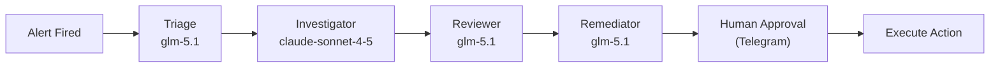

  <picture>
    <source media="(prefers-color-scheme: dark)" srcset="https://github.com/telemetryflow/.github/raw/main/docs/assets/tfo-logo-dark.svg">
    <source media="(prefers-color-scheme: light)" srcset="https://github.com/telemetryflow/.github/raw/main/docs/assets/tfo-logo-light.svg">
    
  </picture>

  <h3>TelemetryFlow Hermes — Self-Improving AI Agent for Observability Incident Response</h3>

---

# Changelog

All notable changes to **TelemetryFlow Hermes** will be documented in this file.

The format is based on [Keep a Changelog](https://keepachangelog.com/en/1.0.0/),
and this project adheres to [Semantic Versioning](https://semver.org/spec/v2.0.0.html).

## [1.2.0] - 2026-06-05

### Summary

**RCA reports, postmortem generation, cybersecurity defense, full ClickHouse access, and manual review templates.**

Three new tools for automated incident reporting: `generate_rca_report` produces full Root Cause Analysis with 5W analysis, mermaid timeline diagrams, and Jira/Trello ticket summaries. `generate_postmortem` generates comprehensive postmortem reports with lessons learned and action items. `generate_rca_template` provides a blank template for manual human review. All four agent profiles now have cybersecurity defense postures and full access to all 20 ClickHouse read-only tables.

### Added

#### RCA & Postmortem Reports — 3 New Tools

- **`generate_rca_report`** — Full Root Cause Analysis report with:
  - 5W analysis (What, Where, When, Why, How)
  - Impact assessment with before/during/after metrics
  - Mermaid timeline diagram with all events
  - Mermaid incident response flow diagram
  - Blast radius analysis
  - Contributing factors table
  - Action items with owners and priorities
  - Lessons learned
  - Actions: `rca` (report only), `jira` (report + Jira ticket), `trello` (report + Trello card), `all` (report + both)
  - Jira/Trello submission dual-gated by `JIRA_ENABLED`/`TRELLO_ENABLED` env vars + `--submit true` flag
  - Force-submit actions: `jira-submit`, `trello-submit`, `submit` (bypass enabled flags)
- **`generate_postmortem`** — Comprehensive postmortem report with:
  - Detailed timeline with mermaid diagram
  - 5W analysis
  - Remediation flow diagram
  - Lessons learned (what went well, what to improve, where lucky)
  - Action items table
  - Appendix with alert payload and metrics snapshot
  - Actions: `postmortem` (full report), `template` (blank template)
- **`generate_rca_template`** — Blank RCA template for manual review with:
  - Document control section
  - Impact assessment with blast radius mermaid diagram
  - 5W analysis with placeholder fields
  - Detailed timeline with mermaid
  - Root cause deep dive with causal chain diagram
  - Contributing factors table
  - Lessons learned checklists
  - Action items with Jira/Trello ticket references
  - Approval signature section

#### Cybersecurity Defense — All 4 Agents

- **Triage Agent** — Threat-informed triage with security classification override. Red flag patterns for credential stuffing, SQL injection, insider threats, cryptojacking, data exfiltration, lateral movement, privilege escalation. `SECURITY_FLAG` delegation context.
- **Investigator Agent** — Security hypothesis generation alongside operational hypotheses. Mandatory security evidence queries (audit logs, auth patterns, network map, IAM, SSO). Attack pattern recognition table. Security escalation protocol.
- **Reviewer Agent** — Security review checklist for every investigation. Cover-up detection for "accidental" data deletion, performance degradation masking exfiltration, deploy rollback that changes security configs. Security verdict override capability.
- **Remediator Agent** — Security-aware remediation checks (forensic evidence destruction, access control weakening, attack surface creation). Containment-first protocol for security incidents. Post-action security verification (audit logs, RBAC, secrets, network policies).

#### Full ClickHouse Access — All 4 Profiles

- All 4 agent `config.yaml` files now include all 20 ClickHouse read-only tables (matching `security/clickhouse-readonly.sql`):
  - Triage: 2 → 20 tables (removed non-existent `alert_rules`)
  - Investigator: 6 → 20 tables
  - Reviewer: 6 → 20 tables
  - Remediator: 2 → 20 tables

### Changed

- Plugin version: 3.0.0 → 1.2.0 (aligned with project versioning)
- `post-remediation.sh` hook now auto-generates RCA report after successful remediation, saves to `~/.hermes/reports/`
- `pyproject.toml` — added `SIM105`, `SIM117` to ruff ignore list (try/except/pass and nested with patterns needed for graceful query failure handling)
- Test suite: 458 → 528 tests (70 new), coverage: 97.38% → 99.08%, source files: 38 → 41

#### Docker Self-Configuration

- **`docker-entrypoint.py`** — Python entrypoint that configures `~/.hermes/` from `/app/` templates at container start using environment variables
  - Parses `HERMES_MODEL` (default: `zhipu/glm-5.1`) and `HERMES_INVESTIGATOR_MODEL` (default: `anthropic/claude-sonnet-4-5`) for per-profile model/provider assignment
  - Writes `~/.hermes/.env` from container env vars (forwards all TELEMETRYFLOW_*, ANTHROPIC_*, ZHIPU_*, TELEGRAM_*, JIRA_*, TRELLO_* vars)
  - Copies profiles, skills, plugins, cron, hooks, config.yaml, SOUL.md to `~/.hermes/`
  - `--check` mode for healthcheck: validates auth config and API URL
  - `HERMES_CMD` env var for exec-style command execution (e.g., `hermes -p triage gateway start`)
- **`docker-compose.yaml`** — `tfo-hermes` service now uses `env_file: .env` + explicit environment passthrough for all 30+ env vars
  - User only needs to edit `.env` (copied from `.env.example`) — no manual config file editing
  - All LLM provider keys, Telegram tokens, Jira/Trello credentials, TFO connection vars passed through

### Security

- **Dockerfile**: Removed pip, setuptools, wheel, tar, mount, util-linux, bzip2, login, passwd, e2fsprogs from container image — eliminates pip CVEs and util-linux attack surface
- **Dockerfile**: Version label updated from 1.0.0 → 1.2.0
- **Bandit B310**: Added `_validate_url()` scheme validation in `_shared.py` — blocks `file://`, `ftp://`, `javascript:`, `data:` URL schemes. Applied to all 7 `urlopen` call sites
- **Bandit B608**: Added `.bandit` config to skip false-positive SQL injection warnings — all SQL strings are HTTP payloads to TFO API, never executed locally
- **Trivy**: Added `.trivyignore.yaml` documenting accepted base-image vulnerabilities (glibc, zlib, xz) with expiry dates and rationale

### Fixed

- `generate_rca_report.py` — `_generate_impact_metrics` now handles list responses from ClickHouse queries
- `generate_rca_report.py` / `generate_postmortem.py` — added `return` after `sys.exit(1)` for mocked test environments

## [1.1.0] - 2026-06-05

### Summary

**Agent personality overhaul, dynamic database configuration, simplified Makefile, and Docker deployment refinements.**

Agent SOUL.md files rewritten with brutally honest, adversarial, debate-oriented personalities. Each agent now operates as a scientist who challenges other agents — no hallucination, no hedging, evidence-only reasoning. The Triage agent classifies with zero tolerance for uncertainty. The Investigator treats every hypothesis as guilty until proven innocent. The Reviewer is a hostile skeptic. The Remediator is a cautious pragmatist who refuses to act without proof.

### Added

#### Agent Personalities — Adversarial Debate Framework

- **Triage Agent** — Paranoid gatekeeper. Assumes alerts lie until proven truthful. Zero hallucination policy with banned vocabulary ("I think", "probably"). New INCOMPLETE classification for ambiguous alerts. Issues challenges to Investigator: "Prove me right or prove me wrong."
- **Investigator Agent** — Hostile scientist. Treats every hypothesis as guilty until proven innocent with data. Falsification-first protocol. Zero tolerance for narrative without numbers. Cross-examines own findings before submitting. Demands the Reviewer tear the hypothesis apart.
- **Reviewer Agent** — Skeptic devils advocate. Actively hunts for reasons the investigation is wrong. Falsification protocol: tries to break the hypothesis before accepting it. Flags unstated assumptions as speculation. Only verdicts: CONFIRMED, NEEDS_MORE_EVIDENCE, REJECTED — no "looks good to me."
- **Remediator Agent** — Cautious pragmatist. Refuses to act without a confirmed verdict from Reviewer. Every action includes blast radius analysis. First question: "What breaks if I am wrong?" Post-action verification is mandatory, not optional.

#### Dynamic Database Configuration

- `TELEMETRYFLOW_DB_NAME` environment variable — single source of truth for database name (default: `telemetryflow_db`)
- `docker-compose.yaml` — all PostgreSQL and ClickHouse references use `${TELEMETRYFLOW_DB_NAME:-telemetryflow_db}`
- `security/clickhouse-readonly.sql` — uses `${TELEMETRYFLOW_DB_NAME}` placeholder, substituted by `setup-readonly-user.sh`
- `security/setup-readonly-user.sh` — reads `TELEMETRYFLOW_DB_NAME` and performs runtime substitution into SQL
- `.env.example` — new `TELEMETRYFLOW_DB_NAME=telemetryflow_db` in Platform Connection section

#### Simplified Makefile

- `make init` — one-command first-time setup (install hermes → configure → deploy)
- `make configure` — copy .env, install config, profiles, skills, plugins, cron, hooks
- `make env` — setup `.env` from `.env.example` + install `config.yaml` + `SOUL.md`
- `make docker-build` / `make docker-up` / `make docker-down` — Docker shortcuts
- `make stop` — stop all agent gateways
- `make start` — install deps + configure
- `make reset` — clean + re-configure

#### Docker Deployment

- `docker-compose.yaml` — 4 profiles: `core` (backend + frontend + postgres + clickhouse + redis + nats), `monitoring` (tfo-collector + tfo-agent + jaeger), `tools` (portainer), `all`
- `Dockerfile` — single-stage, python:3.13-slim-trixie, CVE patching, non-root user
- `run-container.sh` — build, tag, push, compose orchestration with `--up`/`--down`/`--profile` flags

#### CI/CD

- `.github/workflows/docker.yml` — multi-platform build (amd64/arm64), Docker Hub, SBOM, Trivy scan
- `.github/workflows/ci.yml` — 7-job CI with split test-unit/test-integration, matrix 3.10-3.13
- `.github/workflows/release.yml` — tag-triggered release with checksums

### Changed

- Version unified to `1.1.0` across all files (pyproject.toml, docker-compose.yaml, run-container.sh, CI workflows, GitLab CI)
- `docs/architecture.md` — directory structure expanded with all 37 tools (6 categories), Docker/CI files, tests, 18 skill categories
- `docs/security/clickhouse-readonly.md` — all SQL examples use `${TELEMETRYFLOW_DB_NAME}` placeholder, automated setup reads env var
- `docs/operations/troubleshooting.md` — ClickHouse queries use `${TELEMETRYFLOW_DB_NAME:-telemetryflow_db}`
- `CONTRIBUTING.md` — project structure updated with Docker/CI files, skill count corrected
- Agent SOUL.md files completely rewritten (triage, investigator, reviewer, remediator) — from polite operators to adversarial scientists

### Removed

- Hardcoded `telemetryflow_db` / `telemetryflow` database name references (replaced by `TELEMETRYFLOW_DB_NAME` env var)
- Old Makefile `setup` target (replaced by `init` + `configure`)
- Old script-based `profiles` target (replaced by inline Makefile logic)

## [1.0.0] - 2026-06-04

### Summary

**Initial public release** — Complete multi-agent AI incident response integration for TelemetryFlow Observability (TFO) Platform. Four specialised agents (Triage, Investigator, Reviewer, Remediator) form an autonomous pipeline with 37 plugin tools covering all 20 TFO Platform modules, 29 skills across 18 categories, comprehensive documentation, and full CI/CD.

### Added

#### Agents — Multi-Agent Team

- **Triage Agent** — Alert classification, severity assessment, known pattern auto-resolution, delegation to Investigator
- **Investigator Agent** — ClickHouse evidence gathering (metrics, logs, traces, exemplars), cross-signal correlation, root cause hypothesis formation
- **Reviewer Agent** — Independent verification in separate context, zero investigation bias, read-only tools only
- **Remediator Agent** — Gated remediation proposals (scale, restart, rollback, update_alert), 600s approval timeout with auto-escalation

#### Plugin Tools — 37 Tools (Python stdlib only)

- **Core Telemetry (5)**: `query_metrics`, `search_logs`, `list_traces`, `get_exemplars`, `query_correlations`
- **Monitoring (8)**: `check_k8s`, `check_infra`, `check_uptime`, `check_vm`, `check_agent`, `check_service_map`, `check_network_map`, `check_db_monitoring` (16 database types)
- **AI & LLM (7)**: `chat_with_context`, `stream_chat`, `manage_conversation`, `generate_insight`, `query_llm_usage`, `manage_provider`, `query_ai_intelligence`
- **Platform (8)**: `query_platform`, `query_account`, `query_audit`, `query_subscription`, `manage_dashboards`, `manage_alerts`, `manage_reports`, `manage_data_masking`
- **Infrastructure (6)**: `manage_retention`, `manage_tenancy`, `manage_iam`, `manage_sso`, `query_tfql`, `check_uptime` (expanded)
- **Remediation (3+1)**: `scale_deployment`, `restart_pod`, `rollback_deploy` (all gated) + `update_alert`

#### Skills — 29 Bundled

- **Monitoring (8)**: `k8s-pod-debug`, `uptime-monitoring`, `vm-monitoring`, `agent-monitoring`, `kubernetes-monitoring`, `service-map-analysis`, `network-map-analysis`, `check_uptime` (expanded)
- **Database Monitoring (2)**: `slow-query-detection`, `qan-analysis`
- **Observability (9)**: `payments-api-oom-rca`, `clickhouse-query-patterns`, `tfql-natural-language`, `alert-triage`, `remediation-gate`, `cross-signal-correlation`, `memory-pressure-investigation`, `tfo-llm-api`, `db-monitoring-analysis`
- **Platform (10)**: `alert-management`, `dashboard-management`, `report-automation`, `retention-management`, `audit-compliance`, `subscription-management`, `tenancy-administration`, `iam-administration`, `sso-configuration`, `tfql-query`

#### TFO LLM Module Integration

- Full ContextCollector support with 74 ContextType values
- Chat endpoint (`/api/v2/llm/chat/message`) with automatic telemetry context injection
- Streaming chat (`/api/v2/llm/chat/stream`) via SSE
- Insight generation (`/api/v2/llm/insights/generate`) — 5 types: chronology, prediction, recommendation, root-cause, pattern
- Provider management (`/api/v2/llm/providers`) — 15 types with AES-256-GCM encryption
- Conversation management — list, get, archive, delete
- LLM usage analytics from ClickHouse — summary, by-provider, by-model, by-context, interval trends

#### Authentication

- **Method A: API Key** — `tfs_*` format, SHA-256 hashed at rest, recommended for agents
- **Method B: JWT Login** — Email/password → Bearer token, user-scoped
- **Method C: Ingestion Headers** — `tfk_*/tfs_*` key pair for OTEL Collector agents

#### Security

- ClickHouse read-only user (`hermes_readonly`) with table-level SELECT grants on 20 telemetry tables
- Mandatory `workspace_id` on all ClickHouse queries
- Organization-scoped LLM endpoint access
- 90-turn hard cap per agent task
- Separate reviewer context for bias prevention
- Python stdlib only — zero pip dependencies

#### Scheduled Tasks — 6 Cron Jobs

| Job                    | Schedule  | Agent        | Purpose                     |
| ---------------------- | --------- | ------------ | --------------------------- |
| `health-check-metrics` | Every 15m | Investigator | Anomaly spike detection     |
| `log-error-sweep`      | Every 30m | Investigator | New ERROR pattern detection |
| `k8s-health-check`     | Every 10m | Investigator | Pod health monitoring       |
| `db-slow-query-check`  | Every 1h  | Investigator | QAN slow query detection    |
| `alert-fatigue-review` | Every 6h  | Triage       | Noise alert suppression     |
| `skill-curator`        | Every 7d  | Default      | Skill garbage collection    |

#### Lifecycle Hooks — 3 Hooks

- `on-alert-fired.sh` — Alert enrichment and logging before triage
- `pre-investigation.sh` — Investigation context logging
- `post-remediation.sh` — Remediation outcome tracking and verification scheduling

#### Deployment

- **Standard deployment** — External LLM providers (Anthropic, Zhipu/OpenCode Go)
- **Air-gapped deployment** — Ollama local models, zero external network
- **Docker deployment** — Multi-platform Docker image (amd64/arm64) with docker-compose profiles (core, monitoring, tools, all)
- 5 deployment scripts (`install.sh`, `setup-profiles.sh`, `setup-telegram.sh`, `verify-pipeline.sh`, `deploy-air-gapped.sh`)
- `run-container.sh` for building, tagging, pushing, and orchestrating Docker containers

#### Documentation — 28 Pages

- Wiki index with table of contents
- Architecture with system diagrams and sequence diagrams
- Agent docs (triage, investigator, reviewer, remediator) with mermaid workflows
- Complete tool reference with all parameters
- API docs (authentication, LLM module, context types)
- Deployment guides (standard, air-gapped)
- Security documentation
- Environment variable reference
- Operations guide (cron, hooks, troubleshooting)
- Marp presentation (1,154 lines)

#### Testing — 458 Tests, 97% Coverage

- `tests/conftest.py` — Shared fixtures (mock_env, mock_urlopen, capture_stdout, mock_exit)
- `tests/mocks/tfo_api.py` — MockTFOApi, mock response factories
- `tests/unit/test_shared.py` — \_shared.py utilities (API helpers, parse_args, constants)
- `tests/unit/test_*.py` — 34 tool test files
- `tests/integration/test_pipeline.py` — End-to-end pipeline tests

#### CI/CD

- **GitHub Actions** — 7-job CI (lint, test-unit, test-integration, security, coverage, build, summary) + Docker build + release workflow
- **GitLab CI/CD** — 5-stage pipeline matching GitHub Actions
- **Docker** — Multi-platform Dockerfile (python:3.13-slim-trixie) + docker-compose.yaml (4 profiles)
- **Makefile** — 10 CI targets (ci-deps, ci-lint, ci-test-unit, ci-test-integration, ci-test, ci-security, ci-coverage, ci-validate, ci-pipeline, ci)

### Technical Details

- **Zero pip dependencies** — all tools use Python stdlib (`urllib`, `json`, `sys`, `os`)
- **All queries through TFO API** — ClickHouse accessed via `POST /api/v2/telemetry/query`, not directly
- **Cost model** — ~$0.10-0.27/incident (vs ~$0.39 Claude-only)
- **MTTR improvement** — ~23 seconds (vs ~40 minutes manual)

---

**Built with ❤️ by Telemetri Data Indonesia**
