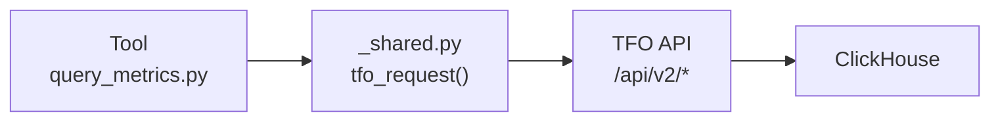

<div align="center">
  <picture>
    <source media="(prefers-color-scheme: dark)" srcset="https://github.com/telemetryflow/.github/raw/main/docs/assets/tfo-logo-dark.svg">
    <source media="(prefers-color-scheme: light)" srcset="https://github.com/telemetryflow/.github/raw/main/docs/assets/tfo-logo-light.svg">
    
  </picture>

  <h3>TelemetryFlow Hermes — Self-Improving AI Agent for Observability Incident Response</h3>

[](CHANGELOG.md)
[](https://opensource.org/licenses/Apache-2.0)
[](https://www.python.org/)
[](https://github.com/NousResearch/hermes-agent)
[](tests/)
[](tests/)
[](plugins/telemetryflow/plugin.yaml)
[](docs/api/context-types.md)
[](security/clickhouse-readonly.sql)
[](docs/)

</div>

---

# Contributing to TelemetryFlow Hermes

Thank you for your interest in contributing! This guide covers everything you need to start contributing to TelemetryFlow Hermes.

## Table of Contents

- [Code of Conduct](#code-of-conduct)
- [Getting Started](#getting-started)
- [Development Setup](#development-setup)
- [Project Structure](#project-structure)
- [Making Changes](#making-changes)
- [Testing](#testing)
- [Submitting Changes](#submitting-changes)
- [Style Guide](#style-guide)
- [Architecture Guidelines](#architecture-guidelines)
- [Release Process](#release-process)

## Code of Conduct

Be respectful, constructive, and professional. We follow the [Contributor Covenant](https://www.contributor-covenant.org/) code of conduct.

## Getting Started

### Prerequisites

| Requirement  | Version | Install                                      |
| ------------ | ------- | -------------------------------------------- |
| Python 3     | 3.8+    | `python3 --version`                          |
| pytest       | Latest  | `pip install pytest pytest-cov`              |
| ruff         | Latest  | `pip install ruff`                           |
| Hermes Agent | Latest  | See [Quick Start](./docs/getting-started.md) |

### Fork and Clone

```bash
# Fork the repository on GitHub, then:
git clone https://github.com/YOUR_USERNAME/telemetryflow-hermes.git
cd telemetryflow-hermes
```

## Development Setup

```bash
# Install dev dependencies
pip install pytest pytest-cov ruff bandit mypy

# Verify setup
make test

# Run linter
make lint

# Run CI pipeline locally
make ci-pipeline
```

## Project Structure

```
telemetryflow-hermes/
├── plugins/telemetryflow/tools/    # 40 tool implementations (Python stdlib only)
├── profiles/                       # Agent profiles (triage, investigator, reviewer, remediator)
├── skills/                         # 29 skills across 18 categories
├── tests/                          # Test suite (472 tests, 97% coverage)
│   ├── conftest.py                 # Shared fixtures
│   ├── mocks/                      # Mock objects (MockTFOApi, response factories)
│   ├── unit/                       # Unit tests per tool (34 files)
│   └── integration/                # Integration tests
├── docs/                           # Documentation wiki (28+ pages)
├── cron/                           # Scheduled investigation jobs
├── scripts/                        # Deployment scripts
├── security/                       # ClickHouse read-only SQL
├── hooks/                          # Lifecycle hooks
├── Dockerfile                      # Multi-stage Docker (python:3.13-slim-trixie)
├── docker-compose.yaml             # 4 profiles: core, monitoring, tools, all
├── run-container.sh                # Build, tag, push, compose orchestration
├── Makefile                        # fmt, lint, test, build, ci targets
├── pyproject.toml                  # pytest, ruff, coverage config
└── .github/workflows/              # CI (ci.yml), Docker (docker.yml), Release (release.yml)
```

## Making Changes

### Tool Development

All tools follow the same pattern:

1. **Create the tool** in `plugins/telemetryflow/tools/<tool_name>.py`
2. **Use `_shared.py` helpers**: `tfo_request()`, `clickhouse_query()`, `parse_args()`, `output_json()`
3. **Register in `plugin.yaml`** with name, description, command, args
4. **If it's a write operation**, add `requires_approval: true`
5. **Write tests** in `tests/unit/test_<tool_name>.py`

**Tool template:**

```python
#!/usr/bin/env python3
"""Description of what the tool does."""

import sys
import os

sys.path.insert(0, os.path.join(os.path.dirname(__file__)))
from _shared import tfo_request, parse_args, output_json


def main():
    args = parse_args()
    required_param = args.get("required_param")
    if not required_param:
        print("ERROR: --required_param is required", file=sys.stderr)
        sys.exit(1)

    result = tfo_request("/api/v2/endpoint", method="GET", params={
        "param": required_param,
    })
    if result is not None:
        output_json(result)


if __name__ == "__main__":
    main()
```

### Skill Development

Skills are Markdown files with YAML frontmatter:

```markdown
---
name: skill-name
description: >
  When to activate this skill.
  version: 1.2.0
author: agent
---

## Procedure

1. Step one
2. Step two

## Pitfalls

- Common mistake to avoid

## Verification

- How to verify success
```

### Documentation

All docs use **GitHub-flavored Markdown** with **mermaid diagrams** for architecture visualizations. See [docs/README.md](./docs/README.md) for the wiki index.

## Testing

### Running Tests

```bash
# All tests
make test

# Unit tests only
pytest tests/unit -v

# Integration tests only
pytest tests/integration -v

# With coverage (95%+ required)
make test-cov

# Specific test file
pytest tests/unit/test_query_metrics.py -v
```

### Test Coverage Requirements

| Layer                           | Minimum Coverage |
| ------------------------------- | ---------------- |
| Shared utilities (`_shared.py`) | 95%              |
| Individual tools                | 90%              |
| Overall                         | **95%**          |

### Writing Tests

Follow the pattern in `tests/unit/test_query_metrics.py`:

```python
"""Tests for <tool_name>.py tool."""

import json
from unittest import mock
import pytest


def _import_tool():
    import importlib
    import <tool_module>
    importlib.reload(<tool_module>)
    return <tool_module>


class Test<ToolName>:
    def test_basic(self, mock_env, mock_urlopen, capture_stdout):
        _, mock_resp = mock_urlopen
        mock_resp.read.return_value = json.dumps({"status": "ok"}).encode("utf-8")

        with mock.patch("sys.argv", ["tool.py", "--param", "value"]):
            tool = _import_tool()
            tool.main()

        output = json.loads(capture_stdout.getvalue())
        assert "status" in output

    def test_error_handling(self, mock_env, mock_urlopen_error, mock_exit):
        with mock.patch("sys.argv", ["tool.py", "--param", "value"]):
            tool = _import_tool()
            tool.main()
            mock_exit.assert_called_with(1)

    def test_missing_required_param(self, mock_env, mock_exit):
        with mock.patch("sys.argv", ["tool.py"]):
            tool = _import_tool()
            tool.main()
            mock_exit.assert_called_with(1)
```

### Available Fixtures

| Fixture                   | Description                                               |
| ------------------------- | --------------------------------------------------------- |
| `mock_env`                | Sets all `TELEMETRYFLOW_*` environment variables          |
| `mock_urlopen`            | Mocks `urllib.request.urlopen` with configurable response |
| `mock_urlopen_error`      | Mocks HTTP error (404)                                    |
| `mock_urlopen_conn_error` | Mocks connection error                                    |
| `capture_stdout`          | Captures stdout output                                    |
| `mock_exit`               | Mocks `sys.exit` to prevent test termination              |

## Submitting Changes

### Pull Request Process

1. **Create a feature branch**: `git checkout -b feature/amazing-feature`
2. **Write code** following the style guide below
3. **Write tests** — maintain 95%+ coverage
4. **Run CI locally**: `make ci-pipeline`
5. **Update documentation** if adding new features
6. **Commit**: `git commit -m 'Add amazing feature'`
7. **Push**: `git push origin feature/amazing-feature`
8. **Open a Pull Request** against `main`

### PR Checklist

- [ ] All tests pass (`make test`)
- [ ] Coverage remains ≥95% (`make test-cov`)
- [ ] Linter passes (`make lint`)
- [ ] No secrets committed
- [ ] Documentation updated (if applicable)
- [ ] CHANGELOG.md updated (if applicable)

## Style Guide

### Python

- **Python 3.8+** compatible (no walrus operator in critical paths)
- **stdlib only** — no external pip dependencies in tools
- **No comments** unless requested
- **Type hints** are welcome but not required
- **Line length**: 120 characters max
- **Formatter**: ruff (configured in `pyproject.toml`)

### Naming Conventions

| Type                  | Convention        | Example                                       |
| --------------------- | ----------------- | --------------------------------------------- |
| Tool files            | `snake_case.py`   | `query_metrics.py`                            |
| Test files            | `test_<tool>.py`  | `test_query_metrics.py`                       |
| Skill files           | `SKILL.md`        | `skills/observability/k8s-pod-debug/SKILL.md` |
| Profile dirs          | `kebab-case/`     | `profiles/triage/`                            |
| Environment variables | `TELEMETRYFLOW_*` | `TELEMETRYFLOW_API_KEY`                       |

### Markdown

- **GitHub-flavored Markdown** for all documentation
- **Mermaid diagrams** for architecture and flow visualization
- **Tables** for reference data
- **Code blocks** with language annotation

## Architecture Guidelines

### Zero Dependencies Rule

All plugin tools must use **Python standard library only**. No `requests`, `httpx`, `click`, or any external package. This ensures:

- Maximum portability (no virtualenv needed)
- Zero supply chain risk
- Instant deployment on any system with Python 3

### TFO API Communication

All tools communicate with TelemetryFlow Platform through `_shared.py`:



Never connect to ClickHouse directly. Always go through the TFO API for:

- Authentication and authorization
- Workspace scoping
- Audit logging
- Rate limiting

### Environment Variable Prefix

All environment variables use the `TELEMETRYFLOW_` prefix:

- `TELEMETRYFLOW_API_KEY`
- `TELEMETRYFLOW_API_URL`
- `TELEMETRYFLOW_ORGANIZATION_ID`
- `TELEMETRYFLOW_WORKSPACE_ID`

Never use `TFO_` or other abbreviations.

## Release Process

1. Update `VERSION` in `pyproject.toml` and `.github/workflows/ci.yml`
2. Update `CHANGELOG.md` with the new version section
3. Commit: `git commit -m "chore: bump version to X.Y.Z"`
4. Tag: `git tag vX.Y.Z`
5. Push: `git push origin main --tags`
6. GitHub Actions automatically creates the release

---

**Built with ❤️ by Telemetri Data Indonesia**
