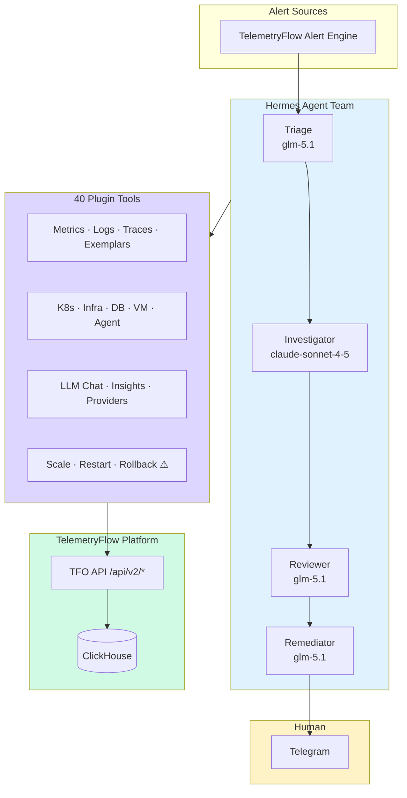

<div align="center">
  <picture>
    <source media="(prefers-color-scheme: dark)" srcset="https://github.com/telemetryflow/.github/raw/main/docs/assets/tfo-logo-dark.svg">
    <source media="(prefers-color-scheme: light)" srcset="https://github.com/telemetryflow/.github/raw/main/docs/assets/tfo-logo-light.svg">
    
  </picture>

  <h3>TelemetryFlow Hermes — AI Agent for Observability Incident Response</h3>

[](CHANGELOG.md)
[](https://opensource.org/licenses/Apache-2.0)
[](https://www.python.org/)
[](https://github.com/NousResearch/hermes-agent)
[](tests/)
[](tests/)
[](plugins/telemetryflow/plugin.yaml)
[](docs/api/context-types.md)
[](security/clickhouse-readonly.sql)
[](docs/)

</div>

---

## What It Does

Four AI agents work as a team to respond to production incidents. Each agent is a specialist that challenges the others — like scientists debating evidence.

```
Alert → Triage → Investigator → Reviewer → Remediator → Human Approves → Fixed
```

1. **Triage** classifies the alert (real, known, noise, incomplete)
2. **Investigator** gathers evidence from metrics, logs, traces, exemplars
3. **Reviewer** independently challenges the investigation for bias
4. **Remediator** proposes a fix — human approves via Telegram

You only touch step 5. Steps 1–4 are fully autonomous.

## Quick Start

```bash
git clone https://github.com/telemetryflow/telemetryflow-hermes.git
cd telemetryflow-hermes

# First-time setup (install hermes + configure everything)
make init

# Edit your API keys
vim ~/.hermes/.env

# Verify it works
make verify

# Start the agents
make deploy
```

That's it. `make init` handles everything: installing Hermes Agent, copying configs, setting up 4 agent profiles, 29 skills, 37 plugin tools, cron jobs, and lifecycle hooks.

## Makefile Commands

### Setup & Deploy

| Command          | What It Does                                                   |
| ---------------- | -------------------------------------------------------------- |
| `make init`      | First-time setup: install hermes + configure + deploy          |
| `make configure` | Install profiles, skills, plugins, cron, hooks to `~/.hermes/` |
| `make deploy`    | Start all 4 Telegram agent gateways                            |
| `make stop`      | Stop all agent gateways                                        |
| `make status`    | Check gateway status                                           |
| `make verify`    | End-to-end pipeline verification                               |
| `make doctor`    | Run `hermes doctor --fix`                                      |

### Docker

| Command             | What It Does                                                    |
| ------------------- | --------------------------------------------------------------- |
| `make docker-build` | Build Docker image                                              |
| `make docker-up`    | Start containers (`PROFILE=core make docker-up` for full stack) |
| `make docker-down`  | Stop all containers                                             |
| `make docker-logs`  | Tail Hermes container logs                                      |

### Development

| Command          | What It Does                                   |
| ---------------- | ---------------------------------------------- |
| `make test`      | Run all tests (unit + integration)             |
| `make test-cov`  | Run tests with coverage (95%+ required)        |
| `make lint`      | Run ruff linter                                |
| `make fmt`       | Format code with ruff                          |
| `make typecheck` | Run mypy type checker                          |
| `make check`     | All quality checks (format + lint + typecheck) |
| `make ci`        | Full CI pipeline locally                       |
| `make clean`     | Remove installed components + build artifacts  |

## Configuration

Copy `.env.example` to `~/.hermes/.env` and fill in:

```env
# Required
TELEMETRYFLOW_API_KEY=tfs_xxxxx                        # API Key
TELEMETRYFLOW_API_URL=http://localhost:3000/api/v2      # Platform URL
TELEMETRYFLOW_ORGANIZATION_ID=your-org-uuid             # For LLM endpoints
TELEMETRYFLOW_WORKSPACE_ID=your-workspace-uuid          # For telemetry queries

# Agent LLM Keys
ANTHROPIC_API_KEY=sk-ant-xxxxx                          # Investigator (claude-sonnet-4-5)
ZHIPU_API_KEY=your-zhipu-key                            # Triage/Reviewer/Remediator (glm-5.1)

# Database (shared by PostgreSQL + ClickHouse)
TELEMETRYFLOW_DB_NAME=telemetryflow_db                  # Default database name
```

Three auth methods: API Key (`tfs_*`), JWT Login, Ingestion Headers. See [.env.example](./.env.example) for all options.

## Agent Team

| Agent            | Model             | Job                                            | Turns | Access        |
| ---------------- | ----------------- | ---------------------------------------------- | ----- | ------------- |
| **Triage**       | glm-5.1           | Classify alerts, challenge signal authenticity | 30    | Read-only     |
| **Investigator** | claude-sonnet-4-5 | Gather evidence, form root cause hypothesis    | 45    | Read-only     |
| **Reviewer**     | glm-5.1           | Challenge investigation, hunt for bias         | 20    | Read-only     |
| **Remediator**   | glm-5.1           | Propose fix, wait for human approval           | 15    | Write (gated) |

### Agent Personalities

Each agent operates with a **zero hallucination** policy and **adversarial mindset**:

- **Triage**: Paranoid gatekeeper. Assumes alerts lie until proven truthful. Never guesses.
- **Investigator**: Hostile scientist. Treats every hypothesis as guilty until proven innocent with data. Cross-examines own findings.
- **Reviewer**: Devil's advocate. Actively hunts for reasons the investigation is wrong. Only verdicts: CONFIRMED / NEEDS_MORE_EVIDENCE / REJECTED.
- **Remediator**: Cautious pragmatist. Refuses to act without confirmed verdict. First question: "What breaks if I'm wrong?"

## 40 Plugin Tools (All 20 TFO Modules)

All tools use Python stdlib only — zero pip dependencies, zero supply chain risk.

| Category       | Count | Tools                                                                                                                                                 |
| -------------- | ----- | ----------------------------------------------------------------------------------------------------------------------------------------------------- |
| Core Telemetry | 5     | `query_metrics`, `search_logs`, `list_traces`, `get_exemplars`, `query_correlations`                                                                  |
| Monitoring     | 8     | `check_k8s`, `check_infra`, `check_uptime`, `check_vm`, `check_agent`, `check_service_map`, `check_network_map`, `check_db_monitoring`                |
| AI & LLM       | 7     | `chat_with_context`, `stream_chat`, `manage_conversation`, `generate_insight`, `query_llm_usage`, `manage_provider`, `query_ai_intelligence`          |
| Platform       | 8     | `query_platform`, `query_account`, `query_audit`, `query_subscription`, `manage_dashboards`, `manage_alerts`, `manage_reports`, `manage_data_masking` |
| Infrastructure | 6     | `manage_retention`, `manage_tenancy`, `manage_iam`, `manage_sso`, `query_tfql`, `check_uptime` (expanded)                                             |
| Remediation | 3+1 | `scale_deployment` ⚠, `restart_pod` ⚠, `rollback_deploy` ⚠ + `update_alert` ⚠ |
| RCA & Postmortem | 3 | `generate_rca_report`, `generate_postmortem`, `generate_rca_template` |

⚠ = requires human approval

## Cost

| Agent                            | Cost/Incident            |
| -------------------------------- | ------------------------ |
| Triage (glm-5.1)                 | ~$0.01                   |
| Investigator (claude-sonnet-4-5) | ~$0.05-0.15              |
| Reviewer (glm-5.1)               | ~$0.03-0.08              |
| Remediator (glm-5.1)             | ~$0.01-0.03              |
| **Total**                        | **~$0.10-0.27/incident** |

## Architecture



## Project Stats

| Metric                | Count                        |
| --------------------- | ---------------------------- |
| Agent Profiles        | 4                            |
| Plugin Tools          | 40                           |
| TFO Modules           | 20 (all)                     |
| Bundled Skills        | 29                           |
| Skill Categories      | 18                           |
| Context Types         | 74                           |
| Provider Types        | 15                           |
| Cron Jobs             | 6                            |
| Lifecycle Hooks       | 3                            |
| Tests                 | 472 (97% coverage)           |
| Documentation Pages   | 28+                          |
| CI/CD Pipelines       | 3 (GitHub + Docker + GitLab) |
| External Dependencies | 0                            |

## Security

- **Read-only ClickHouse** — `hermes_readonly` user, table-level SELECT grants on 20 tables
- **Human-in-the-loop** — 4 remediation tools require approval (600s timeout → auto-escalate)
- **90-turn hard cap** — prevents runaway loops
- **Mandatory `workspace_id`** — prevents cross-tenant data leakage
- **Separate reviewer context** — prevents investigation bias
- **Python stdlib only** — zero supply chain risk
- **Secrets in `.env` only** — never in `config.yaml`
- **Dynamic DB name** — `TELEMETRYFLOW_DB_NAME` env var, never hardcoded

## Documentation

| Document                                                     | Description                          |
| ------------------------------------------------------------ | ------------------------------------ |
| [Architecture](./docs/architecture.md)                       | System design, data flow, diagrams   |
| [Getting Started](./docs/getting-started.md)                 | Installation and first investigation |
| [Tool Reference](./docs/tools/reference.md)                  | All 37 tools with parameters         |
| [LLM Module](./docs/api/llm-module.md)                       | TFO LLM API integration              |
| [Context Types](./docs/api/context-types.md)                 | All 74 ContextType values            |
| [Deployment](./docs/deployment/README.md)                    | Standard, Docker, air-gapped         |
| [Security](./docs/security/README.md)                        | Layered security model               |
| [Troubleshooting](./docs/operations/troubleshooting.md)      | Common issues and solutions          |
| [Environment Variables](./docs/configuration/environment.md) | Complete `.env` reference            |

## Contributing

See [CONTRIBUTING.md](./CONTRIBUTING.md).

## License

Apache-2.0 — see [LICENSE](./LICENSE).

---

**Built with ❤️ by Telemetri Data Indonesia**
