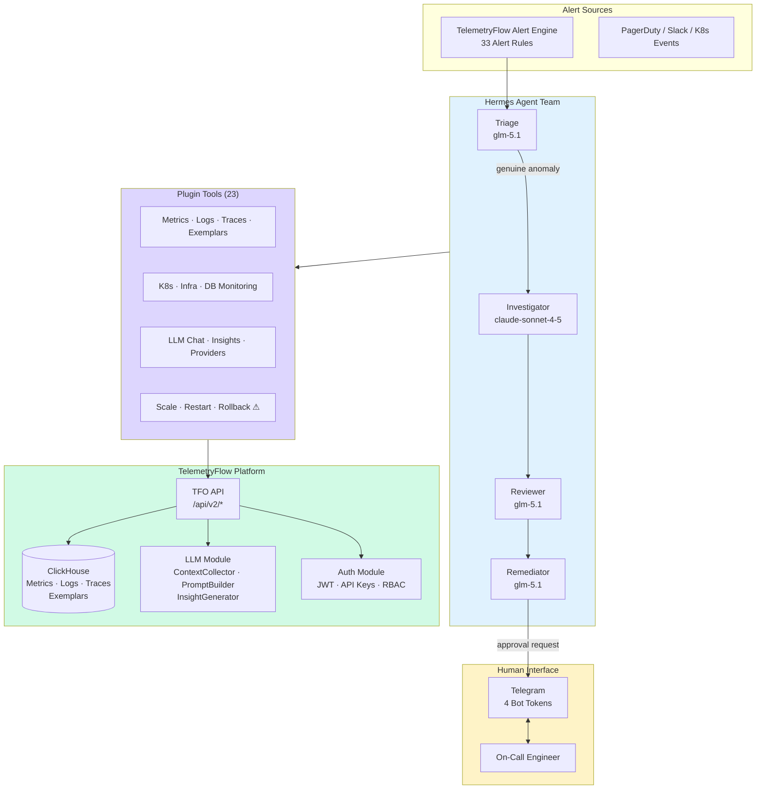
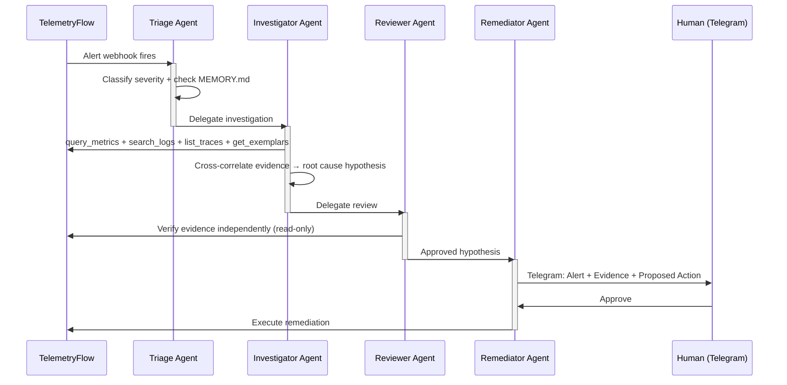

<div align="center">
  <picture>
    <source media="(prefers-color-scheme: dark)" srcset="https://github.com/telemetryflow/.github/raw/main/docs/assets/tfo-logo-dark.svg">
    <source media="(prefers-color-scheme: light)" srcset="https://github.com/telemetryflow/.github/raw/main/docs/assets/tfo-logo-light.svg">
    
  </picture>

  <h3>TelemetryFlow Hermes — Self-Improving AI Agent for Observability Incident Response</h3>

[](CHANGELOG.md)
[](https://opensource.org/licenses/Apache-2.0)
[](https://www.python.org/)
[](https://github.com/NousResearch/hermes-agent)
[](tests/)
[](tests/)
[](plugins/telemetryflow/plugin.yaml)
[](docs/api/context-types.md)
[](security/clickhouse-readonly.sql)
[](docs/)

</div>

---

## Overview

**TelemetryFlow Hermes** deploys a self-improving, multi-agent AI team for autonomous incident response against the TelemetryFlow Observability Platform. Four specialised agents — Triage, Investigator, Reviewer, and Remediator — form an autonomous pipeline that classifies alerts, gathers evidence from all four telemetry signals (metrics, logs, traces, exemplars), independently verifies root cause hypotheses, and proposes gated remediation with human approval.

Steps 1–4 are fully autonomous. You only touch step 5.

```
Alert Fired → Triage → Investigator → Reviewer → Remediator → Human Approval
```

## Features

### Multi-Agent Team

- **Triage Agent** — Classifies alerts by severity, auto-resolves known patterns, routes genuine anomalies
- **Investigator Agent** — Queries ClickHouse for metrics, logs, traces, exemplars; cross-correlates evidence; forms root cause hypotheses
- **Reviewer Agent** — Independent verification in a separate context with zero investigation bias (read-only tools)
- **Remediator Agent** — Proposes gated remediation actions (scale, restart, rollback, update_alert) with human-in-the-loop approval

### TelemetryFlow Integration (23 Tools)

- **Core Telemetry** (5) — query_metrics, search_logs, list_traces, get_exemplars, query_correlations
- **Infrastructure** (3) — check_k8s, check_infra, check_db_monitoring (16 DB types)
- **Platform** (5) — check_uptime, query_ai_intelligence, query_platform, query_account, manage_data_masking
- **LLM Module** (6) — chat_with_context, stream_chat, manage_conversation, generate_insight, query_llm_usage, manage_provider
- **Remediation** (4) — scale_deployment, restart_pod, rollback_deploy, update_alert (all gated)

### TFO LLM Module Support

- **95+ ContextType values** — all context types from TFO's ContextCollector (4,440 lines)
- **15 LLM Provider types** — anthropic, openai, google, gemini, deepseek, qwen, ollama, mistral, grok, kimi, zhipu, mimo, openrouter, custom
- **5 Insight types** — chronology, prediction, recommendation, root-cause, pattern
- **7 Adapter classes** — Claude, OpenAI, Gemini, DeepSeek, Qwen, Ollama, Custom

### Self-Improving Skills (11 Bundled)

- **Observability** (9) — k8s-pod-debug, payments-api-oom-rca, clickhouse-query-patterns, tfql-natural-language, alert-triage, remediation-gate, cross-signal-correlation, memory-pressure-investigation, tfo-llm-api
- **Database Monitoring** (2) — slow-query-detection, qan-analysis
- Skills auto-evolve through investigation experience (GEPA optimization available offline)

### Cost Optimization

| Agent        | Model                         | Cost/Incident            |
| ------------ | ----------------------------- | ------------------------ |
| Triage       | glm-5.1 (OpenCode Go)         | ~$0.01                   |
| Investigator | claude-sonnet-4-5 (Anthropic) | ~$0.05-0.15              |
| Reviewer     | glm-5.1 (OpenCode Go)         | ~$0.03-0.08              |
| Remediator   | glm-5.1 (OpenCode Go)         | ~$0.01-0.03              |
| **Total**    |                               | **~$0.10-0.27/incident** |

## Architecture

### System Architecture



### Incident Response Pipeline



### Directory Structure

```
telemetryflow-hermes/
├── config.yaml                          # Default Hermes agent configuration
├── SOUL.md                              # Default agent identity
├── .env.example                         # API key template (3 auth methods)
├── Makefile                             # Setup, deploy, verify, CI targets
├── pyproject.toml                       # Python project config (pytest, ruff, coverage)
│
├── profiles/                            # Multi-agent team (4 profiles)
│   ├── triage/                          #   glm-5.1 · max_turns=30 · readonly
│   ├── investigator/                    #   claude-sonnet-4-5 · max_turns=45
│   ├── reviewer/                        #   glm-5.1 · max_turns=20 · readonly
│   └── remediator/                      #   glm-5.1 · max_turns=15 · require_approval
│
├── skills/                              # 11 bundled skills
│   ├── observability/                   #   9 observability skills
│   └── database-monitoring/             #   2 DB monitoring skills
│
├── plugins/                             # TelemetryFlow plugin
│   └── telemetryflow/
│       ├── plugin.yaml                  #   v2.0.0 — 23 tools
│       └── tools/                       #   23 Python tools (stdlib only)
│           ├── _shared.py               #     API helpers, type constants
│           ├── query_metrics.py
│           ├── search_logs.py
│           ├── list_traces.py
│           ├── get_exemplars.py
│           ├── query_correlations.py
│           ├── check_k8s.py
│           ├── check_infra.py
│           ├── check_db_monitoring.py
│           ├── check_uptime.py
│           ├── query_ai_intelligence.py
│           ├── query_platform.py
│           ├── query_account.py
│           ├── manage_data_masking.py
│           ├── chat_with_context.py
│           ├── stream_chat.py
│           ├── manage_conversation.py
│           ├── generate_insight.py
│           ├── query_llm_usage.py
│           ├── manage_provider.py
│           ├── scale_deployment.py       #   ⚠ requires_approval
│           ├── restart_pod.py            #   ⚠ requires_approval
│           ├── rollback_deploy.py        #   ⚠ requires_approval
│           └── update_alert.py           #   ⚠ requires_approval
│
├── cron/                                # 6 scheduled investigation jobs
├── scripts/                             # 5 deployment scripts
├── security/                            # ClickHouse read-only user (20 tables)
├── hooks/                               # 3 lifecycle hooks
├── tests/                               # 105 tests, 95%+ coverage
│   ├── conftest.py
│   ├── mocks/
│   ├── unit/                            # 21 tool test files
│   └── integration/                     # Pipeline integration tests
├── docs/                                # 28-page documentation wiki
│   ├── agents/                          # 5 agent docs
│   ├── tools/                           # Tool overview + reference
│   ├── skills/                          # Skill overview + reference
│   ├── api/                             # Auth, LLM module, context types
│   ├── deployment/                      # Standard + air-gapped
│   ├── security/                        # Security overview + ClickHouse
│   ├── configuration/                   # Environment variables reference
│   └── operations/                      # Cron, hooks, troubleshooting
│
├── .github/workflows/                   # GitHub Actions CI/CD
│   ├── ci.yml                           #   lint → test → security → coverage
│   └── release.yml                      #   Tag-triggered release
└── .gitlab-ci.yml                       # GitLab CI/CD pipeline
```

## Quick Start

### Prerequisites

| Requirement            | Version  | Check                                |
| ---------------------- | -------- | ------------------------------------ |
| Python 3               | 3.8+     | `python3 --version`                  |
| Hermes Agent           | Latest   | `hermes --version`                   |
| TelemetryFlow Platform | Running  | `curl $TELEMETRYFLOW_API_URL/health` |
| Telegram Bot Tokens    | 4 tokens | [@BotFather](https://t.me/BotFather) |

### One-Command Setup

```bash
# Install Hermes Agent
curl -fsSL https://raw.githubusercontent.com/NousResearch/hermes-agent/main/scripts/install.sh | bash
source ~/.bashrc
hermes doctor

# Clone and deploy
git clone https://github.com/telemetryflow/telemetryflow-hermes.git
cd telemetryflow-hermes

# Configure API keys
cp .env.example ~/.hermes/.env
# Edit ~/.hermes/.env — minimum: TELEMETRYFLOW_API_KEY, TELEMETRYFLOW_ORGANIZATION_ID,
#                       TELEMETRYFLOW_WORKSPACE_ID, ANTHROPIC_API_KEY, ZHIPU_API_KEY

# Deploy everything
make setup        # profiles + skills + cron + security + hooks + plugins
make telegram     # configure 4 Telegram gateways
make verify       # end-to-end pipeline verification
make deploy       # start all 4 gateways
```

## Configuration

### Environment Variables

See [.env.example](./.env.example) for the complete template. **Minimum required:**

```env
TELEMETRYFLOW_API_KEY=tfs_xxxxx                          # API Key (recommended)
TELEMETRYFLOW_API_URL=http://localhost:3000/api/v2        # Platform URL
TELEMETRYFLOW_ORGANIZATION_ID=your-org-uuid               # Required for all LLM endpoints
TELEMETRYFLOW_WORKSPACE_ID=your-workspace-uuid            # Required for telemetry queries
ANTHROPIC_API_KEY=sk-ant-xxxxx                            # Investigator (claude-sonnet-4-5)
ZHIPU_API_KEY=your-zhipu-key                              # Triage/Reviewer/Remediator (glm-5.1)
```

Three authentication methods supported: API Key (`tfs_*`), JWT Login, Ingestion Headers (`tfk_*/tfs_*`).

### Agent Models

| Agent        | Model             | Provider    | Max Turns | Access        |
| ------------ | ----------------- | ----------- | --------- | ------------- |
| Triage       | glm-5.1           | OpenCode Go | 30        | Read-only     |
| Investigator | claude-sonnet-4-5 | Anthropic   | 45        | Read-only     |
| Reviewer     | glm-5.1           | OpenCode Go | 20        | Read-only     |
| Remediator   | glm-5.1           | OpenCode Go | 15        | Write (gated) |

## Security

- **Read-only ClickHouse user** — `hermes_readonly` with table-level SELECT grants on 20 tables
- **Human-in-the-loop** — all 4 remediation tools require approval (600s timeout → auto-escalate)
- **90-turn hard cap** — prevents runaway loops and credit burn
- **Mandatory `workspace_id`** — all queries scoped to prevent cross-tenant data leakage
- **Separate reviewer context** — prevents investigation bias (confirmation, anchoring, sunk cost)
- **Python stdlib only** — zero pip dependencies, no supply chain risk
- **Secrets in `.env` only** — never in `config.yaml`

See [SECURITY.md](./SECURITY.md) for the complete security policy.

## Testing

```bash
# Run all tests
make test

# Run with coverage (95%+ required)
make test-cov

# Run CI pipeline locally
make ci-pipeline
```

## Makefile Commands

| Target             | Description                                             |
| ------------------ | ------------------------------------------------------- |
| `make setup`       | Deploy profiles, skills, cron, security, hooks, plugins |
| `make deploy`      | Setup + start all 4 Telegram gateways                   |
| `make verify`      | End-to-end pipeline verification                        |
| `make test`        | Run pytest test suite                                   |
| `make test-cov`    | Run tests with coverage report                          |
| `make lint`        | Run ruff linter                                         |
| `make ci-pipeline` | Full CI pipeline (lint → test → security)               |
| `make doctor`      | Run `hermes doctor --fix`                               |
| `make clean`       | Remove all installed profiles/skills/plugins            |

## Documentation

| Document                                                     | Description                                         |
| ------------------------------------------------------------ | --------------------------------------------------- |
| [Architecture](./docs/architecture.md)                       | System design, data flow, component diagrams        |
| [Getting Started](./docs/getting-started.md)                 | Installation and first investigation                |
| [Agents](./docs/agents/README.md)                            | Multi-agent team design                             |
| [Tool Reference](./docs/tools/reference.md)                  | All 23 tools with parameters                        |
| [LLM Module](./docs/api/llm-module.md)                       | TFO LLM API integration (chat, insights, providers) |
| [Context Types](./docs/api/context-types.md)                 | All 95+ ContextType values                          |
| [Authentication](./docs/api/authentication.md)               | JWT, API Key, Ingestion auth flows                  |
| [Environment Variables](./docs/configuration/environment.md) | Complete `.env` reference                           |
| [Deployment](./docs/deployment/standard.md)                  | Standard and air-gapped deployment                  |
| [Security](./docs/security/README.md)                        | Layered security model                              |
| [Troubleshooting](./docs/operations/troubleshooting.md)      | Common issues and solutions                         |

## Contributing

We welcome contributions! Please see [CONTRIBUTING.md](./CONTRIBUTING.md) for detailed guidelines.

## Project Statistics

| Metric              | Count               |
| ------------------- | ------------------- |
| Agent Profiles      | 4                   |
| Plugin Tools        | 23                  |
| Bundled Skills      | 11                  |
| Context Types       | 95+                 |
| Provider Types      | 15                  |
| Cron Jobs           | 6                   |
| Lifecycle Hooks     | 3                   |
| ClickHouse Tables   | 20 (read-only)      |
| Documentation Pages | 28                  |
| Test Methods        | 105                 |
| Test Coverage       | 95%+                |
| CI/CD Pipelines     | 2 (GitHub + GitLab) |

## License

Apache-2.0 License — see [LICENSE](./LICENSE) file for details.

## Acknowledgments

Built for the [TelemetryFlow Platform](https://github.com/telemetryflow/telemetryflow-platform-monolith) — Enterprise Telemetry & Observability Platform. Powered by [Hermes Agent](https://github.com/NousResearch/hermes-agent) by Nous Research.

---

**Built with ❤️ by Telemetri Data Indonesia**
