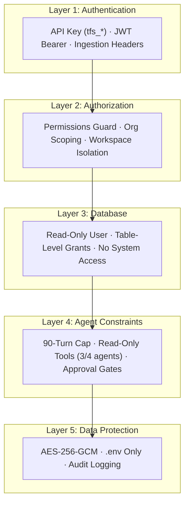

  <picture>
    <source media="(prefers-color-scheme: dark)" srcset="https://github.com/telemetryflow/.github/raw/main/docs/assets/tfo-logo-dark.svg">
    <source media="(prefers-color-scheme: light)" srcset="https://github.com/telemetryflow/.github/raw/main/docs/assets/tfo-logo-light.svg">
    
  </picture>

  <h3>TelemetryFlow Hermes — Self-Improving AI Agent for Observability Incident Response</h3>

---

# Security Policy

## Supported Versions

| Version | Supported          | Status             |
| ------- | ------------------ | ------------------ |
| 1.2.x   | :white_check_mark: | Active development |
| < 1.2   | :x:                | Not supported      |

## Reporting a Vulnerability

### Where to Report

**Do NOT open a public GitHub issue for security vulnerabilities.**

Instead, report security issues to:

- **Email**: security@telemetryflow.id
- **GitHub**: Use the [Security Advisories](https://github.com/telemetryflow/telemetryflow-hermes/security/advisories/new) feature

### What to Include

- Description of the vulnerability
- Steps to reproduce
- Affected component (tool, profile, hook, etc.)
- Potential impact
- Suggested fix (if available)

### Response Timeline

| Stage              | Timeline                                         |
| ------------------ | ------------------------------------------------ |
| Acknowledgment     | Within 24 hours                                  |
| Initial assessment | Within 72 hours                                  |
| Fix development    | Within 7 days (critical), 30 days (non-critical) |
| Disclosure         | After fix is released                            |

## Security Best Practices

### For Users

1. **API Keys**
   - Store all secrets in `~/.hermes/.env` with `chmod 600`
   - Never commit `.env` files to version control
   - Rotate API keys every 90 days
   - Use API keys with minimum required scopes

2. **ClickHouse Access**
   - Use the `hermes_readonly` user (never admin)
   - Table-level SELECT grants only (20 tables)
   - Never grant INSERT, UPDATE, DELETE, or DDL permissions

3. **Network Security**
   - Restrict TFO API access with firewall rules
   - Use TLS for all API communication in production
   - Consider VPN for Telegram gateway in sensitive environments

4. **Agent Permissions**
   - Only the Remediator profile has write access
   - All write operations require human approval (600s timeout)
   - Reviewer uses read-only tools to prevent bias

### For Contributors

1. **No External Dependencies**
   - All tools must use Python stdlib only
   - No pip packages in tool implementations
   - This eliminates supply chain attacks

2. **No Secrets in Code**
   - Never hardcode API keys, tokens, or passwords
   - Use environment variables for all credentials
   - `.env.example` contains only placeholders

3. **Input Validation**
   - All tool parameters must be validated before use
   - SQL queries must use parameterized patterns
   - Never trust user input in ClickHouse queries

4. **Code Review**
   - All PRs require review before merge
   - Security-sensitive changes require additional review
   - Automated security scanning in CI (bandit)

## Security Architecture

### Layered Defense

### Threat Model

| Threat                     | Mitigation                                               |
| -------------------------- | -------------------------------------------------------- |
| Credential leak            | `.env` only (not `config.yaml`), SHA-256 hashed API keys |
| Unauthorized data access   | Permissions Guard + org scoping                          |
| Cross-tenant data leakage  | Mandatory `workspace_id` on all queries                  |
| Runaway API cost           | 90-turn hard cap + org rate limiting                     |
| Unauthorized mutation      | Human approval gates (600s timeout)                      |
| Investigation bias         | Separate Reviewer context + read-only tools              |
| Skill loss                 | Curator snapshots + pin protection                       |
| Supply chain (Python deps) | stdlib only — 0 pip dependencies                         |

### Agent Permission Matrix

| Capability       | Triage | Investigator | Reviewer | Remediator   |
| ---------------- | ------ | ------------ | -------- | ------------ |
| Read metrics     | ✓      | ✓            | ✓        | ✓            |
| Read logs        | ✓      | ✓            | ✓        | ✓            |
| Read traces      | ✗      | ✓            | ✓        | ✗            |
| Scale deployment | ✗      | ✗            | ✗        | ⚠ (approval) |
| Restart pod      | ✗      | ✗            | ✗        | ⚠ (approval) |
| Rollback deploy  | ✗      | ✗            | ✗        | ⚠ (approval) |
| Update alert     | ✗      | ✗            | ✗        | ⚠ (approval) |

## Security Checklist for PRs

- [ ] No secrets or API keys in code
- [ ] No new external dependencies introduced
- [ ] All new tools validate input parameters
- [ ] Write tools marked `requires_approval: true`
- [ ] ClickHouse queries use `workspace_id` filter
- [ ] Environment variables use `TELEMETRYFLOW_` prefix
- [ ] Tests cover error handling paths
- [ ] Documentation updated for security-relevant changes

## Encryption

| Data                            | Method         | Key                              |
| ------------------------------- | -------------- | -------------------------------- |
| LLM Provider API keys (at rest) | AES-256-GCM    | `LLM_ENCRYPTION_KEY` (32+ chars) |
| JWT access tokens               | HS256          | `JWT_SECRET` (32+ chars)         |
| JWT refresh tokens              | HS256          | `JWT_REFRESH_SECRET` (32+ chars) |
| User sessions                   | Cookie signing | `SESSION_SECRET` (32+ chars)     |

## Audit Logging

All API calls are logged by the TelemetryFlow Platform:

- `audit_logs` — Platform audit trail
- `audit_logs_1h` — Hourly rollups
- LLM usage tracked in `llm_usage_analytics` with interval MVs

---

**Last updated**: June 2026

**Built with ❤️ by Telemetri Data Indonesia**
