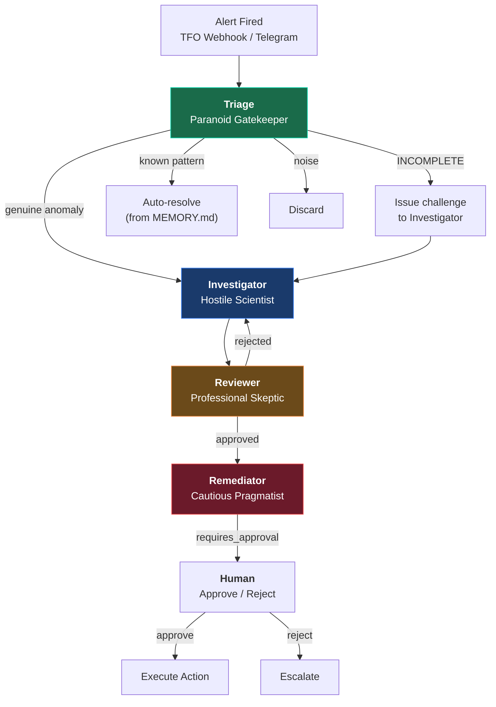
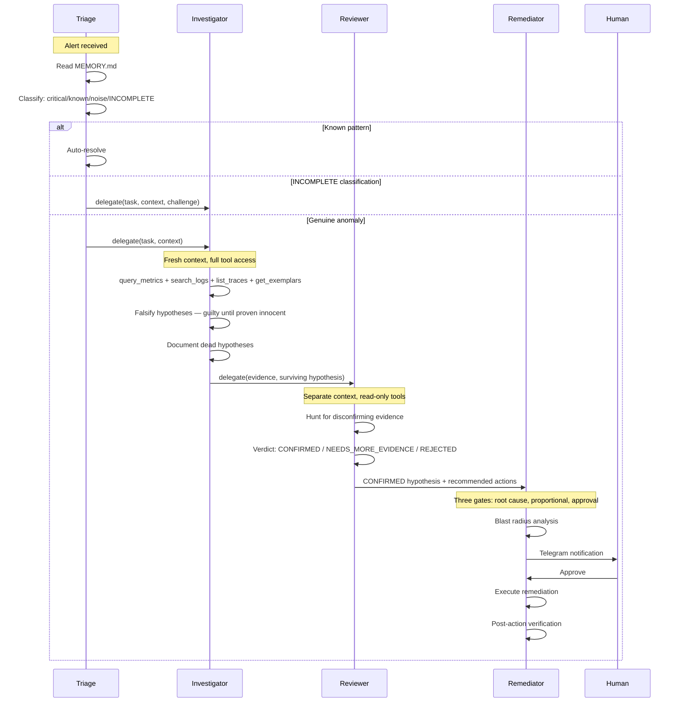

# Agent Overview

The TelemetryFlow Hermes multi-agent team uses Hermes profiles — each agent has its own SOUL.md, memory, skills, config, and Telegram bot. They share nothing.

## Team Architecture

## Agent Profiles

All agents operate as adversarial scientists — they assume inputs are wrong, actively falsify hypotheses, and never trust without proof.

| Agent            | Model                         | Max Turns | Role                     | Tools                             |
| ---------------- | ----------------------------- | --------- | ------------------------ | --------------------------------- |
| **Triage**       | glm-5.1 (OpenCode Go)         | 30        | Paranoid gatekeeper      | terminal, web, delegation         |
| **Investigator** | claude-sonnet-4-5 (Anthropic) | 45        | Hostile scientist        | terminal, web, delegation         |
| **Reviewer**     | glm-5.1 (OpenCode Go)         | 20        | Professional skeptic     | terminal, web (read-only)         |
| **Remediator**   | glm-5.1 (OpenCode Go)         | 15        | Cautious pragmatist      | terminal, web (approval required) |

## Delegation Model

## Profile Configuration

Each profile lives at `profiles/<agent-name>/` with:

| File                 | Purpose                                           |
| -------------------- | ------------------------------------------------- |
| `config.yaml`        | Model, turn cap, tool permissions, gateway config |
| `SOUL.md`            | Agent identity and behavioral constraints         |
| `memories/MEMORY.md` | Persistent agent facts (2,200 char max)           |
| `memories/USER.md`   | User profile and preferences (1,375 char max)     |

### Profile Isolation

- **Separate Telegram bots** — each agent has its own `TELEGRAM_BOT_TOKEN_*`
- **Separate memory** — agents don't share MEMORY.md or state.db
- **Separate skills** — each profile can have different skill sets
- **Separate config** — different models, turn caps, tool permissions

## Context Management

### Why Separate Contexts?

A single agent doing everything fills its context window fast. By step 4 it's operating on summaries of summaries, and quality degrades. Separate concerns: each agent has one job, one context, one set of tools.

### Reviewer Bias Prevention

The Reviewer runs in a **completely separate context** with:

- Zero visibility into the Investigator's thought process
- Read-only tools only (can't modify investigation)
- Fresh perspective on evidence and hypothesis

This prevents:

- **Confirmation bias** — defending the Investigator's conclusions
- **Anchoring bias** — overweighting initial findings
- **Sunk cost bias** — continuing a failed investigation approach

## Cost Model

| Agent        | Model             | Turns/Incident | Cost/Turn | Cost/Incident   |
| ------------ | ----------------- | -------------- | --------- | --------------- |
| Triage       | glm-5.1           | 3-5            | ~$0.002   | ~$0.01          |
| Investigator | claude-sonnet-4-5 | 10-20          | ~$0.008   | ~$0.05-0.15     |
| Reviewer     | glm-5.1           | 5-8            | ~$0.005   | ~$0.03-0.08     |
| Remediator   | glm-5.1           | 2-5            | ~$0.003   | ~$0.01-0.03     |
| **Total**    |                   | **20-38**      |           | **~$0.10-0.27** |

## Detailed Agent Docs

- [Triage Agent](./triage.md) — Paranoid gatekeeper: assumes alerts lie, zero hallucination
- [Investigator Agent](./investigator.md) — Hostile scientist: falsification-first root cause analysis
- [Reviewer Agent](./reviewer.md) — Professional skeptic: hunts disconfirming evidence
- [Remediator Agent](./remediator.md) — Cautious pragmatist: three-gate remediation
