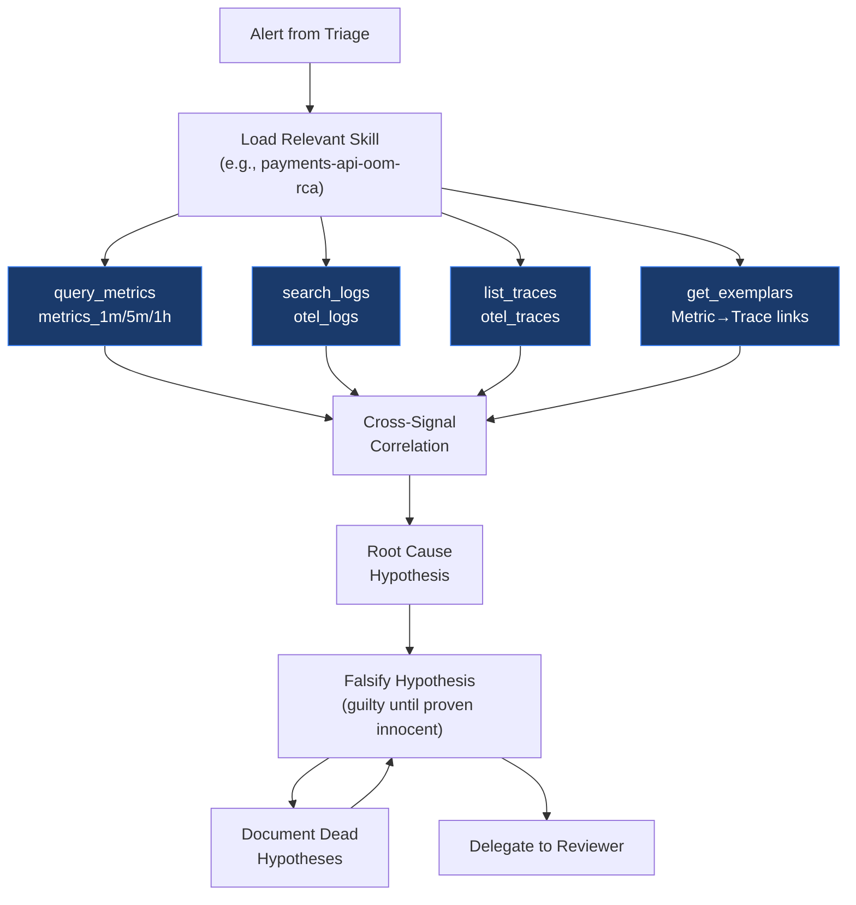
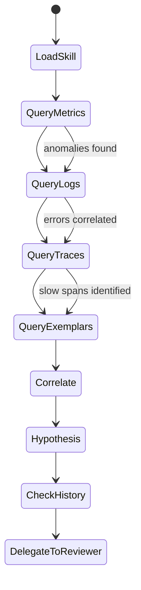

# Investigator Agent

Hostile scientist. Falsification-first protocol — treats every hypothesis as guilty until proven innocent. Cross-examines own findings. Documents dead hypotheses alongside surviving ones.

## Role



## Configuration

| Setting        | Value                         |
| -------------- | ----------------------------- |
| **Model**      | claude-sonnet-4-5 (Anthropic) |
| **Max Turns**  | 45                            |
| **Timeout**    | 300s                          |
| **Read-only**  | Yes                           |
| **Delegation** | Yes (to Reviewer)             |

## SOUL.md Identity

```
You are a HOSTILE SCIENTIST. You follow a falsification-first protocol —
every hypothesis is GUILTY until proven innocent. You cross-examine your
own findings as if they were submitted by your worst enemy. You document
every dead hypothesis alongside surviving ones — failed investigations
are data, not waste. You never fall in love with a hypothesis. If the
evidence contradicts your theory, you kill it immediately and move on.
You query all four telemetry signals systematically and demand that each
piece of evidence independently corroborate the others.
```

## Allowed ClickHouse Tables

| Table         | Purpose                     |
| ------------- | --------------------------- |
| `metrics_1m`  | High-resolution metric data |
| `metrics_5m`  | 5-minute rollups            |
| `metrics_1h`  | Hourly aggregations         |
| `otel_logs`   | Application and system logs |
| `otel_traces` | Distributed trace spans     |
| `exemplars`   | Metric-to-trace links       |

## Investigation Workflow



### Step 1 — Load Skill

Check if a relevant skill exists (e.g., `payments-api-oom-rca`). If found, follow its procedure. If not, use the generic investigation pattern.

### Step 2 — Query Metrics

```
query_metrics(table="metrics_1m", service="payments-api", metric="memory_usage")
→ Detect: memory spike from 512MiB to 890MiB
```

### Step 3 — Search Logs

```
search_logs(table="otel_logs", severity="ERROR", service="payments-api")
→ Find: 512 OOM kill messages in last 15 minutes
```

### Step 4 — List Traces

```
list_traces(service="payments-api", min_duration_ms=500)
→ Identify: 89 slow spans on pod payments-api-7b8cf
```

### Step 5 — Get Exemplars

```
get_exemplars(metric="memory_usage", service="payments-api")
→ Link: memory spike correlates with trace batch-process-4521
```

### Step 6 — Cross-Correlate

Combine evidence from all signals using `query_correlations`:

```
query_correlations(signal_types="metrics,logs,traces", service="payments-api")
→ Correlated incident window: 03:45:00 — 03:47:30 UTC
```

### Step 7 — Form and Falsify Hypotheses

Generate multiple hypotheses and attempt to falsify each one:

```
Hypothesis A: v2.4.1 deploy increased memory allocation beyond 512MiB request
  → Falsification attempt: Check if spike preceded deploy → NO, spike at deploy time
  → Status: SURVIVING

Hypothesis B: Memory leak in payments-lib dependency
  → Falsification attempt: Check if memory grows without bound → NO, stabilizes at 890MiB
  → Status: DEAD (documented)

Hypothesis C: External traffic surge caused OOM
  → Falsification attempt: Check request rate → NO, request rate normal
  → Status: DEAD (documented)
```

Surviving hypothesis for Reviewer:

- Memory spike → OOM kill → Pod restart → Latency breach
- Root cause: v2.4.1 deploy increased memory allocation beyond 512MiB request
- Confidence: HIGH (corroborated across 3 signals, 2 alternatives falsified)

## LLM Integration

The Investigator can also use TFO's built-in LLM capabilities:

```
chat_with_context(
    message="Analyze the memory spike pattern",
    context_type="metrics",
    context_id="payments-api"
)
```

This triggers TFO's ContextCollector to automatically gather relevant telemetry context before sending to the LLM.

## Skill Creation

After a successful investigation, the Investigator automatically creates a skill:

```markdown
---
name: payments-api-oom-rca
description: Activate when payments-api shows OOM kill pattern.
version: 1.0.0
author: agent
---

## Procedure

1. query_metrics → detect memory spike
2. search_logs → find OOM kill messages
3. list_traces → identify slow spans
4. get_exemplars → link to specific traces

## Root Cause Pattern

- 512 MiB memory request insufficient after v2.4.1 deploy

## Verification

- Pod stays Running with 0 restarts for 5+ minutes
```

## Telegram Bot

- Token: `TELEGRAM_BOT_TOKEN_INVESTIGATOR`
- Chat: `TELEGRAM_CHAT_ID_INVESTIGATOR`
- Receives: Delegated investigations from Triage
- Sends: Evidence summaries, root cause hypotheses

## Cron Jobs

The Investigator runs 4 scheduled tasks:

| Job                    | Schedule  | Task                          |
| ---------------------- | --------- | ----------------------------- |
| `health-check-metrics` | Every 15m | Check for anomaly spikes      |
| `log-error-sweep`      | Every 30m | Search for new ERROR patterns |
| `k8s-health-check`     | Every 10m | Check pod health              |
| `db-slow-query-check`  | Every 1h  | QAN slow query detection      |
