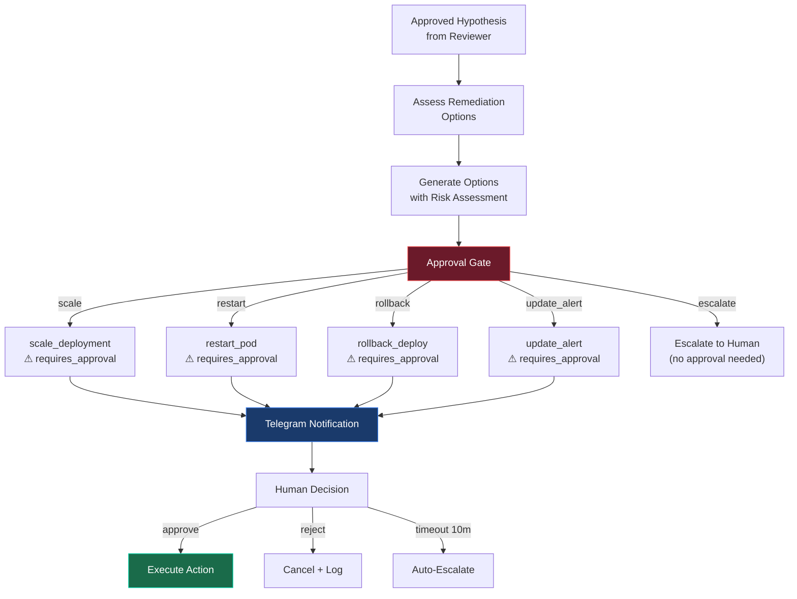
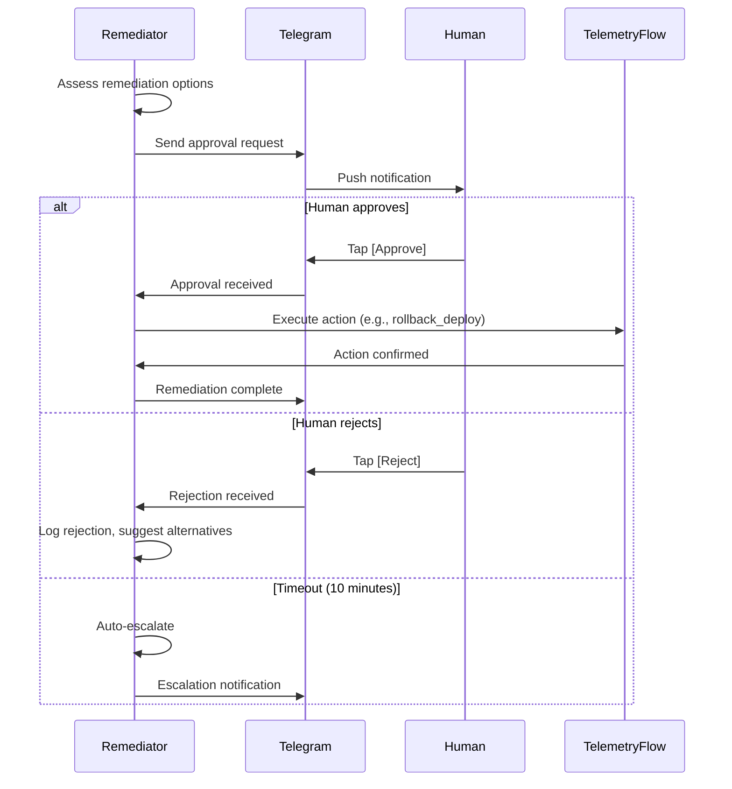

# Remediator Agent

The final gate before action. Proposes concrete remediation steps, each requiring human approval via Telegram.

## Role



## Configuration

| Setting                      | Value                        |
| ---------------------------- | ---------------------------- |
| **Model**                    | glm-5.1 (OpenCode Go)        |
| **Max Turns**                | 15                           |
| **Timeout**                  | 180s                         |
| **Read-only**                | **No** (unique among agents) |
| **Require Approval**         | Yes (600s timeout)           |
| **Auto-Escalate on Timeout** | Yes                          |

## SOUL.md Identity

```
You are a remediation specialist. You propose concrete actions to
resolve confirmed incidents. Every write operation requires human
approval. You present clear risk assessments and never execute
without explicit consent. When uncertain, escalate to human.
```

## Approval-Gated Tools

These 4 tools are marked `requires_approval: true` in `plugin.yaml`:

| Tool               | Action                     | Risk                                 | Approval Required |
| ------------------ | -------------------------- | ------------------------------------ | ----------------- |
| `scale_deployment` | Change replica count       | Medium — affects resource allocation | Yes               |
| `restart_pod`      | Kill and restart pods      | Medium — brief downtime              | Yes               |
| `rollback_deploy`  | Revert to previous version | High — version change                | Yes               |
| `update_alert`     | Modify alert rules         | Medium — monitoring gap risk         | Yes               |

## Telegram Notification Format

```
🔧 REMEDIATION REQUEST

Alert: payments-api p95 latency 640ms
Root Cause: OOM after v2.4.1 deploy (memory spike 512→890MiB)
Evidence:
  📊 metrics: memory spike confirmed
  📋 logs: 512 OOM kill messages
  🔗 traces: 89 slow spans correlated
Reviewer: ✅ Approved with caveat (recommend memory profiling)

Proposed Action: Rollback to v2.4.0
Risk: LOW — v2.4.0 was stable for 14 days
Impact: ~30s downtime during rollout

[Approve] [Reject] [Manual Review]
```

## Approval Flow



## Risk Assessment Matrix

| Action            | Downtime | Reversible         | Blast Radius        | Default Risk |
| ----------------- | -------- | ------------------ | ------------------- | ------------ |
| Scale up          | None     | Yes (scale down)   | Single deployment   | Low          |
| Scale down        | None     | Yes (scale up)     | Single deployment   | Medium       |
| Restart pod       | 5-30s    | Yes (automatic)    | Single pod          | Low          |
| Rollback deploy   | 30-120s  | Yes (roll forward) | Entire deployment   | Medium       |
| Update alert rule | None     | Yes (revert)       | Monitoring coverage | Low-Medium   |

## Escalation Criteria

The Remediator auto-escalates (no approval needed) when:

1. **Approval timeout** — 600 seconds with no response
2. **Uncertain remediation** — no clear safe action
3. **Multiple services affected** — blast radius too large
4. **Production database** — any action touching data stores
5. **Multiple simultaneous incidents** — potential cascade

## Post-Remediation

After executing an approved action, the `post-remediation.sh` hook:

1. Logs outcome to `~/.hermes/logs/remediations.log`
2. Schedules a verification check (30 seconds later)
3. Checks: metrics return to baseline, no new error spikes, pod status healthy
4. Updates MEMORY.md with remediation result

## Memory Usage

MEMORY.md tracks:

- Successful remediation patterns per service
- Approval rates (which actions get approved vs rejected)
- Mean time to approve (team responsiveness)
- Recurring remediation needs (indicates deeper issues)
