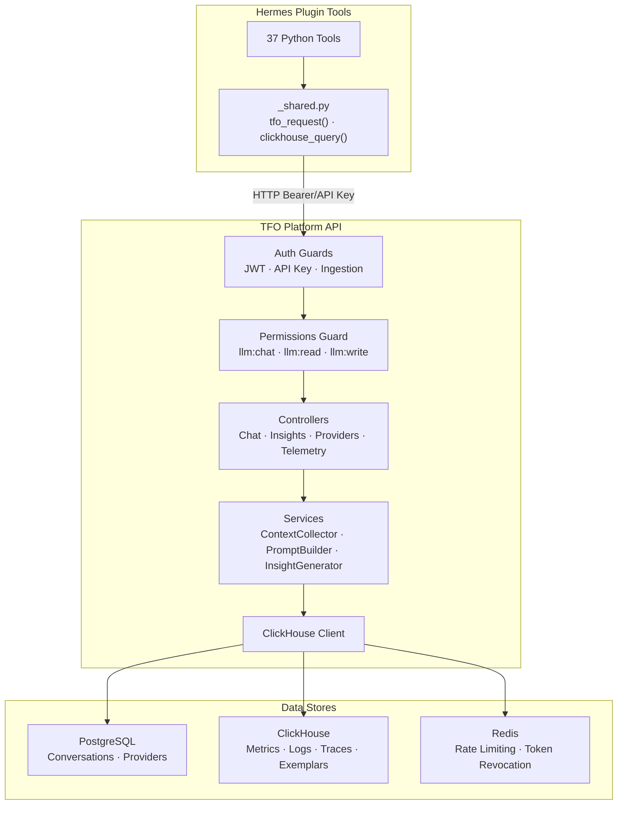
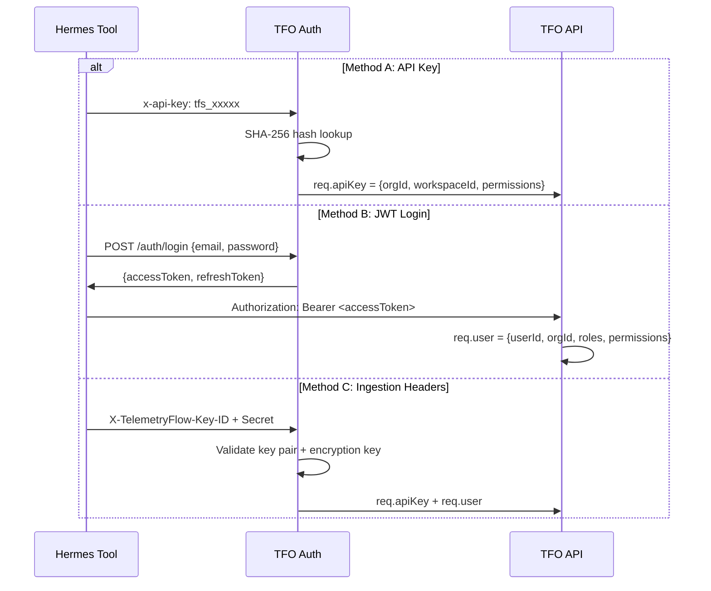

# API Overview

TelemetryFlow Hermes integrates with the TFO Platform through its REST API and ClickHouse. All communication is authenticated and workspace-scoped.

## Integration Architecture



## API Modules

### Authentication

See [Authentication](./authentication.md) for detailed flows.

| Method     | Header                          | Use Case           |
| ---------- | ------------------------------- | ------------------ |
| JWT Bearer | `Authorization: Bearer <jwt>`   | User-scoped access |
| API Key    | `x-api-key: tfs_...`            | Agent M2M access   |
| Ingestion  | `X-TelemetryFlow-Key-ID/Secret` | OTEL Collector     |

### LLM Module

See [LLM Module](./llm-module.md) for endpoint details.

| Endpoint Group | Base Path                          | Description                              |
| -------------- | ---------------------------------- | ---------------------------------------- |
| Chat           | `/api/v2/llm/chat/*`               | Context-aware chat with ContextCollector |
| Insights       | `/api/v2/llm/insights/*`           | AI insight generation (5 types)          |
| Providers      | `/api/v2/llm/providers/*`          | LLM provider CRUD (15 types)             |
| Conversations  | `/api/v2/llm/chat/conversations/*` | Conversation management                  |

### Telemetry Queries

All telemetry queries go through `POST /api/v2/telemetry/query`:

```json
{
  "sql": "SELECT * FROM metrics_1m WHERE workspace_id = ? LIMIT 50",
  "format": "JSON"
}
```

### Context Types

See [Context Types](./context-types.md) for the complete list of 74 ContextType values used by the LLM module.

## Authentication Flow



## Rate Limiting

| Scope           | Limit       | Key                    |
| --------------- | ----------- | ---------------------- |
| LLM Chat        | 100 req/min | `llm:<organizationId>` |
| API General     | Varies      | Per API key            |
| Telemetry Query | Varies      | Per workspace          |

## Required Permissions

| Endpoint                  | Required Permission |
| ------------------------- | ------------------- |
| `/llm/chat/message`       | `llm:chat`          |
| `/llm/chat/conversations` | `llm:read`          |
| `/llm/insights/generate`  | `llm:insights`      |
| `/llm/providers` (read)   | `llm:read`          |
| `/llm/providers` (write)  | `llm:write`         |
| `/telemetry/query`        | `telemetry:read`    |
