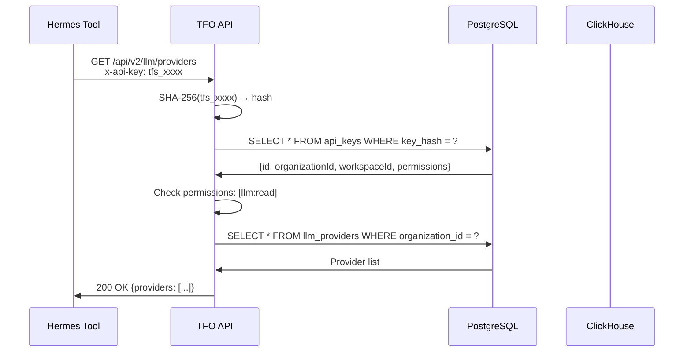
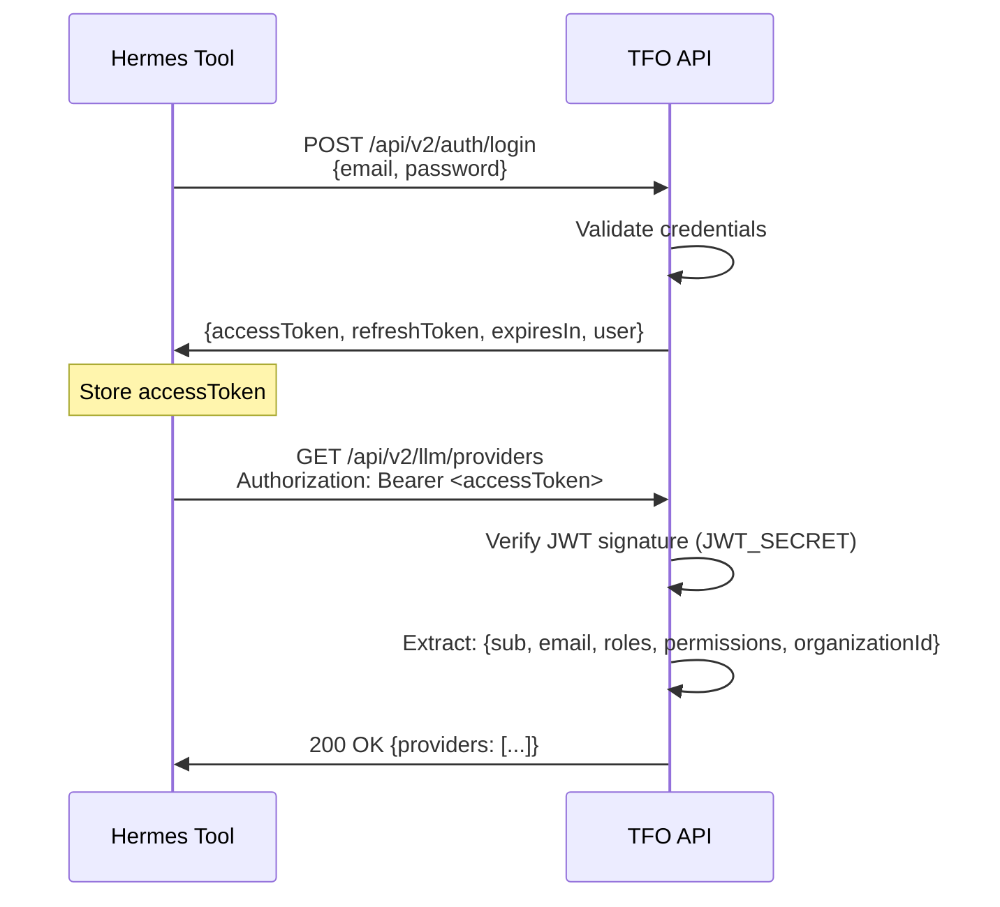
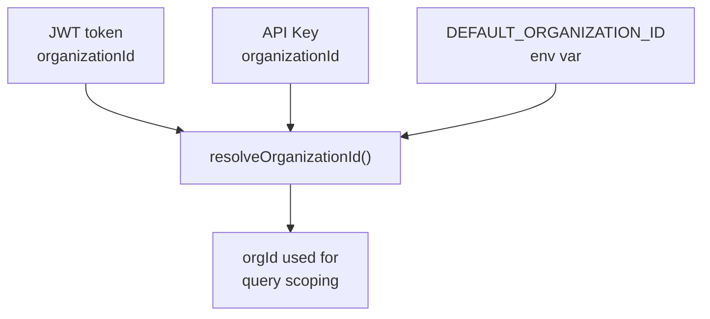

# Authentication

TFO Platform provides four authentication mechanisms. Hermes tools support three of them.

## Authentication Methods

```mermaid
graph TD
    subgraph "Method A: API Key (Recommended)"
        A_KEY["TELEMETRYFLOW_API_KEY=tfs_xxxx"]
        A_HEADER["x-api-key: tfs_xxxx"]
        A_RESOLVE["SHA-256 hash → DB lookup"]
        A_RESULT["req.apiKey = {orgId, workspaceId, permissions}"]
    end

    subgraph "Method B: JWT Login"
        B_CREDS["TELEMETRYFLOW_AUTH_EMAIL + TELEMETRYFLOW_AUTH_PASSWORD"]
        B_LOGIN["POST /api/v2/auth/login"]
        B_TOKEN["accessToken (JWT)"]
        B_HEADER["Authorization: Bearer <jwt>"]
        B_RESULT["req.user = {userId, orgId, roles, permissions}"]
    end

    subgraph "Method C: Ingestion Headers"
        B_IDS["TELEMETRYFLOW_KEY_ID=tfk_xxxx + TELEMETRYFLOW_KEY_SECRET=tfs_xxxx"]
        C_HEADER["X-TelemetryFlow-Key-ID + X-TelemetryFlow-Key-Secret"]
        C_RESULT["req.apiKey + req.user"]
    end

    A_KEY --> A_HEADER --> A_RESOLVE --> A_RESULT
    B_CREDS --> B_LOGIN --> B_TOKEN --> B_HEADER --> B_RESULT
    B_IDS --> C_HEADER --> C_RESULT
```



## Method A: API Key (Recommended for Agents)

**Best for**: Machine-to-machine communication, agent integrations.

### Setup

1. Open TFO Platform UI → Settings → API Keys → Generate
2. Set scopes: `llm:chat`, `llm:read`, `llm:write`, `llm:insights`, `telemetry:read`
3. Copy the key (format: `tfs_<64 alphanumeric chars>`)

### Configuration

```env
# ~/.hermes/.env
TELEMETRYFLOW_API_KEY=tfs_your_api_key_here
```

### How It Works



### Key Format

| Prefix | Type       | Format                   |
| ------ | ---------- | ------------------------ |
| `tfk_` | Key ID     | `tfk_[A-Za-z0-9]{32,64}` |
| `tfs_` | Key Secret | `tfs_[A-Za-z0-9]{32,64}` |

### Accepted Headers

The API Key guard checks in order:

1. `x-api-key: tfs_xxxx`
2. `api_key` query parameter: `?api_key=tfs_xxxx`
3. `Authorization: ApiKey tfs_xxxx`

---

## Method B: JWT Login (User-Scoped)

**Best for**: User-scoped operations, testing, debugging.

### Setup

```env
# ~/.hermes/.env
TELEMETRYFLOW_AUTH_EMAIL=user@example.com
TELEMETRYFLOW_AUTH_PASSWORD=SecureP@ssw0rd!
```

### How It Works



### JWT Payload

```json
{
  "sub": "user-uuid",
  "email": "user@example.com",
  "roles": ["admin"],
  "permissions": ["llm:chat", "llm:read", "llm:write", "llm:insights"],
  "tenantId": "tenant-uuid",
  "organizationId": "org-uuid",
  "sessionId": "session-uuid"
}
```

### Token Lifecycle

| Property          | Dev                  | Production                          |
| ----------------- | -------------------- | ----------------------------------- |
| Access token TTL  | 24h                  | 15m                                 |
| Refresh token TTL | 30d                  | 7d                                  |
| Signing algorithm | HS256                | HS256                               |
| Secret            | `JWT_SECRET` env var | `JWT_SECRET` env var (min 32 chars) |

---

## Method C: Ingestion Headers (OTEL Collector)

**Best for**: OTEL Collector agents, Go agent integrations.

### Setup

```env
# ~/.hermes/.env
TELEMETRYFLOW_KEY_ID=tfk_your_key_id
TELEMETRYFLOW_KEY_SECRET=tfs_your_key_secret
```

### How It Works

Two schemes:

**Scheme 1: Basic Auth**

```
Authorization: Basic base64(tfk_xxx:tfs_xxx)
x-telemetryflow-encryption-key: <key>
```

**Scheme 2: Custom Headers**

```
X-TelemetryFlow-Key-ID: tfk_xxx
X-TelemetryFlow-Key-Secret: tfs_xxx
```

---

## Permissions Required

| Permission       | Endpoints                                   | Description                      |
| ---------------- | ------------------------------------------- | -------------------------------- |
| `llm:chat`       | `/llm/chat/message`, `/llm/chat/stream`     | Send chat messages               |
| `llm:read`       | `/llm/providers`, `/llm/chat/conversations` | Read providers and conversations |
| `llm:write`      | `/llm/providers` (POST, PUT, DELETE)        | Manage providers                 |
| `llm:insights`   | `/llm/insights/generate`                    | Generate AI insights             |
| `llm:delete`     | `/llm/chat/conversations` (DELETE)          | Delete conversations             |
| `telemetry:read` | `/telemetry/query`                          | Query ClickHouse data            |

## Organization Scoping

All LLM endpoints require an `organizationId`. It is resolved from:



1. `req.user.organizationId` (from JWT)
2. `req.apiKey.organizationId` (from API Key)
3. `DEFAULT_ORGANIZATION_ID` env var (fallback)

## Security Best Practices

- Use **API Keys** for agent integrations (narrow scopes, revocable)
- Use **JWT** only for user-scoped testing
- Rotate API keys every 90 days
- Set minimum required permissions only
- Store all secrets in `~/.hermes/.env`, never in `config.yaml`
