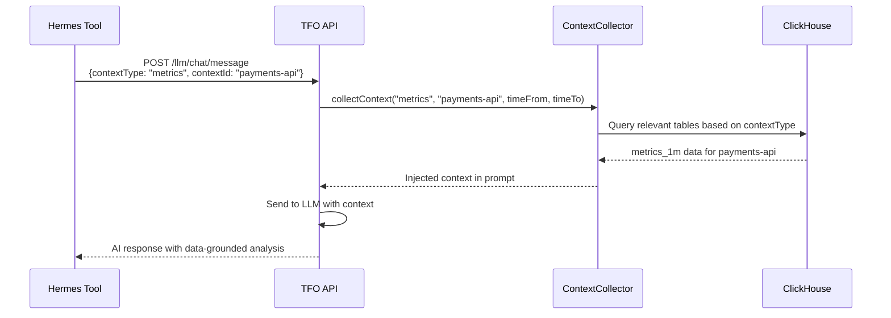
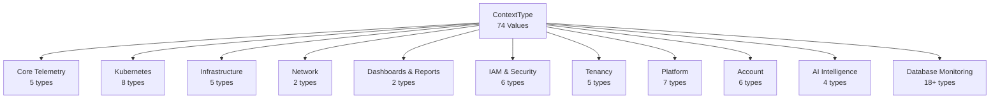
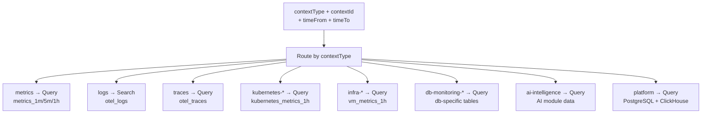

# Context Types

Complete reference for all 74 ContextType values used by the TelemetryFlow LLM module's `ContextCollector`. Context types determine what telemetry data is automatically gathered when sending a chat message or generating an insight.

## How Context Types Work

## Context Type Categories

---

## Core Telemetry

| ContextType    | Description                 | ClickHouse Source                        | ContextCollector Action                                   |
| -------------- | --------------------------- | ---------------------------------------- | --------------------------------------------------------- |
| `metrics`      | Time-series metric data     | `metrics_1m`, `metrics_5m`, `metrics_1h` | Queries recent metric values for the context scope        |
| `logs`         | Application and system logs | `otel_logs`                              | Searches recent log entries, filtered by service/severity |
| `traces`       | Distributed traces          | `otel_traces`                            | Queries trace spans, waterfall analysis                   |
| `exemplars`    | Metric-to-trace links       | `exemplars`, `exemplars_1h`              | Joins metric data with specific traces                    |
| `correlations` | Cross-signal correlations   | `signal_correlations_1h`                 | Pre-computed correlation analysis                         |

## Kubernetes Monitoring

| ContextType              | Description               | ClickHouse Source       |
| ------------------------ | ------------------------- | ----------------------- |
| `kubernetes-overview`    | Cluster overview          | `kubernetes_metrics_1h` |
| `kubernetes-clusters`    | Cluster-level metrics     | `kubernetes_metrics_1h` |
| `kubernetes-namespaces`  | Namespace metrics         | `kubernetes_metrics_1h` |
| `kubernetes-nodes`       | Node-level metrics        | `kubernetes_metrics_1h` |
| `kubernetes-pods`        | Pod metrics and status    | `kubernetes_metrics_1h` |
| `kubernetes-deployments` | Deployment metrics        | `kubernetes_metrics_1h` |
| `kubernetes-pv`          | Persistent volume metrics | `kubernetes_metrics_1h` |
| `kubernetes-api-server`  | API server metrics        | `kubernetes_metrics_1h` |
| `kubernetes-coredns`     | CoreDNS metrics           | `kubernetes_metrics_1h` |

## Infrastructure Monitoring

| ContextType      | Description             | ClickHouse Source |
| ---------------- | ----------------------- | ----------------- |
| `infra-overview` | Infrastructure overview | `vm_metrics_1h`   |
| `infra-cpu`      | CPU utilization         | `vm_metrics_1h`   |
| `infra-memory`   | Memory utilization      | `vm_metrics_1h`   |
| `infra-storage`  | Storage utilization     | `vm_metrics_1h`   |
| `infra-network`  | Network metrics         | `vm_metrics_1h`   |

## Network & Service Map

| ContextType   | Description              | ClickHouse Source                                             |
| ------------- | ------------------------ | ------------------------------------------------------------- |
| `service-map` | Service dependency graph | `service_map_metrics_1h`                                      |
| `network-map` | Network traffic map      | `network_map_traffic_1h`, `network_map_connection_metrics_1h` |

## Dashboards & Reports

| ContextType | Description                      |
| ----------- | -------------------------------- |
| `dashboard` | Dashboard configuration and data |
| `reports`   | Generated reports                |

## Alert Management

| ContextType   | Description                | ClickHouse Source       |
| ------------- | -------------------------- | ----------------------- |
| `alerts`      | Active alert instances     | Alert state data        |
| `alert-rules` | Alert rule configurations  | Alert rule definitions  |
| `agents`      | TelemetryFlow Agent status | Agent registration data |

## Uptime & Status Pages

| ContextType   | Description               | ClickHouse Source |
| ------------- | ------------------------- | ----------------- |
| `uptime`      | Uptime check results      | `uptime_checks`   |
| `status-page` | Status page configuration | Status page data  |

## IAM & Security

| ContextType       | Description            |
| ----------------- | ---------------------- |
| `iam`             | IAM overview           |
| `iam-users`       | User management        |
| `iam-roles`       | Role definitions       |
| `iam-permissions` | Permission assignments |
| `iam-matrix`      | Role-permission matrix |
| `iam-assignments` | User-role assignments  |

## Tenancy

| ContextType             | Description             |
| ----------------------- | ----------------------- |
| `tenancy`               | Tenancy overview        |
| `tenancy-regions`       | Region management       |
| `tenancy-organizations` | Organization management |
| `tenancy-workspaces`    | Workspace management    |
| `tenancy-tenants`       | Tenant management       |

## Platform Configuration

| ContextType       | Description                  |
| ----------------- | ---------------------------- |
| `audit`           | Audit log entries            |
| `retention`       | Retention policies           |
| `subscription`    | Subscription management      |
| `api-keys`        | API key management           |
| `notifications`   | Notification channels        |
| `data-masking`    | PII masking rules            |
| `system-setup`    | System configuration         |
| `system-channels` | System notification channels |

## AI Assistant

| ContextType    | Description                       |
| -------------- | --------------------------------- |
| `ai-assistant` | AI Assistant conversation context |

## Account Management

| ContextType             | Description           |
| ----------------------- | --------------------- |
| `account-profile`       | User profile          |
| `account-security`      | Security settings     |
| `account-sessions`      | Active sessions       |
| `account-notifications` | Account notifications |
| `account-preferences`   | User preferences      |
| `account-organization`  | Account organization  |

## AI Intelligence

| ContextType              | Description          | Module                                   |
| ------------------------ | -------------------- | ---------------------------------------- |
| `anomaly-detection`      | Detected anomalies   | AI Intelligence — Anomaly Detection      |
| `corrective-maintenance` | Corrective actions   | AI Intelligence — Corrective Maintenance |
| `cost-optimization`      | Cost recommendations | AI Intelligence — Cost Optimization      |
| `predictive-maintenance` | Predictions          | AI Intelligence — Predictive Maintenance |

## Database Monitoring

| ContextType                        | Description                  | Database Engine       |
| ---------------------------------- | ---------------------------- | --------------------- |
| `db-monitoring-inventory`          | Monitored database inventory | All                   |
| `db-monitoring-clickhouse`         | ClickHouse metrics           | ClickHouse            |
| `db-monitoring-mysql`              | MySQL metrics                | MySQL                 |
| `db-monitoring-postgresql`         | PostgreSQL metrics           | PostgreSQL            |
| `db-monitoring-mongodb-community`  | MongoDB Community metrics    | MongoDB               |
| `db-monitoring-mongodb-atlas`      | MongoDB Atlas metrics        | MongoDB Atlas         |
| `db-monitoring-mssql`              | MSSQL metrics                | Microsoft SQL Server  |
| `db-monitoring-sqlite3`            | SQLite3 metrics              | SQLite3               |
| `db-monitoring-timescaledb`        | TimescaleDB metrics          | TimescaleDB           |
| `db-monitoring-aurora`             | Aurora metrics               | Amazon Aurora         |
| `db-monitoring-aws-rds-mysql`      | AWS RDS MySQL metrics        | Amazon RDS MySQL      |
| `db-monitoring-aws-rds-aurora`     | AWS RDS Aurora metrics       | Amazon RDS Aurora     |
| `db-monitoring-aws-rds-postgresql` | AWS RDS PostgreSQL metrics   | Amazon RDS PostgreSQL |
| `db-monitoring-aws-dynamodb`       | DynamoDB metrics             | Amazon DynamoDB       |
| `db-monitoring-cockroachdb`        | CockroachDB metrics          | CockroachDB           |
| `db-monitoring-qan`                | Query Analytics data         | All (QAN)             |

## Context Collector Behavior

The `ContextCollector` (4,440 lines) handles each context type differently:

For each context type, the ContextCollector:

1. Determines which ClickHouse tables to query
2. Applies time range filters (`timeFrom` → `timeTo`)
3. Applies scope filters (`contextId` as service name, host, etc.)
4. Gathers relevant data
5. Formats as context for the `PromptBuilder`
