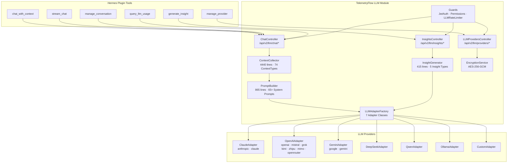
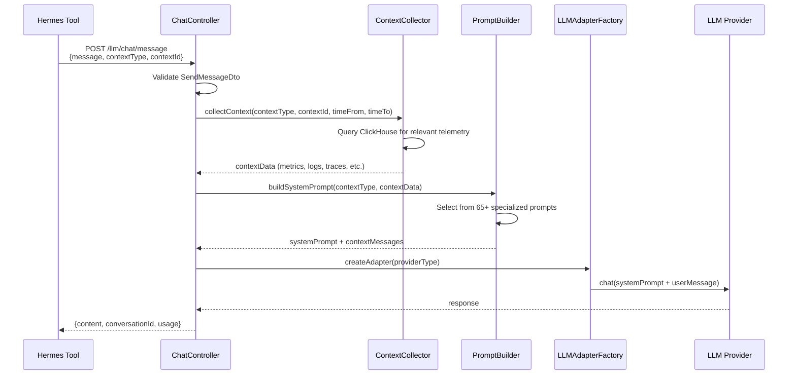
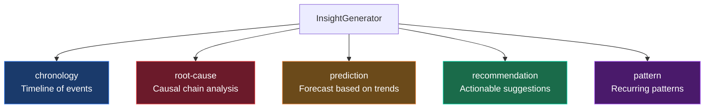
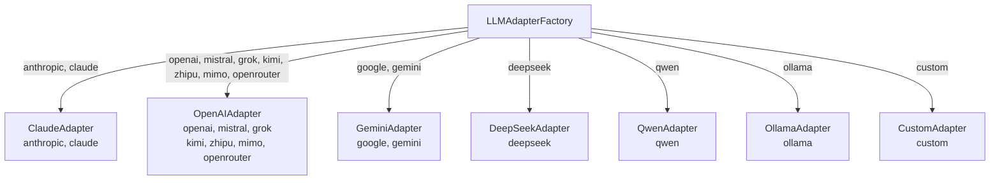
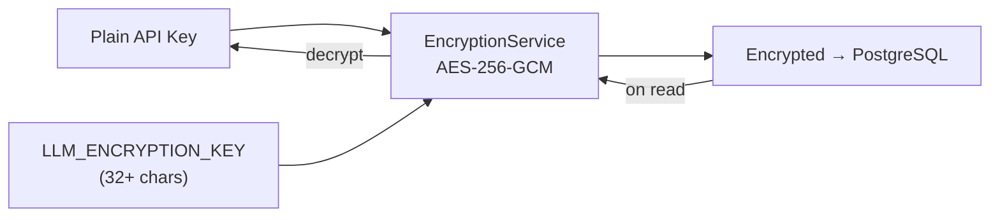
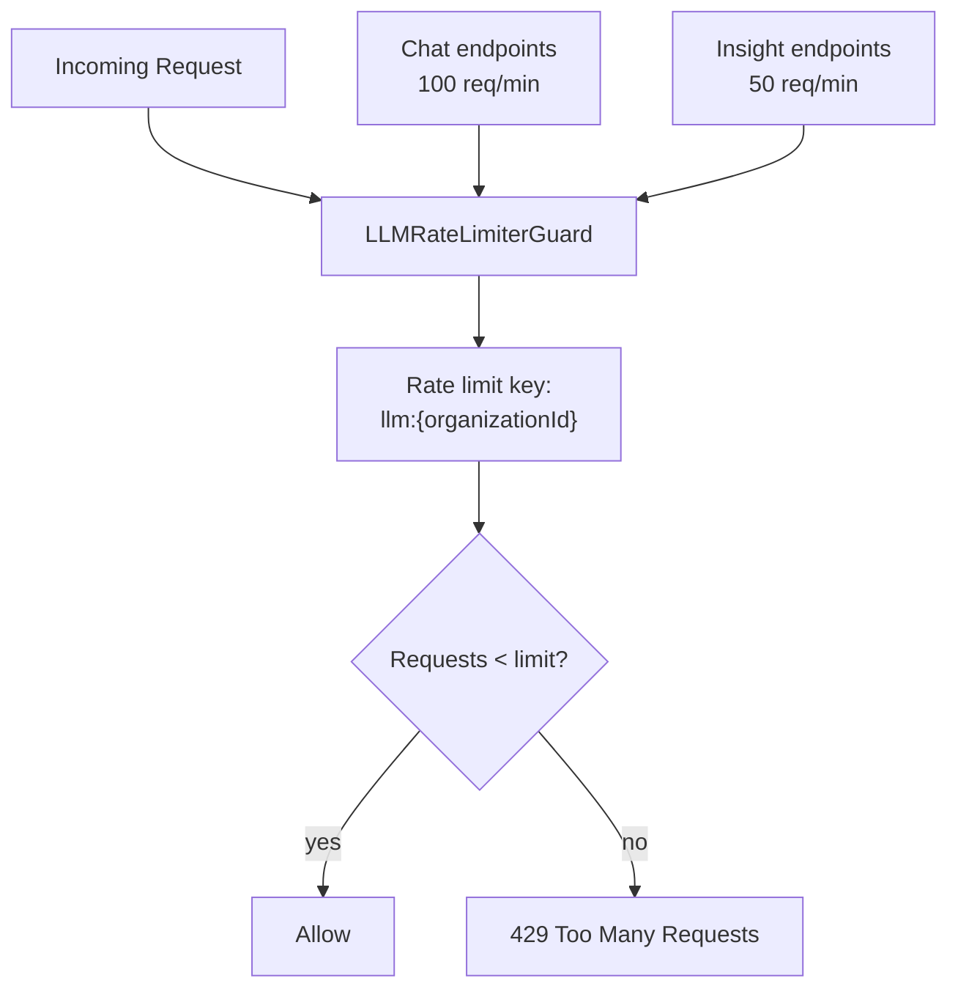
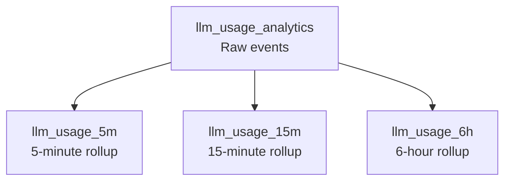

# LLM Module Integration

Complete reference for the TelemetryFlow Platform LLM module API — the AI Assistant backend that powers context-aware chat, insights, and provider management.

## Architecture



## Data Flow — Chat with Context



## Endpoints

### Chat — `/api/v2/llm/chat`

| Method   | Endpoint                          | Permission   | Description                         |
| -------- | --------------------------------- | ------------ | ----------------------------------- |
| `POST`   | `/chat/message`                   | `llm:chat`   | Send message with context injection |
| `POST`   | `/chat/stream`                    | `llm:chat`   | Streaming chat (SSE)                |
| `GET`    | `/chat/conversations`             | `llm:read`   | List conversations                  |
| `GET`    | `/chat/conversations/:id`         | `llm:read`   | Get conversation                    |
| `POST`   | `/chat/conversations/:id/archive` | `llm:write`  | Archive conversation                |
| `DELETE` | `/chat/conversations/:id`         | `llm:delete` | Delete conversation                 |

#### SendMessage DTO (`POST /chat/message`)

```json
{
  "message": "Analyze the memory spike pattern",
  "contextType": "metrics",
  "contextId": "payments-api",
  "conversationId": "uuid-optional",
  "providerId": "uuid-optional",
  "timeFrom": "2026-06-04T00:00:00Z",
  "timeTo": "2026-06-04T03:47:00Z",
  "metadata": {},
  "attachments": [
    {
      "mediaType": "image/png",
      "data": "base64...",
      "name": "screenshot.png"
    }
  ]
}
```

| Field            | Type     | Required | Validation        | Default          |
| ---------------- | -------- | -------- | ----------------- | ---------------- |
| `message`        | string   | **Yes**  | max 32,000 chars  | —                |
| `contextType`    | enum     | **Yes**  | One of 56+ values | —                |
| `contextId`      | string   | No       | —                 | —                |
| `conversationId` | UUID     | No       | `@IsUUID()`       | New conversation |
| `providerId`     | UUID     | No       | `@IsUUID()`       | Org default      |
| `timeFrom`       | ISO 8601 | No       | `@IsDateString()` | 1 hour ago       |
| `timeTo`         | ISO 8601 | No       | `@IsDateString()` | Now              |
| `metadata`       | object   | No       | `@IsObject()`     | —                |
| `attachments`    | array    | No       | `AttachmentDto[]` | —                |

#### ListConversations Query DTO

| Field         | Type    | Default | Validation                |
| ------------- | ------- | ------- | ------------------------- |
| `page`        | number  | `1`     | `@Min(1)`                 |
| `pageSize`    | number  | `20`    | `@Min(1)`, `@Max(100000)` |
| `contextType` | enum    | —       | Filter by context         |
| `isArchived`  | boolean | —       | Filter archived           |
| `search`      | string  | —       | max 255 chars             |

---

### Insights — `/api/v2/llm/insights`

Rate limited to **50 requests** (lower than default 100, insights are more expensive).

| Method | Endpoint               | Permission     | Insight Type            |
| ------ | ---------------------- | -------------- | ----------------------- |
| `POST` | `/insights/generate`   | `llm:insights` | Any (specified in body) |
| `POST` | `/insights/chronology` | `llm:insights` | `chronology`            |
| `POST` | `/insights/root-cause` | `llm:insights` | `root-cause`            |
| `POST` | `/insights/predict`    | `llm:insights` | `prediction`            |
| `POST` | `/insights/recommend`  | `llm:insights` | `recommendation`        |
| `POST` | `/insights/patterns`   | `llm:insights` | `pattern`               |

#### GenerateInsight DTO (`POST /insights/generate`)

```json
{
  "insightType": "root-cause",
  "contextType": "metrics",
  "contextId": "payments-api",
  "providerId": "uuid-optional",
  "timeFrom": "2026-06-03T00:00:00Z",
  "timeTo": "2026-06-04T00:00:00Z",
  "additionalContext": {
    "alert_id": "alert_abc123",
    "severity": "high"
  }
}
```

| Field               | Type     | Required | Default      |
| ------------------- | -------- | -------- | ------------ |
| `insightType`       | enum     | **Yes**  | —            |
| `contextType`       | enum     | **Yes**  | —            |
| `contextId`         | string   | No       | —            |
| `providerId`        | UUID     | No       | Org default  |
| `timeFrom`          | ISO 8601 | No       | 24 hours ago |
| `timeTo`            | ISO 8601 | No       | Now          |
| `additionalContext` | object   | No       | —            |

#### Insight Types



---

### Providers — `/api/v2/llm/providers`

| Method   | Endpoint                     | Permission   | Description          |
| -------- | ---------------------------- | ------------ | -------------------- |
| `POST`   | `/providers`                 | `llm:write`  | Create provider      |
| `GET`    | `/providers`                 | `llm:read`   | List providers       |
| `GET`    | `/providers/default`         | `llm:read`   | Get default provider |
| `POST`   | `/providers/test-key`        | `llm:write`  | Test API key         |
| `GET`    | `/providers/:id`             | `llm:read`   | Get provider         |
| `PATCH`  | `/providers/:id`             | `llm:write`  | Update provider      |
| `POST`   | `/providers/:id/set-default` | `llm:write`  | Set as default       |
| `POST`   | `/providers/:id/validate`    | `llm:write`  | Validate provider    |
| `DELETE` | `/providers/:id`             | `llm:delete` | Delete provider      |

#### CreateLLMProvider DTO (`POST /providers`)

```json
{
  "name": "Production Claude",
  "providerType": "anthropic",
  "apiKey": "sk-ant-...",
  "modelId": "claude-sonnet-4-20250514",
  "temperature": 0.7,
  "maxTokens": 4096,
  "topP": 1.0,
  "samplingMode": "auto",
  "isDefault": true
}
```

| Field          | Type    | Required | Default  | Validation                      |
| -------------- | ------- | -------- | -------- | ------------------------------- |
| `name`         | string  | **Yes**  | —        | max 255                         |
| `providerType` | enum    | **Yes**  | —        | 15 values                       |
| `apiKey`       | string  | **Yes**  | —        | Encrypted at rest (AES-256-GCM) |
| `modelId`      | string  | **Yes**  | —        | max 100                         |
| `baseUrl`      | URL     | No\*     | —        | Required for `custom`, `ollama` |
| `temperature`  | number  | No       | `0.7`    | 0–2                             |
| `maxTokens`    | number  | No       | `4096`   | 1–128,000                       |
| `topP`         | number  | No       | `1.0`    | 0–1                             |
| `samplingMode` | enum    | No       | `"auto"` | `temperature`, `top_p`, `auto`  |
| `isDefault`    | boolean | No       | `false`  | —                               |

#### Provider Types and Adapter Routing



| Provider Type         | Adapter         | Default Base URL                            |
| --------------------- | --------------- | ------------------------------------------- |
| `anthropic`, `claude` | ClaudeAdapter   | `https://api.anthropic.com`                 |
| `openai`              | OpenAIAdapter   | `https://api.openai.com`                    |
| `mistral`             | OpenAIAdapter   | `https://api.mistral.ai`                    |
| `grok`                | OpenAIAdapter   | `https://api.x.ai`                          |
| `kimi`                | OpenAIAdapter   | `https://api.moonshot.cn`                   |
| `zhipu`               | OpenAIAdapter   | `https://open.bigmodel.cn/api/paas`         |
| `mimo`                | OpenAIAdapter   | `https://api.mimo.ai`                       |
| `openrouter`          | OpenAIAdapter   | `https://openrouter.ai/api`                 |
| `google`, `gemini`    | GeminiAdapter   | `https://generativelanguage.googleapis.com` |
| `deepseek`            | DeepSeekAdapter | `https://api.deepseek.com`                  |
| `qwen`                | QwenAdapter     | `https://dashscope.aliyuncs.com`            |
| `ollama`              | OllamaAdapter   | `http://localhost:11434`                    |
| `custom`              | CustomAdapter   | User-provided                               |

## Encryption

API keys are encrypted at rest using `EncryptionService` with AES-256-GCM:



The `LLM_ENCRYPTION_KEY` env var is **required** — the app crashes on startup if missing or < 32 chars.

## Rate Limiting



| Endpoint               | Limit         | Key           |
| ---------------------- | ------------- | ------------- |
| Chat (message, stream) | 100 req/min   | `llm:{orgId}` |
| Insights (all)         | 50 req/min    | `llm:{orgId}` |
| Providers              | No rate limit | —             |

## Usage Analytics (ClickHouse)

LLM usage is tracked in `llm_usage_analytics` with materialized rollups:



Query via `query_llm_usage` tool with actions: `summary`, `by-provider`, `by-model`, `by-context`, `top-users`, `interval`.
