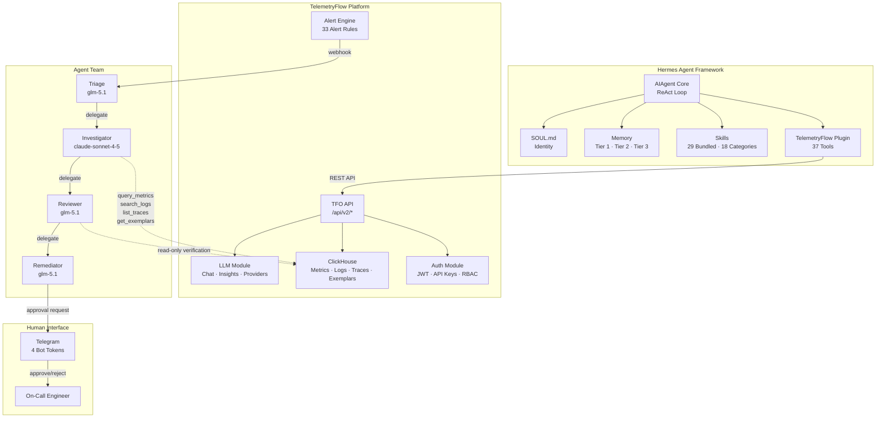
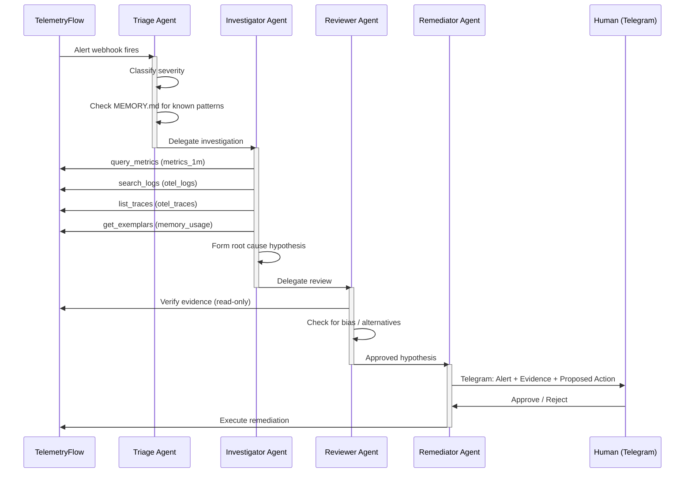
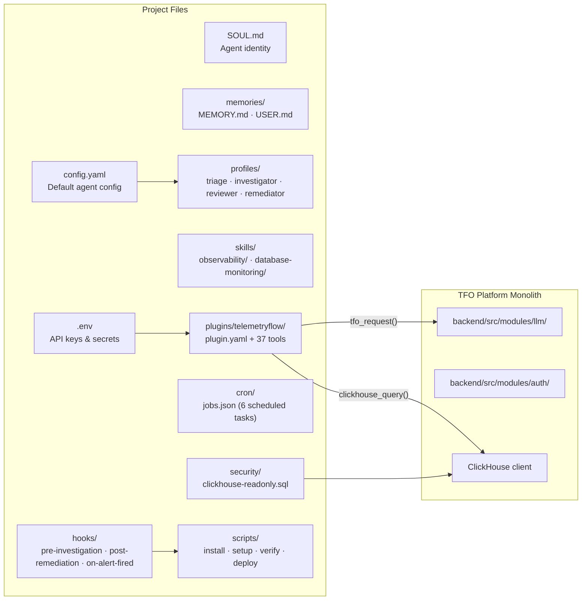

# Architecture Overview

System architecture for TelemetryFlow Hermes — a multi-agent AI incident response pipeline integrated with the TelemetryFlow Observability Platform.

## High-Level Architecture



## Data Flow — Incident Response Pipeline



## Component Architecture



## Technology Stack

| Layer                       | Technology                                         | Purpose                                                  |
| --------------------------- | -------------------------------------------------- | -------------------------------------------------------- |
| **Agent Framework**         | Hermes Agent (Nous Research)                       | Self-improving AI agent with memory, skills, multi-agent |
| **LLM Providers**           | Anthropic, Zhipu (OpenCode Go), OpenRouter, Ollama | Model inference for different agent roles                |
| **Observability**           | TelemetryFlow Platform                             | Metrics, Logs, Traces, Exemplars in ClickHouse           |
| **Database**                | ClickHouse                                         | Columnar storage for all telemetry signals               |
| **Plugin Runtime**          | Python 3 (stdlib only)                             | 37 tools using `urllib`, `json`, `sys`                   |
| **Communication**           | Telegram Bot API                                   | Human-in-the-loop notifications                          |
| **Container Orchestration** | Kubernetes                                         | Pod/deployment management for remediation                |
| **Security**                | JWT, API Keys (tfk*/tfs*), AES-256-GCM             | Authentication and encryption                            |

## Directory Structure

```
telemetryflow-hermes/
├── config.yaml                          # Default Hermes agent configuration
├── SOUL.md                              # Default agent identity
├── .env.example                         # API key template (3 auth methods)
├── Makefile                             # Setup, deploy, verify, CI targets
├── pyproject.toml                       # Python project config (pytest, ruff, coverage)
├── Dockerfile                           # Multi-stage Docker (python:3.13-slim-trixie)
├── docker-compose.yaml                  # 4 profiles: core, monitoring, tools, all
├── run-container.sh                     # Build, tag, push, compose orchestration
│
├── profiles/                            # Multi-agent team (4 profiles)
│   ├── triage/                          # Alert classifier
│   │   ├── config.yaml                  #   glm-5.1, max_turns=30, readonly
│   │   ├── SOUL.md                      #   Triage specialist identity
│   │   └── memories/                    #   MEMORY.md + USER.md
│   ├── investigator/                    # Evidence gatherer
│   │   ├── config.yaml                  #   claude-sonnet-4-5, max_turns=45
│   │   ├── SOUL.md                      #   Senior SRE identity
│   │   └── memories/
│   ├── reviewer/                        # Independent verifier
│   │   ├── config.yaml                  #   glm-5.1, max_turns=20, readonly
│   │   ├── SOUL.md                      #   Independent reviewer identity
│   │   └── memories/
│   └── remediator/                      # Gated actor
│       ├── config.yaml                  #   glm-5.1, max_turns=15, require_approval
│       ├── SOUL.md                      #   Remediation specialist identity
│       └── memories/
│
├── skills/                              # 29 bundled skills (18 categories)
│   ├── monitoring/                      #   8 skills (uptime, vm, agent, k8s, service-map, network-map, ...)
│   ├── observability/                   #   9 skills (k8s-pod-debug, payments-api-oom-rca, ...)
│   ├── database-monitoring/             #   2 skills (slow-query-detection, qan-analysis)
│   ├── alerting/                        #   alert-management
│   ├── dashboard/                       #   dashboard-management
│   ├── reporting/                       #   report-automation
│   ├── retention/                       #   retention-management
│   ├── audit/                           #   audit-compliance
│   ├── subscription/                    #   subscription-management
│   ├── tenancy/                         #   tenancy-administration
│   ├── iam/                             #   iam-administration
│   ├── sso/                             #   sso-configuration
│   ├── query/                           #   tfql-query
│   ├── ai-intelligence/                 #   ai-intelligence
│   └── ...                              #   18 categories total
│
├── plugins/                             # TelemetryFlow plugin
│   └── telemetryflow/
│       ├── plugin.yaml                  # v3.0.0 — 37 tools
│       └── tools/                       # 37 Python tools (stdlib only)
│           ├── _shared.py               # TFO API helpers, 74 ContextTypes, 15 ProviderTypes
│           │
│           │ # ── Core Telemetry (5) ──
│           ├── query_metrics.py
│           ├── search_logs.py
│           ├── list_traces.py
│           ├── get_exemplars.py
│           ├── query_correlations.py
│           │
│           │ # ── Monitoring (8) ──
│           ├── check_k8s.py
│           ├── check_infra.py
│           ├── check_uptime.py
│           ├── check_vm.py
│           ├── check_agent.py
│           ├── check_service_map.py
│           ├── check_network_map.py
│           ├── check_db_monitoring.py
│           │
│           │ # ── AI & LLM (7) ──
│           ├── chat_with_context.py
│           ├── stream_chat.py
│           ├── manage_conversation.py
│           ├── generate_insight.py
│           ├── query_llm_usage.py
│           ├── manage_provider.py
│           ├── query_ai_intelligence.py
│           │
│           │ # ── Platform (8) ──
│           ├── query_platform.py
│           ├── query_account.py
│           ├── query_audit.py
│           ├── query_subscription.py
│           ├── manage_dashboards.py
│           ├── manage_alerts.py
│           ├── manage_reports.py
│           ├── manage_data_masking.py
│           │
│           │ # ── Infrastructure (6) ──
│           ├── manage_retention.py
│           ├── manage_tenancy.py
│           ├── manage_iam.py
│           ├── manage_sso.py
│           ├── query_tfql.py
│           │
│           │ # ── Remediation (3+1) ⚠ requires_approval ──
│           ├── scale_deployment.py       # ⚠
│           ├── restart_pod.py            # ⚠
│           ├── rollback_deploy.py        # ⚠
│           └── update_alert.py           # ⚠
│
├── tests/                               # 458 tests, 97% coverage
│   ├── conftest.py                      # Shared fixtures
│   ├── mocks/                           # MockTFOApi, response factories
│   ├── unit/                            # 34 tool test files
│   └── integration/                     # Pipeline integration tests
│
├── cron/                                # Scheduled tasks
│   ├── jobs.json                        # 6 cron jobs
│   └── output/                          # Cron run outputs
│
├── scripts/                             # Deployment scripts
│   ├── install.sh                       # Hermes Agent installer
│   ├── setup-profiles.sh                # Create 4 agent profiles
│   ├── setup-telegram.sh                # Configure Telegram gateways
│   ├── verify-pipeline.sh               # End-to-end pipeline verification
│   └── deploy-air-gapped.sh             # Air-gapped deployment
│
├── security/                            # Database security
│   ├── clickhouse-readonly.sql          # Read-only user (20 tables)
│   └── setup-readonly-user.sh           # Automated setup script
│
├── hooks/                               # Lifecycle hooks
│   ├── on-alert-fired.sh                # Alert enrichment before triage
│   ├── pre-investigation.sh             # Investigation context logging
│   └── post-remediation.sh              # Remediation outcome tracking
│
├── .github/workflows/                   # GitHub Actions CI/CD
│   ├── ci.yml                           #   lint → test-unit → test-integration → security → coverage
│   ├── docker.yml                       #   Multi-platform Docker build (amd64/arm64)
│   └── release.yml                      #   Tag-triggered release
├── .gitlab-ci.yml                       # GitLab CI/CD pipeline
│
└── docs/                                # Documentation wiki (28+ pages)
    ├── README.md                        # Wiki index
    ├── getting-started.md
    ├── architecture.md
    ├── tfo-hermes.md                    # Marp presentation
    ├── agents/                          # Agent docs
    ├── tools/                           # Tool overview + reference
    ├── skills/                          # Skill overview + reference
    ├── api/                             # Auth, LLM module, context types
    ├── deployment/                      # Standard, Docker, air-gapped
    ├── security/                        # Security overview + ClickHouse
    ├── configuration/                   # Environment variables reference
    └── operations/                      # Cron, hooks, troubleshooting
```

## Key Design Decisions

### 1. Python stdlib only (no pip dependencies)

All 37 plugin tools use only Python standard library (`urllib`, `json`, `sys`, `os`). No `requests`, `httpx`, or external packages. This maximizes portability and eliminates supply chain risk.

### 2. All queries go through TFO API

ClickHouse queries are routed through `POST /api/v2/telemetry/query`, not direct connections. This ensures:

- Authentication and authorization via TFO's auth guards
- Workspace-scoped data isolation
- Audit logging of all queries
- Rate limiting per organization

### 3. Cost-optimized model selection

| Agent        | Model                 | Cost/Incident | Why                                     |
| ------------ | --------------------- | ------------- | --------------------------------------- |
| Triage       | glm-5.1 (OpenCode Go) | ~$0.01        | Simple classification, fast response    |
| Investigator | claude-sonnet-4-5     | ~$0.05-0.15   | Complex reasoning, evidence correlation |
| Reviewer     | glm-5.1               | ~$0.03-0.08   | Verification, not creative reasoning    |
| Remediator   | glm-5.1               | ~$0.01-0.03   | Action proposal, not investigation      |

**Total: ~$0.10-0.27/incident** (vs ~$0.39 with Claude-only)

### 4. Separate contexts for bias prevention

The Reviewer agent runs in a completely separate context — it only sees the evidence and hypothesis, not the Investigator's thought process. This prevents:

- Confirmation bias (defending conclusions)
- Anchoring bias (overweighting initial findings)
- Sunk cost bias (continuing a failed approach)

### 5. Human-in-the-loop for all mutations

Four tools require explicit human approval via Telegram:

- `scale_deployment` — changes replicas
- `restart_pod` — kills running pods
- `rollback_deploy` — reverts deployments
- `update_alert` — modifies alert rules

The Remediator has a 600-second approval timeout with auto-escalation.
