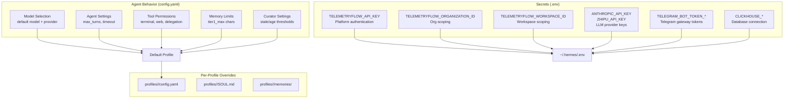

# Configuration Overview

TelemetryFlow Hermes configuration is split across two mechanisms: `config.yaml` for agent behavior and `.env` for secrets.

## Configuration Architecture



## File Locations

| File             | Location                                      | Purpose                            |
| ---------------- | --------------------------------------------- | ---------------------------------- |
| Default config   | `~/.hermes/config.yaml`                       | Agent behavior for default profile |
| Default identity | `~/.hermes/SOUL.md`                           | Agent personality                  |
| Default memory   | `~/.hermes/memories/`                         | MEMORY.md + USER.md                |
| Secrets          | `~/.hermes/.env`                              | All API keys and passwords         |
| Profile config   | `~/.hermes/profiles/<name>/config.yaml`       | Per-profile overrides              |
| Profile identity | `~/.hermes/profiles/<name>/SOUL.md`           | Per-profile personality            |
| Plugin config    | `~/.hermes/plugins/telemetryflow/plugin.yaml` | Tool definitions                   |
| Cron config      | `~/.hermes/cron/jobs.json`                    | Scheduled tasks                    |

## Sub-Pages

- [Environment Variables](./environment.md) — Complete `.env` reference

## Quick Configuration Commands

```bash
# View current config
hermes config get model.default
hermes config get model.provider

# Set model for default profile
hermes config set model.default "glm-5.1"
hermes config set model.provider "opencode-go"

# Set model for specific profile
hermes -p investigator config set model.default "claude-sonnet-4-5"
hermes -p investigator config set model.provider "anthropic"

# Check env path
hermes config env-path

# View tool status
hermes tools list
```
