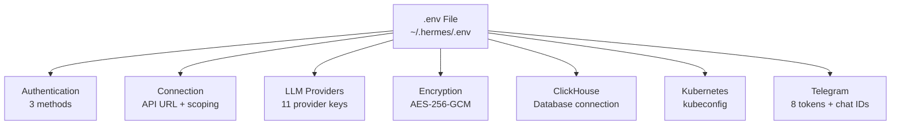
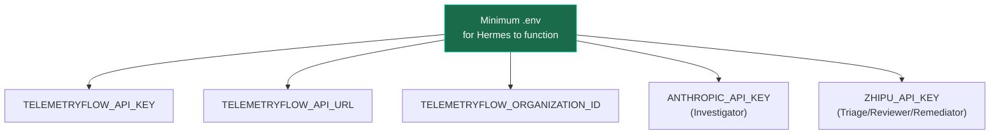

# Environment Variables

Complete reference for all environment variables in TelemetryFlow Hermes.

## Variable Overview



---

## Authentication (pick one method)

### Method A: API Key (Recommended for Agents)

| Variable                | Required | Format           | Description                                         |
| ----------------------- | -------- | ---------------- | --------------------------------------------------- |
| `TELEMETRYFLOW_API_KEY` | **Yes**  | `tfs_<64 chars>` | API key from TelemetryFlow UI → Settings → API Keys |

Required scopes: `llm:chat`, `llm:read`, `llm:write`, `llm:insights`, `telemetry:read`

```env
TELEMETRYFLOW_API_KEY=tfs_abc123def456...
```

### Method B: JWT Login

| Variable                      | Required     | Description                 |
| ----------------------------- | ------------ | --------------------------- |
| `TELEMETRYFLOW_AUTH_EMAIL`    | If using JWT | TelemetryFlow user email    |
| `TELEMETRYFLOW_AUTH_PASSWORD` | If using JWT | TelemetryFlow user password |

```env
TELEMETRYFLOW_AUTH_EMAIL=user@example.com
TELEMETRYFLOW_AUTH_PASSWORD=SecureP@ssw0rd!
```

Token lifecycle: 15m (prod) / 24h (dev). Hermes auto-refreshes.

### Method C: Ingestion Headers

| Variable                   | Required           | Format              | Description |
| -------------------------- | ------------------ | ------------------- | ----------- |
| `TELEMETRYFLOW_KEY_ID`     | If using ingestion | `tfk_<32-64 chars>` | Key ID      |
| `TELEMETRYFLOW_KEY_SECRET` | If using ingestion | `tfs_<32-64 chars>` | Key secret  |

```env
TELEMETRYFLOW_KEY_ID=tfk_abc123...
TELEMETRYFLOW_KEY_SECRET=tfs_def456...
```

---

## Connection

| Variable                            | Required    | Default                        | Description                                        |
| ----------------------------------- | ----------- | ------------------------------ | -------------------------------------------------- |
| `TELEMETRYFLOW_API_URL`             | **Yes**     | `http://localhost:3000/api/v2` | TelemetryFlow API base URL                         |
| `TELEMETRYFLOW_ORGANIZATION_ID`     | **Yes**     | —                              | Organization UUID (required for all LLM endpoints) |
| `TELEMETRYFLOW_WORKSPACE_ID`        | Recommended | —                              | Workspace UUID (required for ClickHouse queries)   |
| `TELEMETRYFLOW_TENANT_ID`           | No          | —                              | Tenant UUID (for multi-tenant setups)              |
| `TELEMETRYFLOW_DEFAULT_PROVIDER_ID` | No          | —                              | LLM provider UUID (overrides org default)          |

```env
TELEMETRYFLOW_API_URL=http://localhost:3000/api/v2
TELEMETRYFLOW_ORGANIZATION_ID=550e8400-e29b-41d4-a716-446655440000
TELEMETRYFLOW_WORKSPACE_ID=660e8400-e29b-41d4-a716-446655440001
```

> **`TELEMETRYFLOW_ORGANIZATION_ID`** is required by every LLM endpoint. Find it in TelemetryFlow UI → Settings → Organization → Copy ID.

---

## LLM Provider Keys (for Hermes Agent)

These keys are used by Hermes profiles for agent reasoning, **not** stored in TelemetryFlow.

| Variable             | Agent Using It               | Description                              |
| -------------------- | ---------------------------- | ---------------------------------------- |
| `ANTHROPIC_API_KEY`  | Investigator                 | Claude Sonnet 4.5 — complex reasoning    |
| `OPENAI_API_KEY`     | (alternative)                | GPT-4o — alternative Investigator        |
| `ZHIPU_API_KEY`      | Triage, Reviewer, Remediator | GLM 5.1 via OpenCode Go — cost-efficient |
| `GOOGLE_API_KEY`     | (optional)                   | Gemini — multimodal tasks                |
| `DEEPSEEK_API_KEY`   | (optional)                   | DeepSeek — cost-efficient alternative    |
| `QWEN_API_KEY`       | (optional)                   | Qwen (Alibaba) — alternative provider    |
| `MISTRAL_API_KEY`    | (optional)                   | Mistral — European data-residency        |
| `GROK_API_KEY`       | (optional)                   | Grok (xAI) — alternative provider        |
| `KIMI_API_KEY`       | (optional)                   | Kimi (Moonshot) — alternative provider   |
| `MIMO_API_KEY`       | (optional)                   | MiMo (Xiaomi) — alternative provider     |
| `OPENROUTER_API_KEY` | (optional)                   | OpenRouter — unified 200+ model endpoint |

```env
# Required minimum
ANTHROPIC_API_KEY=sk-ant-api03-...
ZHIPU_API_KEY=your-zhipu-key

# Ollama — no key needed (air-gapped)
# Ensure Ollama running: http://localhost:11434
```

---

## Encryption

| Variable             | Required              | Description                                                                |
| -------------------- | --------------------- | -------------------------------------------------------------------------- |
| `LLM_ENCRYPTION_KEY` | If managing providers | AES-256-GCM key (min 32 chars). Used by TelemetryFlow's EncryptionService. |

```env
# Generate with:
# node -e "console.log(require('crypto').randomBytes(32).toString('base64'))"
LLM_ENCRYPTION_KEY=YmFzZTY0X2VuY29kZWRfa2V5XzMyX2NoYXJzX29yX21vcmU=
```

---

## ClickHouse

| Variable               | Required        | Default           | Description                |
| ---------------------- | --------------- | ----------------- | -------------------------- |
| `CLICKHOUSE_HOST`      | No              | `localhost`       | ClickHouse server hostname |
| `CLICKHOUSE_PORT`      | No              | `9000`            | Native TCP port            |
| `CLICKHOUSE_HTTP_PORT` | No              | `8123`            | HTTP interface port        |
| `CLICKHOUSE_USER`      | No              | `hermes_readonly` | Read-only user             |
| `CLICKHOUSE_PASSWORD`  | If auth enabled | —                 | User password              |
| `CLICKHOUSE_DATABASE`  | No              | `telemetryflow`   | Default database           |

```env
CLICKHOUSE_HOST=clickhouse.internal
CLICKHOUSE_PORT=9000
CLICKHOUSE_HTTP_PORT=8123
CLICKHOUSE_USER=hermes_readonly
CLICKHOUSE_PASSWORD=secure_password
CLICKHOUSE_DATABASE=telemetryflow
```

> **Note**: Hermes tools query ClickHouse through the TelemetryFlow API (`POST /telemetry/query`), not directly. These variables are for direct access tools and debugging scripts only.

---

## Kubernetes

| Variable     | Required | Default          | Description             |
| ------------ | -------- | ---------------- | ----------------------- |
| `KUBECONFIG` | No       | `~/.kube/config` | Path to kubeconfig file |

```env
KUBECONFIG=~/.kube/config
```

---

## Telegram Gateway

Each agent needs its own bot token (Telegram allows 1 connection per token).

| Variable                          | Agent        | Description               |
| --------------------------------- | ------------ | ------------------------- |
| `TELEGRAM_BOT_TOKEN_TRIAGE`       | Triage       | Bot token from @BotFather |
| `TELEGRAM_CHAT_ID_TRIAGE`         | Triage       | Chat ID for notifications |
| `TELEGRAM_BOT_TOKEN_INVESTIGATOR` | Investigator | Bot token from @BotFather |
| `TELEGRAM_CHAT_ID_INVESTIGATOR`   | Investigator | Chat ID for notifications |
| `TELEGRAM_BOT_TOKEN_REVIEWER`     | Reviewer     | Bot token from @BotFather |
| `TELEGRAM_CHAT_ID_REVIEWER`       | Reviewer     | Chat ID for notifications |
| `TELEGRAM_BOT_TOKEN_REMEDIATOR`   | Remediator   | Bot token from @BotFather |
| `TELEGRAM_CHAT_ID_REMEDIATOR`     | Remediator   | Chat ID for notifications |

```env
# Get chat ID: message bot, then visit
# https://api.telegram.org/bot<TOKEN>/getUpdates

TELEGRAM_BOT_TOKEN_TRIAGE=123456:ABC-DEF...
TELEGRAM_CHAT_ID_TRIAGE=987654321
# ... repeat for each agent
```

---

## Optional: TelemetryFlow Backend

Only set if you're **also running** the TelemetryFlow Platform backend. Not needed for Hermes agent operation.

| Variable                  | Description                               |
| ------------------------- | ----------------------------------------- |
| `JWT_SECRET`              | JWT signing key (min 32 chars)            |
| `JWT_REFRESH_SECRET`      | Refresh token signing (min 32 chars)      |
| `JWT_ACCESS_EXPIRY`       | Access token TTL (default: `15m`)         |
| `JWT_REFRESH_EXPIRY`      | Refresh token TTL (default: `7d`)         |
| `SESSION_SECRET`          | Cookie signing (min 32 chars)             |
| `ENCRYPTION_KEY`          | General encryption (min 32 chars)         |
| `MFA_ENCRYPTION_KEY`      | TOTP secret encryption (min 32 chars)     |
| `LLM_DEFAULT_RATE_LIMIT`  | LLM requests/min per org (default: `100`) |
| `DEFAULT_ORGANIZATION_ID` | Fallback org for org-resolver             |
| `POSTGRES_HOST`           | TypeORM PostgreSQL host                   |
| `POSTGRES_PORT`           | PostgreSQL port (default: `5432`)         |
| `POSTGRES_USER`           | PostgreSQL user                           |
| `POSTGRES_PASSWORD`       | PostgreSQL password                       |
| `POSTGRES_DB`             | PostgreSQL database                       |
| `REDIS_HOST`              | Redis host (default: `localhost`)         |
| `REDIS_PORT`              | Redis port (default: `6379`)              |
| `PORT`                    | Backend API port (default: `3000`)        |

---

## Minimum Required Configuration



**Absolute minimum** (5 variables):

```env
TELEMETRYFLOW_API_KEY=tfs_xxxxx
TELEMETRYFLOW_API_URL=http://localhost:3000/api/v2
TELEMETRYFLOW_ORGANIZATION_ID=your-org-uuid
ANTHROPIC_API_KEY=sk-ant-xxxxx
ZHIPU_API_KEY=your-zhipu-key
```

**Recommended** (add workspace + Telegram):

```env
TELEMETRYFLOW_WORKSPACE_ID=your-workspace-uuid
TELEGRAM_BOT_TOKEN_TRIAGE=xxxxx
TELEGRAM_CHAT_ID_TRIAGE=xxxxx
TELEGRAM_BOT_TOKEN_INVESTIGATOR=xxxxx
TELEGRAM_CHAT_ID_INVESTIGATOR=xxxxx
TELEGRAM_BOT_TOKEN_REVIEWER=xxxxx
TELEGRAM_CHAT_ID_REVIEWER=xxxxx
TELEGRAM_BOT_TOKEN_REMEDIATOR=xxxxx
TELEGRAM_CHAT_ID_REMEDIATOR=xxxxx
```
