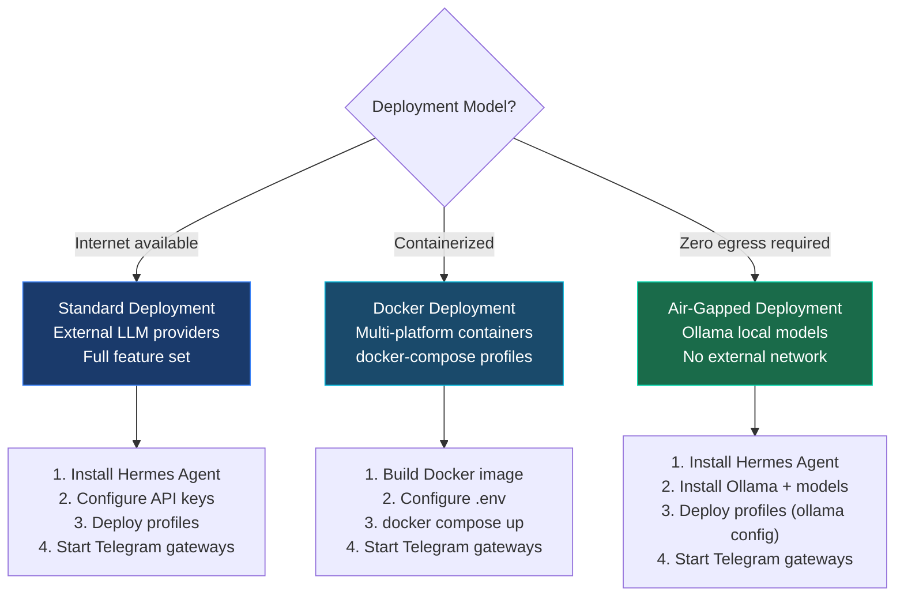

# Deployment Overview

Deploy TelemetryFlow Hermes in standard (cloud-connected), Docker, or air-gapped (fully offline) configurations.

## Deployment Models



## Prerequisites

### Common (both models)

| Requirement              | Purpose                          |
| ------------------------ | -------------------------------- |
| Python 3.8+              | Plugin tool runtime              |
| TelemetryFlow Platform   | Running instance with API access |
| ClickHouse               | Telemetry data storage           |
| Kubernetes cluster       | For remediation actions          |
| Telegram bot tokens (4x) | Agent communication              |
| `kubectl` configured     | K8s API access                   |

### Standard Only

| Requirement           | Purpose                                |
| --------------------- | -------------------------------------- |
| Anthropic API key     | Investigator agent (claude-sonnet-4-5) |
| Zhipu/OpenCode Go key | Triage/Reviewer/Remediator (glm-5.1)   |

### Air-Gapped Only

| Requirement          | Purpose                          |
| -------------------- | -------------------------------- |
| Ollama installed     | Local LLM inference              |
| Model weights pulled | `llama3.3`, `mistral-nemo`, etc. |
| No external network  | Full offline operation           |

## Quick Deploy

### Standard

```bash
# Clone
git clone https://github.com/telemetryflow/telemetryflow-hermes.git
cd telemetryflow-hermes

# Configure
cp .env.example ~/.hermes/.env
# Edit ~/.hermes/.env with your keys

# Deploy
make setup
make telegram
make verify
make deploy
```

### Docker

```bash
# Clone
git clone https://github.com/telemetryflow/telemetryflow-hermes.git
cd telemetryflow-hermes

# Configure
cp .env.example .env
# Edit .env with your keys

# Build and start (core stack)
./run-container.sh -b --up --profile core

# Or full stack
./run-container.sh -b --up --profile all
```

## Docker Compose Profiles

| Profile      | Services                                                  |
| ------------ | --------------------------------------------------------- |
| _(none)_     | Hermes agent only                                         |
| `core`       | Backend + Frontend + Postgres + ClickHouse + Redis + NATS |
| `monitoring` | TFO Collector + TFO Agent + Jaeger                        |
| `tools`      | Portainer                                                 |
| `all`        | Everything combined                                       |

## Next Steps

- [Standard Deployment](./standard.md) — Full deployment with external LLM providers
- [Air-Gapped Deployment](./air-gapped.md) — Offline deployment with Ollama
