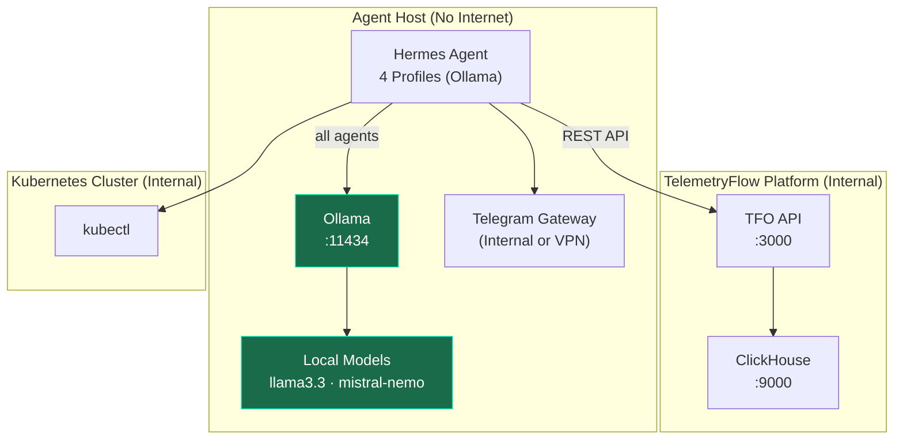
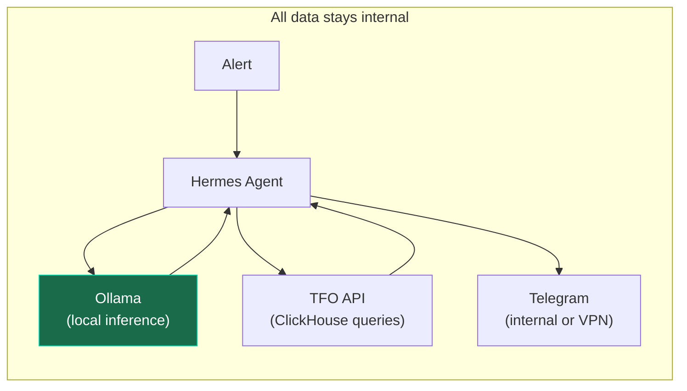
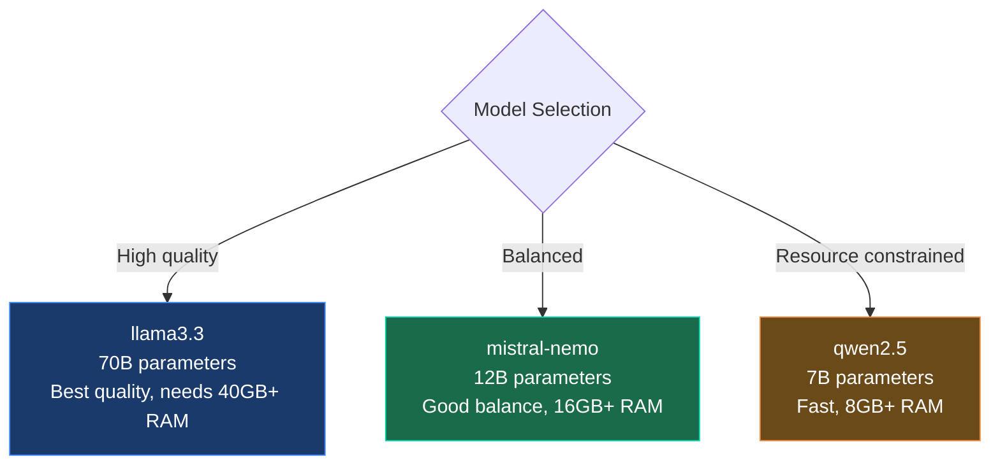

# Air-Gapped Deployment

Deploy TelemetryFlow Hermes in fully offline environments using Ollama for local LLM inference. No external network access required.

## Architecture



## Data Flow (Zero Egress)



**Prompt, context, and response never leave the cluster.** No API keys needed. No external network access required.

## Step-by-Step

### Step 1 — Install Ollama

```bash
# On the agent host (no internet needed if pre-installed)
curl -fsSL https://ollama.com/install.sh | sh

# Or download binary directly for air-gapped hosts
# https://github.com/ollama/ollama/releases
```

### Step 2 — Pull Models

On a machine with internet access, then transfer:

```bash
# On internet-connected machine
ollama pull llama3.3
ollama pull mistral-nemo

# Export models
ollama save llama3.3 -o llama3.3.tar
ollama save mistral-nemo -o mistral-nemo.tar

# Transfer to air-gapped host (USB, SCP, etc.)
scp llama3.3.tar air-gapped-host:~
scp mistral-nemo.tar air-gapped-host:~

# On air-gapped host
ollama load llama3.3 -i llama3.3.tar
ollama load mistral-nemo -i mistral-nemo.tar
```

### Step 3 — Verify Ollama

```bash
ollama list
# Should show: llama3.3, mistral-nemo

curl http://localhost:11434/api/generate -d '{
  "model": "llama3.3",
  "prompt": "Hello"
}'
```

### Step 4 — Configure Hermes for Ollama

```bash
# Install Hermes Agent
bash scripts/install.sh
source ~/.bashrc

# Configure all profiles for Ollama
hermes config set model.default "llama3.3"
hermes config set model.provider "ollama"
```

Or use the deploy script:

```bash
bash scripts/deploy-air-gapped.sh
```

This script:

1. Sets all profiles to use `ollama` provider
2. Configures `model.default: llama3.3`
3. Skips external API key validation
4. Deploys profiles, skills, cron, hooks, plugins

### Step 5 — Configure Environment

Edit `~/.hermes/.env`:

```env
# No external API keys needed
# ANTHROPIC_API_KEY= (leave empty)
# ZHIPU_API_KEY= (leave empty)

# TelemetryFlow connection (internal)
TELEMETRYFLOW_API_KEY=tfs_internal_key
TELEMETRYFLOW_API_URL=http://tfo-api.internal:3000/api/v2
TELEMETRYFLOW_ORGANIZATION_ID=org-uuid
TELEMETRYFLOW_WORKSPACE_ID=workspace-uuid

# Ollama (local)
OLLAMA_HOST=http://localhost:11434

# ClickHouse (internal)
CLICKHOUSE_HOST=clickhouse.internal
CLICKHOUSE_USER=hermes_readonly
CLICKHOUSE_PASSWORD=secure_password
CLICKHOUSE_DATABASE=telemetryflow

# Telegram (if using internal bot server)
# Or use local notification alternative
```

### Step 6 — Deploy and Start

```bash
make setup
make verify
make deploy
```

## Model Selection Guide



| Model          | Parameters | RAM Required | Quality | Speed   |
| -------------- | ---------- | ------------ | ------- | ------- |
| `llama3.3`     | 70B        | 40GB+        | Best    | Slow    |
| `mistral-nemo` | 12B        | 16GB+        | Good    | Medium  |
| `qwen2.5`      | 7B         | 8GB+         | Decent  | Fast    |
| `phi3`         | 3.8B       | 4GB+         | Basic   | Fastest |

### GPU Acceleration

Ollama automatically uses GPU if available:

```bash
# Check GPU status
nvidia-smi

# Ollama uses CUDA/Metal automatically
# No extra configuration needed
```

## Profile Configuration (Air-Gapped)

All 4 profiles use the same Ollama model:

| Agent        | Model    | Provider | Notes                                     |
| ------------ | -------- | -------- | ----------------------------------------- |
| Triage       | llama3.3 | ollama   | Classification                            |
| Investigator | llama3.3 | ollama   | Complex reasoning (slower without Claude) |
| Reviewer     | llama3.3 | ollama   | Verification                              |
| Remediator   | llama3.3 | ollama   | Action proposal                           |

> **Note**: Without Claude Sonnet, the Investigator may require more turns for complex investigations. Consider using a larger model (70B+) for the Investigator if resources allow.

## Alternatives to Telegram

In air-gapped environments, Telegram may not be accessible. Alternatives:

### Option 1: Internal Bot Server

Use a self-hosted bot framework (e.g., [Mattermost](https://mattermost.com), [Rocket.Chat](https://rocket.chat)).

### Option 2: Webhook to Internal Service

Configure Hermes to POST notifications to an internal webhook:

```bash
hermes -p remediator gateway setup  # select Webhook instead of Telegram
```

### Option 3: Log-Based Monitoring

Watch `~/.hermes/logs/` for remediation requests:

```bash
tail -f ~/.hermes/logs/remediations.log | grep "REQUEST_APPROVAL"
```

## Limitations

| Feature               | Standard                 | Air-Gapped                |
| --------------------- | ------------------------ | ------------------------- |
| LLM Quality           | Claude Sonnet (best)     | llama3.3 (good)           |
| Speed                 | Fast (cloud inference)   | Depends on local hardware |
| Cost                  | ~$0.10-0.27/incident     | Free (after hardware)     |
| TFO LLM API           | Full (all 15 providers)  | N/A (local Ollama)        |
| Skills Hub            | Full access (687 skills) | Pre-installed only        |
| GEPA Optimization     | Available                | Not available             |
| External Integrations | All                      | None                      |
