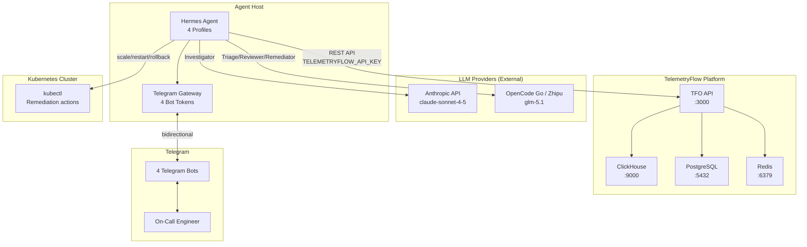
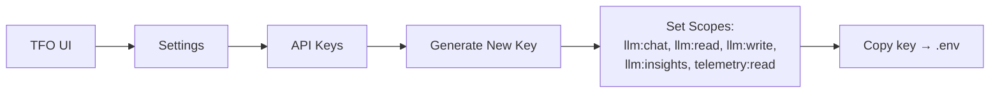
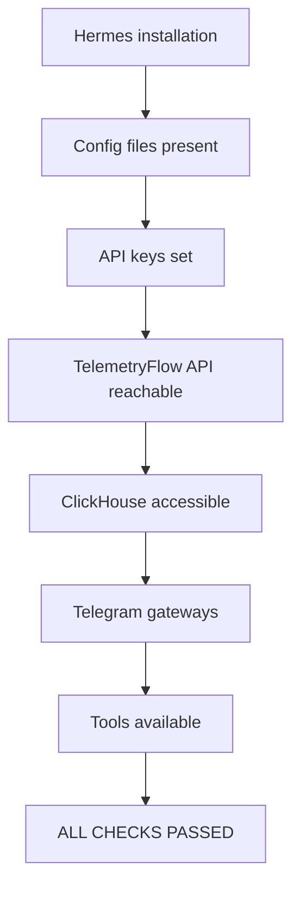

# Standard Deployment

Full deployment with external LLM providers (Anthropic, Zhipu/OpenCode Go, etc.).

## Architecture



## Step-by-Step

### Step 1 — Clone and Setup

```bash
git clone https://github.com/telemetryflow/telemetryflow-hermes.git
cd telemetryflow-hermes
make env
```

### Step 2 — Edit Environment Variables

Edit `~/.hermes/.env`:

```env
# Authentication (Method A recommended)
TELEMETRYFLOW_API_KEY=tfs_your_api_key_here

# Connection
TELEMETRYFLOW_API_URL=http://localhost:3000/api/v2
TELEMETRYFLOW_ORGANIZATION_ID=your-org-uuid
TELEMETRYFLOW_WORKSPACE_ID=your-workspace-uuid

# LLM Providers
ANTHROPIC_API_KEY=sk-ant-your-key    # Investigator
ZHIPU_API_KEY=your-zhipu-key         # Triage/Reviewer/Remediator
```

### Step 3 — Create TelemetryFlow API Key

In TelemetryFlow UI:



Required scopes:

- `llm:chat` — Send chat messages
- `llm:read` — Read providers and conversations
- `llm:write` — Manage providers
- `llm:insights` — Generate insights
- `telemetry:read` — Query ClickHouse

### Step 4 — Setup ClickHouse Read-Only User

```bash
# Run on ClickHouse server as admin
clickhouse-client < security/clickhouse-readonly.sql
```

This creates `hermes_readonly` with SELECT grants on 20 telemetry tables. See [ClickHouse Security](../security/clickhouse-readonly.md).

### Step 5 — Create Telegram Bots

Create 4 bots via @BotFather on Telegram:

```
/newbot → triage_bot
/newbot → investigator_bot
/newbot → reviewer_bot
/newbot → remediator_bot
```

For each bot, get the chat ID:

1. Message the bot
2. Visit `https://api.telegram.org/bot<TOKEN>/getUpdates`
3. Copy the `chat.id` value

### Step 6 — First-Time Setup

```bash
make init
```

This installs the Hermes agent and configures:

- 4 agent profiles (triage, investigator, reviewer, remediator)
- 29 skills across 18 categories
- 6 cron jobs
- 37 plugin tools
- 3 lifecycle hooks
- ClickHouse read-only security
- 4 Telegram gateways

### Step 7 — Verify Pipeline

```bash
make verify
```

Verification checks:



### Step 8 — Start Gateways

```bash
make deploy
```

Starts 4 background processes:

- `hermes -p triage gateway start`
- `hermes -p investigator gateway start`
- `hermes -p reviewer gateway start`
- `hermes -p remediator gateway start`

### Step 9 — Test with Sample Alert

Send a test alert to the Triage bot on Telegram:

```
ALERT: payments-api p95 latency breach
Service: payments-api
Metric: http_server_duration_p95
Value: 640ms (threshold: 200ms)
Severity: HIGH
Time: 2026-06-04T03:47:00Z
```

Expected flow: Triage → Investigator → Reviewer → Remediator → Human approval (~23 seconds).

## Make Targets Reference

| Target                | Description                                              |
| --------------------- | -------------------------------------------------------- |
| `make init`           | First-time setup (install hermes + configure everything) |
| `make configure`      | Install profiles, skills, plugins, cron, hooks           |
| `make env`            | Setup .env from .env.example                             |
| `make deploy`         | Start all 4 Telegram agent gateways                      |
| `make stop`           | Stop all gateways                                        |
| `make status`         | Check gateway status                                     |
| `make verify`         | End-to-end verification                                  |
| `make doctor`         | Run `hermes doctor --fix`                                |
| `make docker-build`   | Build Docker image                                       |
| `make docker-up`      | Start Docker containers                                  |
| `make docker-down`    | Stop Docker containers                                   |
| `make clean`          | Remove installed components                              |
| `make reset`          | Clean + re-configure                                     |

## Production Considerations

### Process Management

Use `systemd` or `screen` to keep gateways running:

```bash
# Using screen
screen -dmS hermes-triage hermes -p triage gateway start
screen -dmS hermes-investigator hermes -p investigator gateway start
screen -dmS hermes-reviewer hermes -p reviewer gateway start
screen -dmS hermes-remediator hermes -p remediator gateway start

# Or for SSH disconnects
sudo loginctl enable-linger $USER
```

### Logging

All agent activity is logged to `~/.hermes/logs/`:

| Log File             | Contents                             |
| -------------------- | ------------------------------------ |
| `agent.log`          | Agent activity and decisions         |
| `gateway.log`        | Telegram gateway events              |
| `errors.log`         | Error traces                         |
| `investigations.log` | Investigation start/end (from hooks) |
| `remediations.log`   | Remediation outcomes (from hooks)    |
| `alerts.log`         | Alert received events (from hooks)   |

### Monitoring

```bash
# Check all gateway status
make status

# Watch recent investigation logs
tail -f ~/.hermes/logs/investigations.log

# Check errors
grep -i error ~/.hermes/logs/gateway.log | tail -20
```
