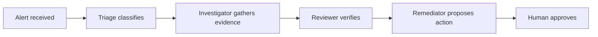

# Getting Started

Install and configure TelemetryFlow Hermes for autonomous incident response.

## Prerequisites

| Requirement            | Version  | Check                                |
| ---------------------- | -------- | ------------------------------------ |
| Python 3               | 3.8+     | `python3 --version`                  |
| Hermes Agent           | Latest   | `hermes --version`                   |
| TelemetryFlow Platform | Running | `curl $TELEMETRYFLOW_API_URL/health` |
| ClickHouse             | Running  | Via TFO API                          |
| Telegram Bot Token     | 4 tokens | [@BotFather](https://t.me/BotFather) |
| kubectl                | 1.28+    | `kubectl version`                    |

## Installation

### Step 1 — Install Hermes Agent

```bash
curl -fsSL https://raw.githubusercontent.com/NousResearch/hermes-agent/main/scripts/install.sh | bash
source ~/.bashrc

# Verify installation
hermes doctor
```

### Step 2 — Clone TelemetryFlow Hermes

```bash
git clone https://github.com/telemetryflow/telemetryflow-hermes.git
cd telemetryflow-hermes
```

### Step 3 — Configure API Keys

```bash
cp .env.example ~/.hermes/.env
```

Edit `~/.hermes/.env` with your credentials. See [Environment Variables](./configuration/environment.md) for the complete reference.

**Minimum required variables:**

```env
# TFO Platform Authentication (pick one method)
TELEMETRYFLOW_API_KEY=tfs_your_api_key_here

# TelemetryFlow Platform Connection
TELEMETRYFLOW_API_URL=http://localhost:3000/api/v2
TELEMETRYFLOW_ORGANIZATION_ID=your-org-uuid
TELEMETRYFLOW_WORKSPACE_ID=your-workspace-uuid

# LLM Provider (for Hermes agent reasoning)
ZHIPU_API_KEY=your_zhipu_key         # Triage/Reviewer/Remediator
ANTHROPIC_API_KEY=your_anthropic_key  # Investigator
```

### Step 4 — Deploy Agent Profiles

```bash
make setup
```

This installs:

- 4 agent profiles (triage, investigator, reviewer, remediator)
- 29 skills across 18 categories
- 6 cron jobs
- 37 plugin tools covering all 20 TFO Platform modules
- 3 lifecycle hooks
- ClickHouse read-only security

### Step 5 — Configure Telegram

```bash
# Create 4 bots with @BotFather on Telegram
# Then run:
make telegram
```

Each agent needs its own bot token (Telegram allows 1 connection per token).

### Step 6 — Verify Pipeline

```bash
make verify
```

This runs `scripts/verify-pipeline.sh` which checks:

- Hermes installation
- API connectivity
- ClickHouse access
- Telegram gateway
- Tool availability

### Step 7 — Start Gateways

```bash
make deploy
```

Starts all 4 Telegram gateways in background.

## First Investigation

Send a test alert to your Triage agent's Telegram bot:

```
ALERT: payments-api p95 latency breach
Service: payments-api
Metric: http_server_duration_p95
Value: 640ms (threshold: 200ms)
Severity: HIGH
Time: 2026-06-04T03:47:00Z
```

The agent pipeline will:



Expected timeline: **~23 seconds** from alert to proposed remediation.

## Next Steps

- [Architecture Overview](./architecture.md) — understand the system design
- [Agent Configuration](./agents/README.md) — customize each agent's behavior
- [Tool Reference](./tools/reference.md) — all 37 tools and parameters
- [Deployment Guide](./deployment/standard.md) — production deployment
