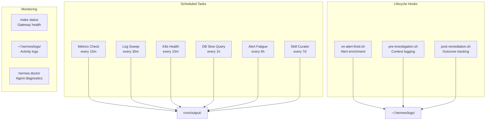

# Operations Overview

Day-to-day operations guide for TelemetryFlow Hermes — cron jobs, lifecycle hooks, and troubleshooting.

## Operations Dashboard

## Common Operations

| Task                    | Command                                     | Description                        |
| ----------------------- | ------------------------------------------- | ---------------------------------- |
| Check status            | `make status`                               | Show all 4 gateway statuses        |
| View investigation logs | `tail -f ~/.hermes/logs/investigations.log` | Real-time investigations           |
| View remediation logs   | `tail -f ~/.hermes/logs/remediations.log`   | Real-time remediations             |
| Run diagnostics         | `make doctor`                               | Hermes agent health check          |
| Restart gateways        | `make deploy`                               | Restart all 4 gateways             |
| Clean installation      | `make clean`                                | Remove all profiles/skills/plugins |
| Run curator             | `hermes curator run`                        | Manual skill cleanup               |
| Verify pipeline         | `make verify`                               | Full pipeline verification         |

## Sub-Pages

- [Cron Jobs](./cron-jobs.md) — 6 scheduled investigation tasks
- [Lifecycle Hooks](./hooks.md) — 3 event-driven automation scripts
- [Troubleshooting](./troubleshooting.md) — Common issues and solutions
