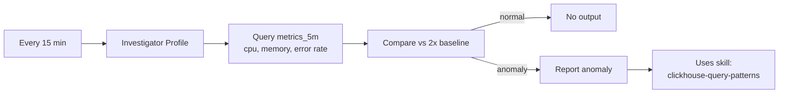
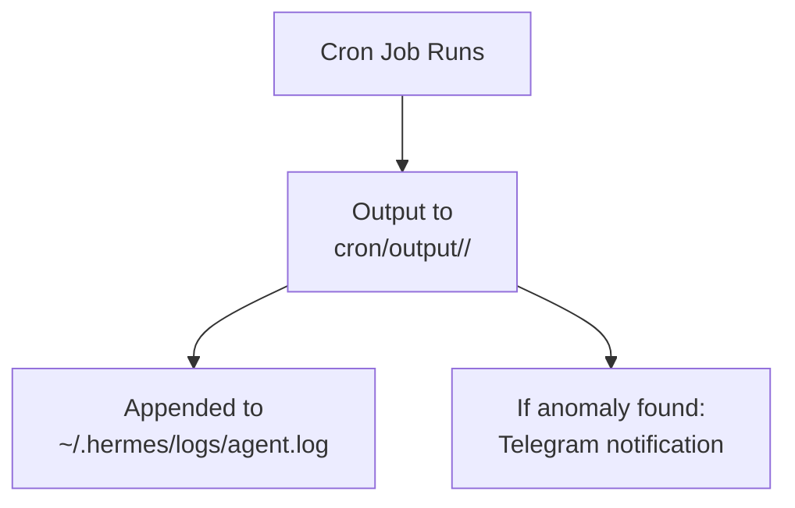

# Cron Jobs

6 scheduled investigation tasks that run automatically to proactively detect issues before they become incidents.

## Job Schedule

```mermaid
gantt
    title Cron Job Schedule
    dateFormat X
    axisFormat %s

    section Investigator
    K8s Health Check      :k8s, 0, 600s
    Metrics Health Check  :metrics, 0, 900s
    Log Error Sweep       :logs, 0, 1800s
    DB Slow Query Check   :db, 0, 3600s

    section Triage
    Alert Fatigue Review  :alert, 0, 21600s

    section Default
    Skill Curator         :curator, 0, 604800s
```



## Job Details

### health-check-metrics



| Property     | Value                                                                                                  |
| ------------ | ------------------------------------------------------------------------------------------------------ |
| **Schedule** | Every 15 minutes                                                                                       |
| **Profile**  | `investigator`                                                                                         |
| **Skill**    | `clickhouse-query-patterns`                                                                            |
| **Task**     | Check metrics_5m for anomaly spikes in cpu, memory, error rate. Report services exceeding 2x baseline. |

### log-error-sweep

| Property     | Value                                                                                                                                     |
| ------------ | ----------------------------------------------------------------------------------------------------------------------------------------- |
| **Schedule** | Every 30 minutes                                                                                                                          |
| **Profile**  | `investigator`                                                                                                                            |
| **Task**     | Search otel_logs for new ERROR patterns in last 30 minutes. Compare with MEMORY.md known patterns. Report only genuinely new error types. |

### k8s-health-check

| Property     | Value                                                                                                                                              |
| ------------ | -------------------------------------------------------------------------------------------------------------------------------------------------- |
| **Schedule** | Every 10 minutes                                                                                                                                   |
| **Profile**  | `investigator`                                                                                                                                     |
| **Skill**    | `k8s-pod-debug`                                                                                                                                    |
| **Task**     | Check Kubernetes pod health via TFO API. Look for CrashLoopBackOff, OOMKilled, ImagePullBackOff pods. Cross-reference with MEMORY.md known issues. |

### db-slow-query-check

| Property     | Value                                                                                                         |
| ------------ | ------------------------------------------------------------------------------------------------------------- |
| **Schedule** | Every 1 hour                                                                                                  |
| **Profile**  | `investigator`                                                                                                |
| **Skill**    | `slow-query-detection`                                                                                        |
| **Task**     | Query TFO QAN for slow queries (>200ms) across all monitored databases. Report top 5 slowest by p95 duration. |

### alert-fatigue-review

| Property     | Value                                                                                                                                              |
| ------------ | -------------------------------------------------------------------------------------------------------------------------------------------------- |
| **Schedule** | Every 6 hours                                                                                                                                      |
| **Profile**  | `triage`                                                                                                                                           |
| **Task**     | Review alert firing patterns from last 6 hours. Identify noise alerts firing >10 times. Suggest suppression rules for known patterns in MEMORY.md. |

### skill-curator

| Property     | Value                                                                                                   |
| ------------ | ------------------------------------------------------------------------------------------------------- |
| **Schedule** | Every 7 days                                                                                            |
| **Profile**  | `default`                                                                                               |
| **Task**     | Run Hermes Curator to review agent-created skills. Archive unused skills, consolidate overlapping ones. |

## Job Configuration

Jobs are defined in `cron/jobs.json`:

```json
{
  "jobs": [
    {
      "id": "health-check-metrics",
      "profile": "investigator",
      "schedule": "every 15m",
      "task": "Check TelemetryFlow ClickHouse metrics_5m...",
      "enabled": true,
      "skill": "clickhouse-query-patterns",
      "output_dir": "cron/output/"
    }
  ]
}
```

### Modifying Jobs

```bash
# Add a new job (plain English)
hermes -p investigator cron add "every 30m" "Check for memory pressure on node-pool-3"

# Disable a job
# Edit ~/.hermes/cron/jobs.json, set "enabled": false

# View job output
ls ~/.hermes/cron/output/

# Chain jobs (output feeds next job)
hermes cron add "every 1h" "Summarize cron output" --context_from health-check-metrics
```

## Output Handling



Each job writes output to `cron/output/<job_id>/` with timestamps. The agent can be configured to notify on anomalies via Telegram.
