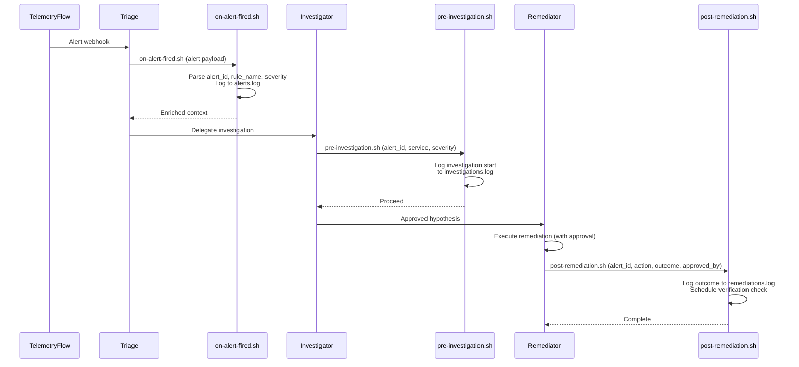
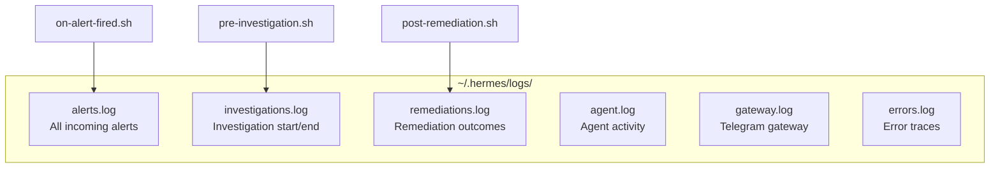

# Lifecycle Hooks

3 event-driven scripts that run automatically at key points in the incident response pipeline.

## Hook Architecture



## Hook Details

### on-alert-fired.sh

**Trigger**: When a TelemetryFlow alert triggers the Triage agent.

**Purpose**: Log the alert and enrich context before triage classification.

**Arguments**:
| Arg | Description |
|-----|-------------|
| `$1` | Alert payload (JSON string) |

**Behavior**:

1. Logs `ALERT_FIRED` with timestamp and payload size to `alerts.log`
2. Parses JSON to extract `alert_id`, `rule_name`, `severity`
3. Prints alert summary for Triage context

**Log Output** (`~/.hermes/logs/alerts.log`):

```
[2026-06-04T03:47:00Z] ALERT_FIRED payload_size=1247
  Alert ID: alert_abc123
  Rule: payments-api-latency-breach
  Severity: HIGH
  Triage classification starting...
```

---

### pre-investigation.sh

**Trigger**: Before the Investigator agent starts a new investigation.

**Purpose**: Log investigation start and validate alert context.

**Arguments**:
| Arg | Description |
|-----|-------------|
| `$1` | Alert ID |
| `$2` | Service name |
| `$3` | Severity level |

**Behavior**:

1. Logs `INVESTIGATION_START` with alert ID, service, severity
2. Warns if no alert_id provided (investigation may lack context)

**Log Output** (`~/.hermes/logs/investigations.log`):

```
[2026-06-04T03:47:01Z] INVESTIGATION_START alert=alert_abc123 service=payments-api severity=HIGH
```

---

### post-remediation.sh

**Trigger**: After the Remediator agent executes an approved action.

**Purpose**: Log the outcome and trigger verification.

**Arguments**:
| Arg | Description |
|-----|-------------|
| `$1` | Alert ID |
| `$2` | Action taken (e.g., `rollback_deploy`) |
| `$3` | Outcome (`success`, `failure`, `unknown`) |
| `$4` | Approver (`human`, `auto`) |

**Behavior**:

1. Logs `REMEDIATION_COMPLETE` with all details
2. Prints reminder to run verification in 30 seconds
3. Verification checklist: metrics return to baseline, no new error spikes, pod status healthy

**Log Output** (`~/.hermes/logs/remediations.log`):

```
[2026-06-04T03:47:45Z] REMEDIATION_COMPLETE alert=alert_abc123 action=rollback_deploy outcome=success approved_by=human
```

## Hook Installation

```bash
# Via Makefile
make hooks

# Manual
mkdir -p ~/.hermes/hooks
cp hooks/*.sh ~/.hermes/hooks/
chmod +x ~/.hermes/hooks/*.sh
```

## Log Files



## Custom Hooks

To add custom hooks:

```bash
# Create hook script
cat > ~/.hermes/hooks/on-call-notify.sh << 'EOF'
#!/bin/bash
set -euo pipefail
ALERT_ID="${1:-}"
SEVERITY="${2:-}"
if [ "$SEVERITY" = "CRITICAL" ]; then
  # Send to PagerDuty, Slack, etc.
  curl -X POST https://hooks.slack.com/... \
    -d "{\"text\": \"CRITICAL alert: $ALERT_ID\"}"
fi
EOF
chmod +x ~/.hermes/hooks/on-call-notify.sh
```
