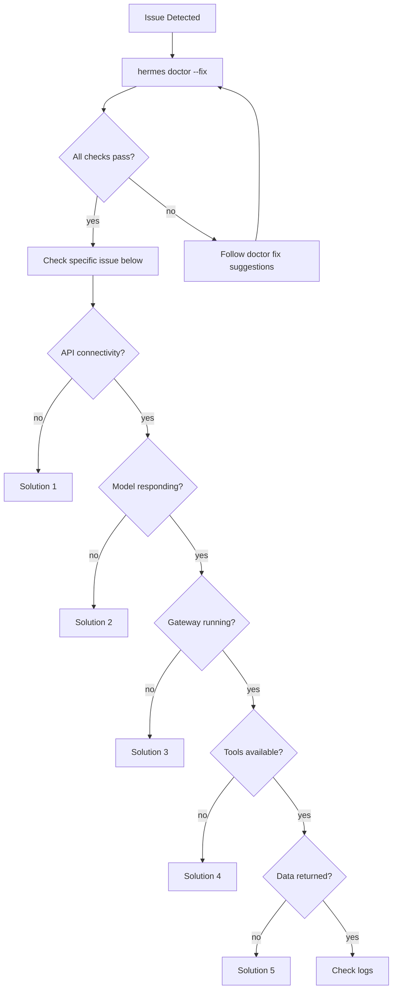

# Troubleshooting

Common issues and solutions for TelemetryFlow Hermes.

## Quick Diagnostics



## Common Issues

### 1. TelemetryFlow API Not Reachable

**Symptom**: `Connection error` or `HTTP 502` from plugin tools.

**Checks**:

```bash
# Check API URL
echo $TELEMETRYFLOW_API_URL

# Test connectivity
curl -sf "$TELEMETRYFLOW_API_URL/../health"

# Check API key
echo $TELEMETRYFLOW_API_KEY | head -c 10
```

**Solutions**:
| Cause | Fix |
|-------|-----|
| Wrong URL | Update `TELEMETRYFLOW_API_URL` in `~/.hermes/.env` |
| TFO Platform down | Start the platform: `./run-container.sh --up --profile core` or `docker compose --profile core up -d` |
| Firewall blocking | Open port 3000 (or your configured port) |
| SSL certificate error | Use `http://` for local, verify cert for remote |

---

### 2. Model Not Responding

**Symptom**: Agent hangs or returns errors when reasoning.

**Checks**:

```bash
# Check model config
hermes config get model.default
hermes config get model.provider

# Check API key
hermes config env-path
cat ~/.hermes/.env | grep ANTHROPIC_API_KEY
cat ~/.hermes/.env | grep ZHIPU_API_KEY

# Test provider directly
curl -sf https://api.anthropic.com/v1/messages \
  -H "x-api-key: $ANTHROPIC_API_KEY" \
  -H "content-type: application/json" \
  -H "anthropic-version: 2023-06-01" \
  -d '{"model":"claude-sonnet-4-5","max_tokens":10,"messages":[{"role":"user","content":"hi"}]}'
```

**Solutions**:
| Cause | Fix |
|-------|-----|
| Invalid API key | Regenerate key from provider dashboard |
| Quota exceeded | Check provider billing/usage dashboard |
| Wrong model name | Verify model ID matches provider's catalog |
| Provider outage | Switch to alternative: `hermes config set model.provider "openrouter"` |

---

### 3. Gateway Not Running

**Symptom**: Telegram bot not responding to messages.

**Checks**:

```bash
# Check gateway status
make status

# Check gateway logs
grep -i error ~/.hermes/logs/gateway.log | tail -20

# Check if process is running
ps aux | grep hermes
```

**Solutions**:
| Cause | Fix |
|-------|-----|
| Process died | `hermes -p <profile> gateway start` |
| SSH disconnect | `sudo loginctl enable-linger $USER` |
| Invalid bot token | Verify token with @BotFather |
| Multiple connections | Each bot needs unique token (1 connection/token) |
| Port conflict | Kill duplicate: `pkill -f "hermes.*gateway"` |

---

### 4. Tool Not Available

**Symptom**: Agent says tool doesn't exist or fails to execute.

**Checks**:

```bash
hermes tools list
ls ~/.hermes/plugins/telemetryflow/tools/
```

**Solutions**:
| Cause | Fix |
|-------|-----|
| Plugin not installed | `make plugins` |
| Tools disabled | `hermes tools enable terminal && hermes tools enable web` |
| Python 3 not found | `which python3` — ensure Python 3.8+ is installed |
| Permission denied | `chmod +x ~/.hermes/plugins/telemetryflow/tools/*.py` |
| Stale session | Send `/reset` in Telegram (changes apply to new sessions) |

---

### 5. No Data Returned from Queries

**Symptom**: Tools return empty results.

**Checks**:

```bash
# Check workspace ID
echo $TELEMETRYFLOW_WORKSPACE_ID

# Check org ID
echo $TELEMETRYFLOW_ORGANIZATION_ID

# Test direct ClickHouse query
clickhouse-client --user=hermes_readonly \
  --query "SELECT count() FROM telemetryflow.metrics_1m LIMIT 1"
```

**Solutions**:
| Cause | Fix |
|-------|-----|
| Wrong workspace ID | Update `TELEMETRYFLOW_WORKSPACE_ID` |
| No data in time range | Expand time range in tool parameters |
| Read-only user not created | `bash security/setup-readonly-user.sh` |
| ClickHouse not ingesting | Check TelemetryFlow Collector status |
| Empty database | Verify TFO Collector is sending OTLP data |

---

### 6. Approval Timeout

**Symptom**: Remediation request sent but no response, then auto-escalation.

**Checks**:

```bash
grep "timeout" ~/.hermes/logs/remediations.log
```

**Solutions**:
| Cause | Fix |
|-------|-----|
| Engineer not monitoring Telegram | Set up Telegram notifications/alerts |
| 600s timeout too short | Increase `approval_timeout_seconds` in profile config |
| Wrong chat ID | Verify `TELEGRAM_CHAT_ID_REMEDIATOR` |
| Bot not sending | Check `TELEGRAM_BOT_TOKEN_REMEDIATOR` |

---

### 7. Skills Accumulating / Stale

**Symptom**: Too many skills, degraded performance.

**Solutions**:

```bash
# Manual curator run
hermes curator run

# Pin important skills
hermes curator pin k8s-pod-debug
hermes curator pin payments-api-oom-rca

# Check archive
ls ~/.hermes/skills/.archive/

# Restore archived skill
hermes curator restore payments-api-oom-rca
```

---

### 8. High API Costs

**Symptom**: Unexpected LLM API charges.

**Checks**:

```bash
# Check which model each profile uses
hermes -p triage config get model.default
hermes -p investigator config get model.default
hermes -p reviewer config get model.default
hermes -p remediator config get model.default

# Check turn counts
grep "turn" ~/.hermes/logs/agent.log | tail -20
```

**Solutions**:
| Cause | Fix |
|-------|-----|
| All profiles using Claude | Switch Triage/Reviewer/Remediator to `glm-5.1` |
| High turn counts | Reduce `max_turns` in profile configs |
| Investigator doing too much | Check skills are loading properly |
| Cron jobs running expensive queries | Reduce cron frequency |

---

### 9. Gateway Dies on SSH Disconnect

**Symptom**: Gateway stops when SSH session ends.

**Solution**:

```bash
# Enable linger (keeps user processes after logout)
sudo loginctl enable-linger $USER

# Or use screen/tmux
screen -dmS hermes-triage hermes -p triage gateway start
screen -dmS hermes-investigator hermes -p investigator gateway start

# Or use systemd user service
cat > ~/.config/systemd/user/hermes-triage.service << 'EOF'
[Unit]
Description=Hermes Triage Gateway
[Service]
ExecStart=/usr/local/bin/hermes -p triage gateway start
Restart=always
[Install]
WantedBy=default.target
EOF
systemctl --user enable hermes-triage
systemctl --user start hermes-triage
```

---

### 10. OOM / Memory Issues (Air-Gapped)

**Symptom**: Ollama crashes or slow responses on agent host.

**Solutions**:

```bash
# Check Ollama resource usage
ollama ps

# Use smaller model
hermes config set model.default "qwen2.5"
hermes config set model.provider "ollama"

# Check available memory
free -h

# Reduce parallel agents
# Start only critical agents
hermes -p triage gateway start
hermes -p investigator gateway start
# Skip reviewer and remediator if memory constrained
```

## Log Reference

| Log File             | What to Look For                    |
| -------------------- | ----------------------------------- |
| `agent.log`          | Agent decisions, tool calls, errors |
| `gateway.log`        | `error`, `disconnect`, `timeout`    |
| `errors.log`         | Stack traces, crash reports         |
| `investigations.log` | Investigation start/end timestamps  |
| `remediations.log`   | Approval status, outcomes           |
| `alerts.log`         | Alert received timestamps           |

## Getting Help

If the above solutions don't resolve your issue:

1. Run `hermes doctor --fix` and share the output
2. Check `~/.hermes/logs/errors.log` for stack traces
3. Open an issue at [github.com/telemetryflow/telemetryflow-hermes/issues](https://github.com/telemetryflow/telemetryflow-hermes/issues)
