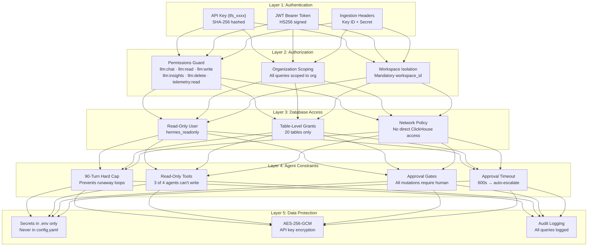
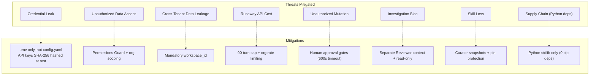
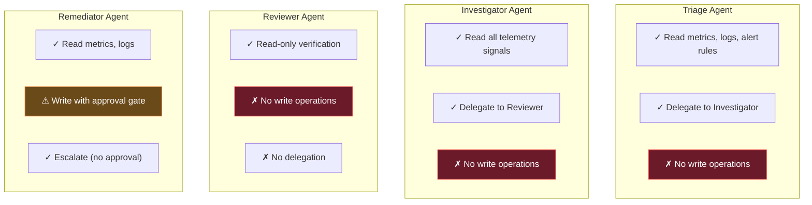
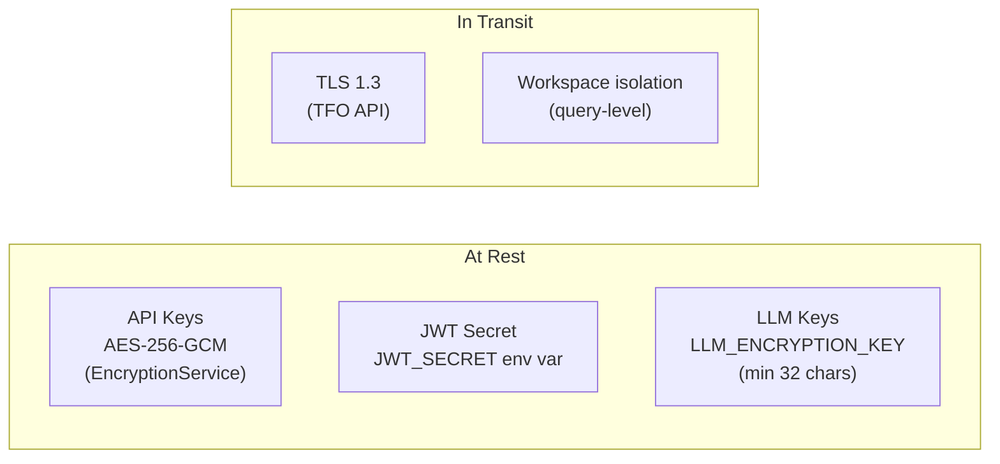

# Security Overview

Layered security model for TelemetryFlow Hermes — from authentication to database access to remediation gates.

## Security Layers

## Threat Model

## Agent Permission Matrix

| Capability        | Triage | Investigator | Reviewer | Remediator   |
| ----------------- | ------ | ------------ | -------- | ------------ |
| Read metrics      | ✓      | ✓            | ✓        | ✓            |
| Read logs         | ✓      | ✓            | ✓        | ✓            |
| Read traces       | ✗      | ✓            | ✓        | ✗            |
| Read exemplars    | ✗      | ✓            | ✓        | ✗            |
| Read correlations | ✗      | ✓            | ✓        | ✗            |
| Scale deployment  | ✗      | ✗            | ✗        | ⚠ (approval) |
| Restart pod       | ✗      | ✗            | ✗        | ⚠ (approval) |
| Rollback deploy   | ✗      | ✗            | ✗        | ⚠ (approval) |
| Update alert      | ✗      | ✗            | ✗        | ⚠ (approval) |
| Delegate          | ✓      | ✓            | ✗        | ✗            |
| Escalate to human | ✓      | ✓            | ✓        | ✓            |

## Encryption

## Secrets Management

| Secret                  | Location         | Format                    |
| ----------------------- | ---------------- | ------------------------- |
| `TELEMETRYFLOW_API_KEY` | `~/.hermes/.env` | `tfs_<64 chars>`          |
| `ANTHROPIC_API_KEY`     | `~/.hermes/.env` | `sk-ant-...`              |
| `ZHIPU_API_KEY`         | `~/.hermes/.env` | Provider-specific         |
| `LLM_ENCRYPTION_KEY`    | `~/.hermes/.env` | Base64, 32+ chars         |
| `CLICKHOUSE_PASSWORD`   | `~/.hermes/.env` | Plain text                |
| `TELEGRAM_BOT_TOKEN_*`  | `~/.hermes/.env` | Bot token from @BotFather |

**Rules:**

- Secrets go in `~/.hermes/.env`, **never** in `config.yaml`
- `config.yaml` is for agent behavior settings only
- `.env` file should be `chmod 600`

## Sub-Pages

- [ClickHouse Read-Only Access](./clickhouse-readonly.md) — Database user and table grants
