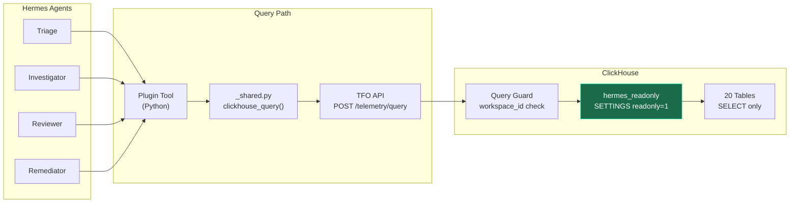
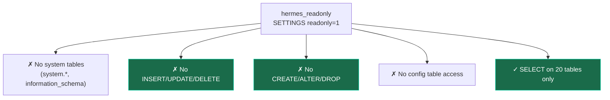

# ClickHouse Read-Only Access

Database security for Hermes agents — read-only user with table-level SELECT grants on 20 telemetry tables.

## Access Model



> **Important**: All ClickHouse queries go through the TelemetryFlow API (`POST /api/v2/telemetry/query`), not directly. The read-only user is a defense-in-depth measure.

## User Setup

### SQL Script (`security/clickhouse-readonly.sql`)

```sql
CREATE USER IF NOT EXISTS hermes_readonly
  IDENTIFIED BY 'CHANGE_ME_SECURE_PASSWORD'
  DEFAULT DATABASE telemetryflow
  SETTINGS readonly = 1;

GRANT SELECT ON telemetryflow.* TO hermes_readonly;
```

### Automated Setup

```bash
bash security/setup-readonly-user.sh
```

## Table-Level Grants

The `hermes_readonly` user has SELECT access on exactly 20 tables:

### Core Telemetry (6 tables)

| Table | Purpose | Materialization |
|-------|---------|----------------|
| `metrics_1m` | 1-minute metric rollups | MV from raw metrics |
| `metrics_5m` | 5-minute metric rollups | MV from metrics_1m |
| `metrics_1h` | 1-hour metric rollups | MV from metrics_5m |
| `otel_logs` | Application and system logs | Direct ingestion |
| `otel_traces` | Distributed trace spans | Direct ingestion |
| `exemplars` | Metric-to-trace links | Direct ingestion |

### Aggregations (5 tables)

| Table | Purpose |
|-------|---------|
| `exemplars_1h` | 1-hour exemplar rollups |
| `signal_correlations_1h` | Cross-signal correlations |
| `service_latency_percentiles_1h` | Service latency percentiles |
| `service_error_rates_1h` | Service error rate trends |
| `logs_1h` | Log aggregation rollups |

### Monitoring (5 tables)

| Table | Purpose |
|-------|---------|
| `qan_metrics` | Query Analytics for databases |
| `kubernetes_metrics_1h` | K8s pod/node/deployment metrics |
| `vm_metrics_1h` | Infrastructure (VM) metrics |
| `uptime_checks` | Uptime monitoring results |

### Platform (2 tables)

| Table | Purpose |
|-------|---------|
| `audit_logs` | Platform audit trail |
| `audit_logs_1h` | Audit log rollups |

### Network Maps (2 tables)

| Table | Purpose |
|-------|---------|
| `service_map_metrics_1h` | Service dependency map |
| `network_map_traffic_1h` | Network traffic map |
| `network_map_connection_metrics_1h` | Connection metrics |

## Security Properties



| Property | Enabled By | Prevents |
|----------|-----------|----------|
| Read-only mode | `SETTINGS readonly = 1` | All write operations |
| Table-level grants | `GRANT SELECT ON <table>` | Accessing unauthorized tables |
| No system access | Grant list excludes `system.*` | Reading server config, other DBs |
| Workspace scoping | TFO API query guard | Cross-tenant data leakage |
| Password protected | `IDENTIFIED BY` | Anonymous access |

## Verification

```bash
# Check grants
clickhouse-client --user=default --query "SHOW GRANTS FOR hermes_readonly"

# Test read access (should succeed)
clickhouse-client --user=hermes_readonly --password=CHANGE_ME \
  --query "SELECT count() FROM telemetryflow.metrics_1m"

# Test write access (should fail)
clickhouse-client --user=hermes_readonly --password=CHANGE_ME \
  --query "INSERT INTO telemetryflow.metrics_1m VALUES (1,2,3)"
# Expected: Cannot execute query in readonly mode

# Test system access (should fail — no grant)
clickhouse-client --user=hermes_readonly --password=CHANGE_ME \
  --query "SELECT * FROM system.users"
# Expected: Not enough privileges
```

## Rotation

To rotate the password:

```sql
ALTER USER hermes_readonly IDENTIFIED BY 'new_secure_password';
```

Then update `~/.hermes/.env`:

```env
CLICKHOUSE_PASSWORD=new_secure_password
```

No restart needed — tools read the env var on each invocation.
