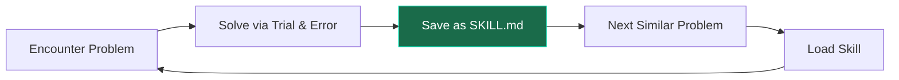
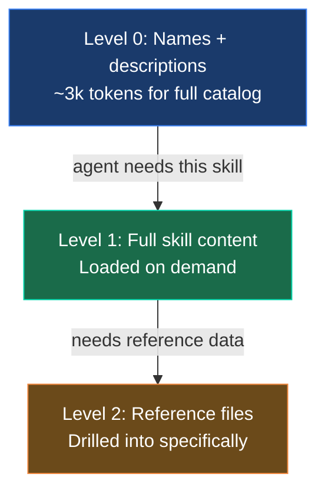
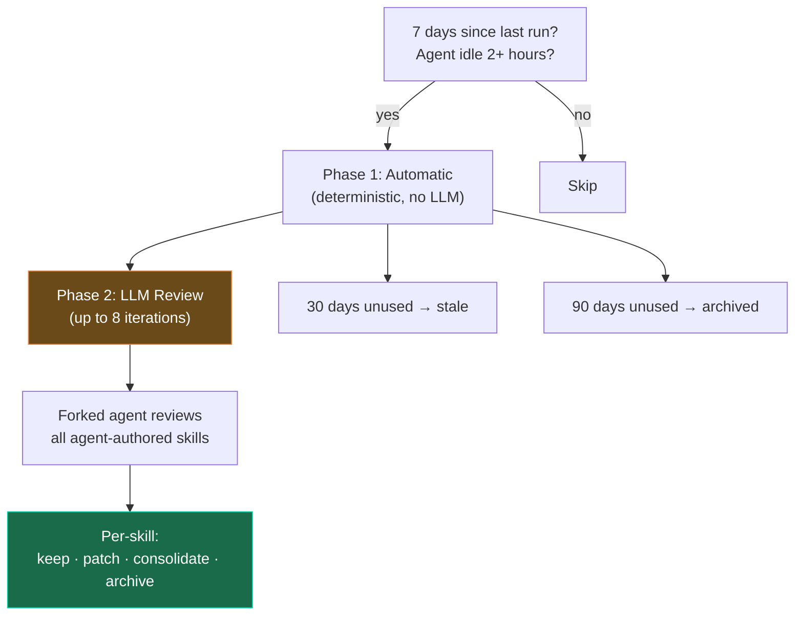

# Skills Overview

29 bundled skills across 18 categories covering all 20 TFO Platform modules. Skills are Hermes Agent's procedural memory — they define **how** the agent does things.

## Self-Evolving Skills



Skills are automatically created when the Investigator:

- Completes a complex task (5+ tool calls)
- Hits errors or dead ends and finds the working path
- Gets corrected by the Reviewer
- Discovers a non-trivial investigation workflow

## Bundled Skills

### Observability (9 skills)

| Skill                           | Category      | Trigger                                      |
| ------------------------------- | ------------- | -------------------------------------------- |
| `k8s-pod-debug`                 | Kubernetes    | CrashLoopBackOff, OOMKilled, pod failures    |
| `payments-api-oom-rca`          | RCA           | payments-api memory spike, OOM pattern       |
| `clickhouse-query-patterns`     | Query         | Common ClickHouse query templates for TFO    |
| `tfql-natural-language`         | Query         | Natural language to TFQL conversion          |
| `alert-triage`                  | Triage        | Alert classification and severity assessment |
| `remediation-gate`              | Remediation   | Approval gate workflow for write actions     |
| `cross-signal-correlation`      | Investigation | Correlating metrics ↔ logs ↔ traces          |
| `memory-pressure-investigation` | Investigation | Node/pod memory pressure debugging           |
| `tfo-llm-api`                   | API           | TFO LLM API v2.0 reference (74 ContextTypes) |

### Database Monitoring (2 skills)

| Skill                  | Category | Trigger                                |
| ---------------------- | -------- | -------------------------------------- |
| `slow-query-detection` | QAN      | Slow query identification and analysis |
| `qan-analysis`         | QAN      | Query Analytics deep-dive procedures   |

## Skill Format

Each skill is a Markdown file with YAML frontmatter:

```markdown
---
name: k8s-pod-debug
description: >
  Activate for crashing pods, CrashLoopBackOff,
  "why is my pod restarting", container failures.
version: 1.2.0
author: agent
platforms: [linux, macos]
---

## Procedure

1. Get pod status → check events → pull logs
2. Look for OOMKilled, ImagePullBackOff, config errors

## Pitfalls

- Forgetting --previous flag on restarted containers

## Verification

- Pod stays Running with 0 restarts for 5+ minutes
```

## Progressive Disclosure



## Curator — Skill Garbage Collection



### Safety Constraints

- **Never touches** bundled or hub-installed skills
- **Never auto-deletes** — worst case is archival (recoverable)
- **Snapshot before every pass** — `tar.gz` of entire skills directory
- **Pin protection** — `hermes curator pin <skill>` prevents archival

## Full Reference

See [Skill Reference](./reference.md) for detailed procedures.
