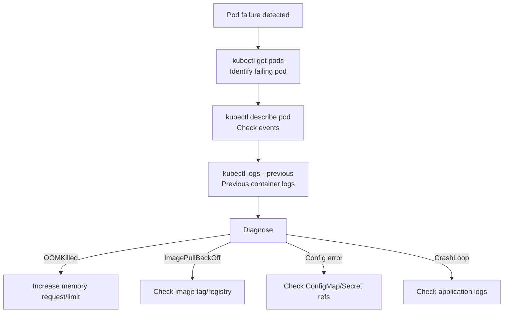
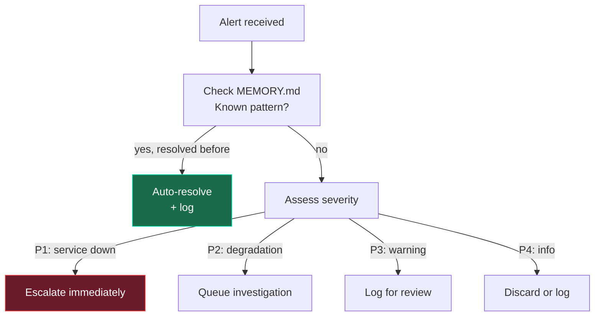
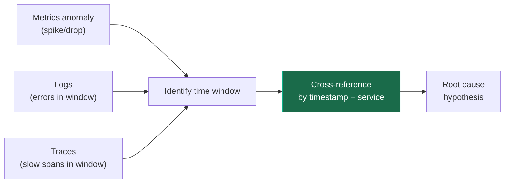

# Skill Reference

Detailed procedures for all 29 bundled skills across 18 categories.

---

## Observability Skills

### k8s-pod-debug

**Trigger**: CrashLoopBackOff, OOMKilled, ImagePullBackOff, container failures, "why is my pod restarting"

**Procedure**:

**Key pitfall**: Always use `--previous` flag for restarted containers to get the crash logs.

**Verification**: Pod stays `Running` with 0 restarts for 5+ minutes.

---

### payments-api-oom-rca

**Trigger**: payments-api memory spike, OOM kill pattern, pod restart cascade

**Procedure**:

1. `query_metrics(table="metrics_1m", service="payments-api")` → detect memory spike
2. `search_logs(table="otel_logs", severity="ERROR", service="payments-api")` → find OOM kill messages
3. `list_traces(min_duration_ms=500, service="payments-api")` → identify slow spans
4. `get_exemplars(metric="memory_usage", service="payments-api")` → link to specific traces
5. Cross-reference with MEMORY.md: previous OOM incidents

**Root Cause Pattern**: 512 MiB memory request insufficient after v2.4.1 deploy.

**Verification**: Pod stays Running with 0 restarts for 5+ minutes after fix.

---

### clickhouse-query-patterns

**Trigger**: Need to query TFO ClickHouse tables, writing a new investigation query

**Common Query Templates**:

| Pattern            | Table                    | Use Case                              |
| ------------------ | ------------------------ | ------------------------------------- |
| Metric spike       | `metrics_1m`             | Detect anomalies in last hour         |
| Error rate trend   | `metrics_1h`             | Error rate by service over 24h        |
| Log search         | `otel_logs`              | Full-text search with severity filter |
| Slow traces        | `otel_traces`            | Duration > threshold                  |
| Exemplar lookup    | `exemplars`              | Metric-to-trace correlation           |
| Signal correlation | `signal_correlations_1h` | Cross-signal analysis                 |

**Key rule**: Always include `workspace_id` filter. Queries without it will fail.

---

### tfql-natural-language

**Trigger**: Natural language questions about observability data, TFQL query generation

**Procedure**:

1. Parse the natural language question
2. Identify target signals (metrics, logs, traces)
3. Identify time range and filters
4. Generate TFQL query
5. Execute via `query_metrics` or `search_logs`

**Examples**:

| Natural Language                                | TFQL Equivalent                                                            |
| ----------------------------------------------- | -------------------------------------------------------------------------- |
| "Show me error rate for payments-api last hour" | `query_metrics(service="payments-api", metric="error_rate", from="-1h")`   |
| "Any OOM kills in production?"                  | `search_logs(query="OOMKilled", namespace="production", severity="ERROR")` |
| "Slowest traces for auth-service"               | `list_traces(service="auth-service", sort="duration_desc", limit=10)`      |

---

### alert-triage

**Trigger**: New alert received, severity classification needed

**Decision Matrix**:

---

### remediation-gate

**Trigger**: Remediation action proposed, approval gate check

**Procedure**:

1. Assess proposed action against risk matrix
2. Check if action requires approval (all 4 remediation tools do)
3. Format Telegram notification with:
   - Alert summary
   - Root cause
   - Evidence links
   - Proposed action with risk assessment
   - Reviewer verdict
4. Wait for human response (600s timeout)
5. On timeout: auto-escalate

**Risk Levels**:

| Action       | Risk       | Downtime | Reversible |
| ------------ | ---------- | -------- | ---------- |
| Scale up     | Low        | None     | Yes        |
| Restart pod  | Low        | 5-30s    | Yes        |
| Rollback     | Medium     | 30-120s  | Yes        |
| Update alert | Low-Medium | None     | Yes        |

---

### cross-signal-correlation

**Trigger**: Need to correlate metrics ↔ logs ↔ traces for root cause analysis

**Procedure**:

1. Identify the anomaly time window from metrics
2. Search logs in the same window for related errors
3. Find traces with abnormal duration in the window
4. Use `get_exemplars` to link metric spikes to specific traces
5. Use `query_correlations` for pre-computed correlation data

---

### memory-pressure-investigation

**Trigger**: Node or pod memory pressure, eviction events, OOM warnings

**Procedure**:

1. `check_infra(scope="memory")` → identify pressure on which nodes
2. `check_k8s(scope="pods")` → find pods with high memory usage
3. `query_metrics(table="metrics_1m", metric="memory_usage")` → memory trend
4. `search_logs(query="memory pressure|evicted|OOM")` → eviction events
5. Check if `node-pool-3` has recurring pattern (from MEMORY.md)

**Common findings**: Insufficient memory requests, memory leaks, batch job spikes.

---

### tfo-llm-api

**Trigger**: Need to use TFO's built-in LLM capabilities (chat, insights, providers)

**API Reference**:

| Endpoint                         | Method   | Description               |
| -------------------------------- | -------- | ------------------------- |
| `/api/v2/llm/chat/message`       | POST     | Send message with context |
| `/api/v2/llm/chat/stream`        | POST     | Streaming chat (SSE)      |
| `/api/v2/llm/chat/conversations` | GET      | List conversations        |
| `/api/v2/llm/insights/generate`  | POST     | Generate insight          |
| `/api/v2/llm/providers`          | GET/POST | Manage providers          |

**Context Types**: 74 values — see [Context Types](../api/context-types.md)

**Insight Types**: `chronology`, `prediction`, `recommendation`, `root-cause`, `pattern`

**Provider Types**: 15 values — anthropic, openai, google, deepseek, qwen, ollama, mistral, grok, kimi, zhipu, mimo, openrouter, custom

---

## Database Monitoring Skills

### slow-query-detection

**Trigger**: Database performance degradation, slow query alerts

**Procedure**:

1. `check_db_monitoring(db_type="<type>", action="qan")` → get slow queries
2. Filter by duration > 200ms
3. Group by query fingerprint
4. Identify top 5 slowest by p95
5. Check execution plan if available

**Supported databases**: PostgreSQL, MySQL, MariaDB, Percona, ClickHouse, MongoDB, MSSQL, TimescaleDB, Aurora, CockroachDB

---

### qan-analysis

**Trigger**: Deep-dive into Query Analytics data, query performance investigation

**Procedure**:

1. `check_db_monitoring(action="qan")` → get QAN metrics
2. Analyze query execution patterns
3. Identify lock contention
4. Check index usage
5. Compare with baseline performance

**Output**: Query fingerprint, execution count, avg/p95/p99 duration, rows scanned, index hit ratio.
