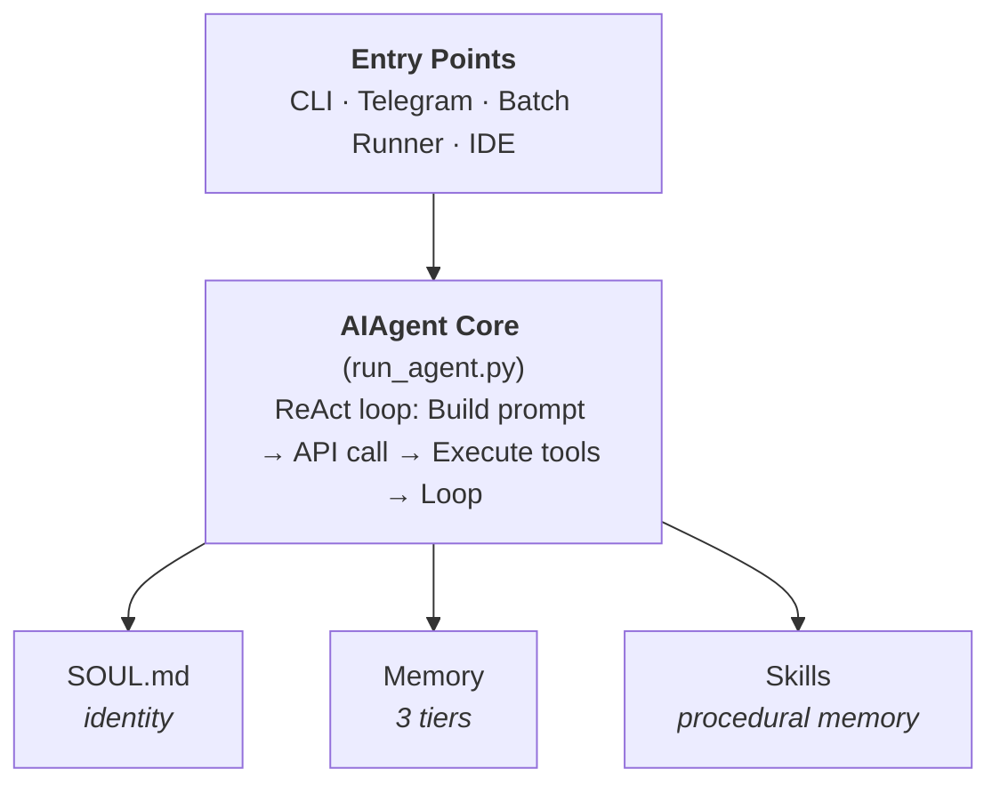
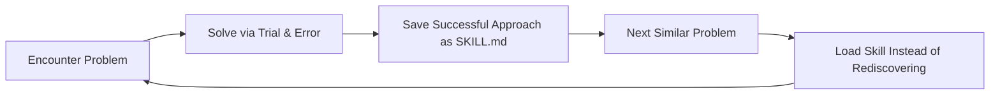
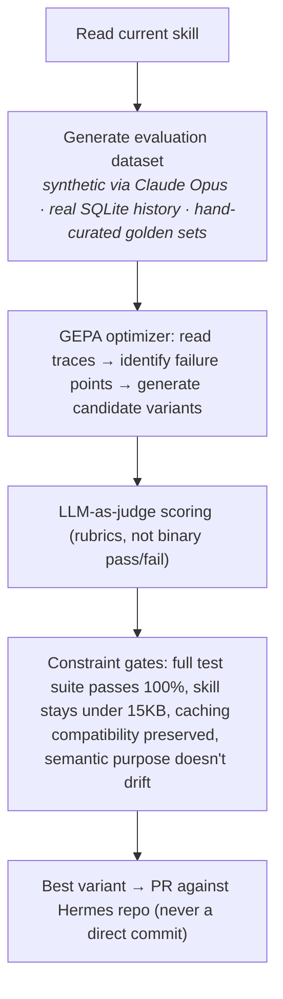
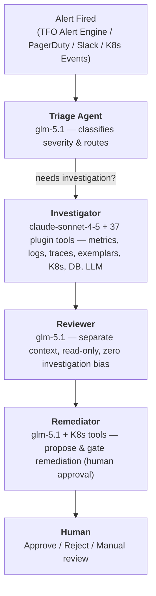
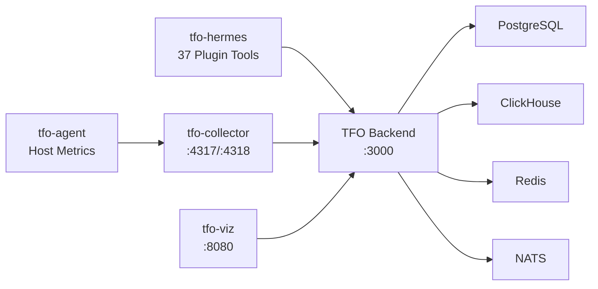

<!-- _class: lead -->

# Hermes Agent for TelemetryFlow Observability

## Self-Improving AI Agent with Memory, Skills & Multi-Agent Teams

**Platform**: TelemetryFlow — Community Enterprise Observability Platform
**Agent**: Hermes — Self-Improving AI Agent Framework by Nous Research
**Signals**: Metrics, Logs, Traces, Exemplars

---

<!-- _class: divider -->

# The Observability Challenge

---

## Why Observability Needs AI

Modern distributed systems generate millions of telemetry signals per second — but the tools to make sense of them haven't kept pace with the complexity they create.

| Challenge               | Impact                                                    |
| ----------------------- | --------------------------------------------------------- |
| **Signal Flood**        | Thousands of alerts per hour — most are noise             |
| **Manual Correlation**  | Engineers switch between 4+ tools to trace root cause     |
| **Slow MTTR**           | Average incident resolution: 30–45 minutes                |
| **Knowledge Silos**     | Expert context lives in heads, not systems                |
| **No Automated Action** | Investigation is manual; remediation requires human steps |

> You have all the data. You don't have an agent that can **read it all, correlate it, remember it, and act on it** — at machine speed.

---

## TelemetryFlow Platform Overview

TelemetryFlow is an **enterprise-grade, 100% OTLP-compliant** observability platform that unifies four telemetry signals into a single pane of glass.

| Signal        | Storage    | Capability                                                |
| ------------- | ---------- | --------------------------------------------------------- |
| **Metrics**   | ClickHouse | Time-series with interactive charts, zoom/pan             |
| **Logs**      | ClickHouse | Real-time streaming, full-text search, severity filtering |
| **Traces**    | ClickHouse | Waterfall, flame graph, service dependency graph          |
| **Exemplars** | ClickHouse | Metric-to-trace links for context-aware debug             |

- **Multi-Tenancy**: Region → Organization → Workspace → Tenant
- **33 Production Alert Rules** with fatigue prevention
- **6 Dashboard Templates** with 12+ widget types
- **Enterprise Security**: JWT, MFA, SSO, 5-Tier RBAC, API Keys
- **Database Monitoring**: Native collectors for 9 databases with QAN
- **TFO Agent**: Replaces Prometheus + KSM + node-exporter + FluentBit + cAdvisor
- **AI Intelligence**: MCP servers for Claude AI, TFQL natural language queries
- **TFO Collector v1.2.1**: OCB-Native Gateway with 4 custom TFO components

---

<!-- _class: divider -->

# Introducing Hermes Agent

---

## What is Hermes Agent?

A **self-improving AI agent framework** by Nous Research. The agent accumulates memory across sessions, writes and prunes its own reusable skills, and can be optimized offline via an evolutionary pipeline (GEPA). No other open-source agent ships all three in a single framework.

| Property        | Detail                                                                                                 |
| --------------- | ------------------------------------------------------------------------------------------------------ |
| **License**     | Apache 2.0                                                                                             |
| **Source**      | github.com/NousResearch/hermes-agent                                                                   |
| **Core**        | Single `AIAgent` class in `run_agent.py` — ReAct loop                                                  |
| **Providers**   | 9 LLM providers — Anthropic, OpenAI, OpenCode Go, OpenRouter, Google, Mistral, Groq, Ollama, LM Studio |
| **Execution**   | 6 backends — local, Docker, SSH, Modal, Daytona, Singularity                                           |
| **Turn Cap**    | 90-turn hard cap per task (prevents runaway loops)                                                     |
| **Memory**      | 3-tier system — Persistent Markdown + SQLite FTS5 + External providers                                 |
| **Skills**      | 687 skills across 18 categories (self-evolving + hub)                                                  |
| **Multi-Agent** | Profiles + delegation tool for parallel teams                                                          |
| **Scheduling**  | Cron in plain English — jobs survive restarts                                                          |

---

## Architecture Overview

Everything flows through a single `AIAgent` class. CLI, Telegram gateway, batch runner, and IDE integrations are all entry points into the same core loop.



**Key design decisions:**

- **90-turn hard cap** per task — prevents runaway loops silently burning API credits. Subagents share the same budget.
- **6 execution backends** — local terminal, Docker, SSH, Modal, Daytona, Singularity. Same code, just a config change.
- **Model-agnostic** — a translation layer routes any provider through one of three API formats. Swap between providers with a single config change, no code edits required.

---

## Supported LLM Providers

9 providers with a unified translation layer — swap models with a single config change.

| Provider        | Example models                         | Best for                                  | Local? |
| --------------- | -------------------------------------- | ----------------------------------------- | ------ |
| **Anthropic**   | `claude-sonnet-4-5`, `claude-opus-4-5` | Highest quality reasoning, long context   | No     |
| **OpenAI**      | `gpt-4o`, `gpt-4o-mini`, `o3-mini`     | Strong general capability, wide ecosystem | No     |
| **OpenCode Go** | `glm-5.1`, `glm-5.0`                   | Cost-efficient coding agent pipeline      | No     |
| **OpenRouter**  | Any model via unified endpoint         | Access to 200+ models via one API key     | No     |
| **Google**      | `gemini-2.5-pro`, `gemini-2.5-flash`   | Multimodal tasks, large context window    | No     |
| **Mistral**     | `mistral-large`, `mistral-small`       | European data-residency, efficient models | No     |
| **Groq**        | `llama-3.3-70b`, `mixtral-8x7b`        | Fastest inference (LPU hardware)          | No     |
| **Ollama**      | Any pulled model, e.g. `llama3.3`      | Full offline / air-gapped operation       | Yes    |
| **LM Studio**   | Any loaded model                       | Local GUI-managed models                  | Yes    |

> **OpenRouter tip**: Acts as a single endpoint for hundreds of models. Set `provider: openrouter` once and switch models by name without juggling multiple API keys.

---

## Identity Layer — SOUL.md

Before memory loads, before skills load — **identity loads first**.

**Location**: `~/.hermes/SOUL.md`
**Position**: Slot #1 in the system prompt, always.

SOUL.md defines the agent's personality, tone, communication style, and hard limits. It is hand-authored and static — you write it once, tweak over time. Without it, Hermes falls back to a built-in default identity.

### Why It Matters for Observability

> Everything the agent writes — memory entries, skill files, RCA responses — happens through the lens of this identity. SOUL.md is the fixed frame; memory and skills are the moving parts inside it.

**Example for TelemetryFlow RCA Agent:**

```markdown
# SOUL.md

You are a pragmatic senior SRE with strong observability expertise.
You optimize for signal over noise, root cause over symptoms,
and actionable remediation over advisory commentary.
You never fabricate a metric. You never guess at a root cause
without evidence from ClickHouse.
```

---

<!-- _class: divider -->

# Memory System — Three Tiers

---

## Tier 1 — Persistent Markdown (Always in Context)

Two tiny files injected as a frozen snapshot at session start. Always present, zero retrieval cost.

| File                           | Max Size    | Purpose                                                        |
| ------------------------------ | ----------- | -------------------------------------------------------------- |
| `~/.hermes/memories/MEMORY.md` | 2,200 chars | Agent notes: project conventions, tool quirks, lessons learned |
| `~/.hermes/memories/USER.md`   | 1,375 chars | Your profile: name, preferences, skill level, things to avoid  |

- New entries written mid-session persist to disk immediately but only appear in the system prompt on the **next session**.
- At ~80% capacity, the agent **consolidates** — merging related entries into denser, more information-packed versions.

### Observability Example

```markdown
# MEMORY.md

- payments-api always OOMs on deploy (4x in 30 days)
- workspace_id is mandatory on all ClickHouse queries
- node-pool-3 has recurring memory pressure
- alert fatigue rule: suppress < medium severity during deploys
```

---

## Tier 2 — Full-Text Session Search (SQLite)

Every conversation (CLI and Telegram) is stored in `~/.hermes/state.db` with **FTS5 full-text search**. The agent can search weeks of past conversations on demand.

| Tier       | Trade-off                                                      |
| ---------- | -------------------------------------------------------------- |
| **Tier 1** | Always in context, tiny capacity                               |
| **Tier 2** | Unlimited capacity, requires active search + LLM summarisation |

**Critical facts** live in Tier 1. **Everything else** is searchable on demand.

### Observability Use Case

```
Agent: "What did we find when auth-service crashed last Tuesday?"
→ Hermes searches state.db with FTS5
→ Summarises the previous RCA
→ Applies learnings to the current investigation
```

---

## Tier 3 — External Memory Providers

Eight pluggable providers that run alongside built-in memory (never replacing it). Only one can be active at a time.

When active, Hermes automatically:

- **Prefetches** relevant memories before each turn
- **Syncs** conversation turns after each response
- **Extracts** memories on session end

For TelemetryFlow deployments, this enables **cross-cluster memory** — an agent in us-east-1 can recall investigation patterns from ap-southeast-1 through a shared memory provider.

---

<!-- _class: divider -->

# Self-Evolving Skills

---

## Skills: Procedural Memory

Memory handles _facts_. **Skills handle _procedures_**.

A skill is a Markdown file with YAML frontmatter — the agent's procedural memory for _how_ it does things.

```markdown
---
name: k8s-pod-debug
description: >
  Activate for crashing pods, CrashLoopBackOff,
  "why is my pod restarting", container failures.
version: 1.2.0
author: agent
platforms: [linux, macos]
---

## Procedure

1. Get pod status → check events → pull logs
2. Look for OOMKilled, ImagePullBackOff, config errors

## Pitfalls

- Forgetting --previous flag on restarted containers

## Verification

- Pod stays Running with 0 restarts for 5+ minutes
```

### Progressive Disclosure (Token Efficiency)

| Level | What the agent sees              | Token cost                  |
| ----- | -------------------------------- | --------------------------- |
| 0     | Names + descriptions only        | ~3k tokens for full catalog |
| 1     | Full skill content (when needed) | Loaded on demand            |
| 2     | Reference files within a skill   | Drilled into specifically   |

---

## Self-Improvement Loop

Skill creation triggers **automatically** when:

- The agent completes a complex task (5+ tool calls)
- It hits errors or dead ends and finds the working path
- The user corrects its approach
- It discovers a non-trivial workflow



**The loop**: encounter problem → solve through trial and error → save successful approach as `SKILL.md` → next similar problem loads the skill instead of rediscovering from scratch.

The `skill_manage` tool supports: `create`, `patch`, `edit`, `delete`, `write_file`, `remove_file`.

> **`patch`** is the preferred action — targeted fix, token-efficient. Use `edit` only for full rewrites.

---

## The Curator — Skill Garbage Collection

Without maintenance, agent-created skills pile up into dozens of narrow, overlapping playbooks that waste tokens and pollute the catalog.

**Trigger**: Inactivity check (not cron) — if 7 days have passed since last run AND the agent has been idle for 2+ hours, a background fork spins up with its own prompt cache, never touching the active conversation.

### Two-Phase Operation

**Phase 1 — Automatic Transitions** (no LLM, deterministic):

- Unused for 30 days → `stale`
- Unused for 90 days → `archived`

**Phase 2 — LLM Review** (up to 8 iterations):

- A forked agent surveys all agent-authored skills
- Per-skill decision: keep, patch, consolidate, or archive

### Safety Constraints

- **Never touches** bundled or hub-installed skills — only agent-authored ones
- **Never auto-deletes** — worst outcome is archival to `~/.hermes/skills/.archive/` (recoverable with one command; rollbacks are themselves reversible)
- **Snapshot before every pass** — `tar.gz` of entire skills directory. Rollback is one command
- **Pin protection** — `hermes curator pin <skill>` protects from archival and deletion. Patches and edits still go through

---

## GEPA — Offline Skill Optimization

The in-agent learning loop has a known weakness: **the agent tends toward self-congratulation** — it almost always thinks it performed well, even when it didn't.

GEPA (**Genetic-Pareto Prompt Evolution**) is the solution. It lives in a **companion repository** (`NousResearch/hermes-agent-self-evolution`), operates fully offline, and was published as an **ICLR 2026 Oral paper** (MIT licensed).



**Cost**: ~$2–10 per optimization run. No GPU required — everything runs through API calls.

> Skip GEPA initially. Use it when you hit a wall and don't want to spend time and money on fine-tuning (RL/GRPO). It's a strong alternative to try before moving to full RL-based fine-tuning.

---

## Skills Hub

Hermes maintains an official Skills Hub with **687 skills across 18 categories** — plus TelemetryFlow Hermes bundles **29 specialised skills** across **18 categories** covering all 20 TFO Platform modules:

| Source                                                          | Count |
| --------------------------------------------------------------- | ----- |
| Built-in (ships with agent)                                     | 87    |
| Optional (enable on demand)                                     | 79    |
| Anthropic (frontend-design, pdf, pptx, docx, mcp-builder, etc.) | 16    |
| LobeHub (community)                                             | 505   |

Add any GitHub repo as a custom tap:

```bash
hermes skills tap add yourname/your-skills-repo
hermes skills install yourname/your-skills-repo/<skill-name>
```

For TelemetryFlow, this means you can install observability-specific skills from the hub or create custom skill taps for your team's investigation patterns.

---

<!-- _class: divider -->

# Multi-Agent Team for Observability

---

## One Agent vs a Team

> A single agent doing everything fills its context window fast — by step 4 it's operating on summaries of summaries and quality degrades. Separate concerns: each agent has one job, one context, one set of tools.

Hermes uses **profiles** — each with its own Telegram bot, SOUL.md, memory, and skills. They share nothing.

There are two distinct ways to use multiple agents. Both use Hermes profiles. The difference is what you're building:

| Pattern           | Agents                                        | Use Case                              |
| ----------------- | --------------------------------------------- | ------------------------------------- |
| **Dev Pipeline**  | Supervisor → Coder → Reviewer → QC/Tester     | Autonomous software delivery pipeline |
| **Personal**      | Designer + Programmer + Researcher            | Specialised assistants                |
| **Observability** | Triage → Investigator → Reviewer → Remediator | AI-driven RCA & remediation pipeline  |

---

## Observability Team Architecture

Adapted for TelemetryFlow: four specialised agents forming an autonomous incident response pipeline, powered by **37 plugin tools** covering all **20 TFO Platform modules**.



Steps 1–4 are fully autonomous. You only touch step 5.

---

## Agent 1 — Triage (Hermes)

Detects new alerts, reads them, and decides: critical incident, known pattern, or noise? Does not investigate — it manages the queue and delegates.

**SOUL.md excerpt:**

```markdown
You are an incident triage specialist. You classify alerts by severity
and route them to the appropriate agent. You never investigate — you
decide WHO should investigate. Known patterns from MEMORY.md get
auto-resolved. Only genuine anomalies get escalated.
```

**Behavior:**

- Reads alert payload from TelemetryFlow webhook
- Cross-references MEMORY.md for known patterns
- Classifies: critical / known / noise
- Delegates to Investigator only for genuine anomalies
- Auto-resolves known patterns (e.g., "payments-api OOM on deploy — known issue, rollback initiated")

---

## Agent 2 — Investigator (Hermes + Plugin Tools)

The workhorse. Gets an alert, queries TelemetryFlow's four signals via dedicated plugin tools, correlates evidence, produces root cause hypothesis.

**Skills auto-created after investigations:**

```markdown
---
name: payments-api-oom-rca
description: >
  Activate when payments-api shows OOM kill pattern,
  memory spike, or pod restart cascade.
version: 1.3.0
author: agent
---

## Procedure

1. query_metrics --signal metrics --service payments-api → detect memory spike
2. search_logs --severity ERROR → find OOM kill messages
3. list_traces --min-duration 500 → identify slow spans
4. get_exemplars --metric memory_usage → link to specific traces
5. query_correlations → cross-signal evidence
6. Cross-reference with MEMORY.md: previous OOM incidents

## Root Cause Pattern

- 512 MiB memory request insufficient after v2.4.1 deploy
- Previous occurrences: v2.3.0, v2.3.4, v2.4.0

## Verification

- Pod stays Running with 0 restarts for 5+ minutes after fix
```

---

## Agent 3 — Reviewer (Subagent)

Runs in a **separate context with zero investigation bias** — it only sees the evidence and the hypothesis, not what the Investigator was thinking. Uses **read-only tools** to avoid bias toward defending its own conclusions.

**Key design**: A reviewer that can modify the investigation gets biased toward defending its own edits.

**What the Reviewer checks:**

- Does the evidence support the root cause hypothesis?
- Are there alternative explanations not considered?
- Is the proposed remediation safe and proportional?
- Does MEMORY.md contain conflicting historical data?

---

## Agent 4 — Remediator (Hermes + K8s Tools)

The final gate before human review. Proposes concrete remediation actions, each requiring human approval.

**Actions (gated):**

| Action            | Tool               | Gate Required       |
| ----------------- | ------------------ | ------------------- |
| Scale deployment  | `scale_deployment` | Human approval      |
| Restart pod       | `restart_pod`      | Human approval      |
| Rollback deploy   | `rollback_deploy`  | Human approval      |
| Update alert rule | `update_alert`     | Human approval      |
| Escalate to human | `escalate`         | Automatic (no gate) |

**Human-in-the-Loop notification** (via Telegram):

- Alert summary + root cause
- Evidence links (metrics, logs, traces)
- Proposed remediation with risk assessment
- Reviewer verdict
- One-click: **Approve** / **Reject** / **Manual Review**

---

## Cost Per Incident

| Agent        | Model                      | Avg Cost                   |
| ------------ | -------------------------- | -------------------------- |
| Triage       | GLM 5.1 via OpenCode Go    | ~$0.01                     |
| Investigator | Claude Sonnet 4.5 / GPT-4o | ~$0.05–0.15                |
| Reviewer     | GLM 5.1 via OpenCode Go    | ~$0.03–0.08                |
| Remediator   | GLM 5.1 via OpenCode Go    | ~$0.01–0.03                |
| **Total**    |                            | **~$0.10–0.27 / incident** |

> Use expensive models only for investigation (the complex reasoning task).
> Triage, review, and remediation can use cheaper/faster models.
> Original estimate with Claude Sonnet was ~$0.39/ticket. GLM 5.1 may require more turns on complex bugs but costs ~3–4x less.

---

<!-- _class: divider -->

# Live Investigation Walkthrough

---

## Scenario: payments-api Latency Breach

**3:47 AM** — Alert fires: `payments-api` p95 latency breach (180ms → 640ms)

### Step 1 — Triage Agent (Autonomous)

```
Triage reads alert payload.
Cross-references MEMORY.md: "payments-api OOM pattern — 4x in 30 days"
Severity: HIGH — genuine anomaly (different from past patterns: latency, not OOM)
→ Delegates to Investigator
```

### Step 2 — Investigator Agent (Autonomous)

```
Loads skill: payments-api-oom-rca (auto-created from past investigations)
Queries TelemetryFlow via plugin tools:
  query_metrics --signal metrics → memory spike from 512MiB to 890MiB
  search_logs --severity ERROR → 512 OOM kill messages
  list_traces --min-duration 500 → 89 slow spans on pod payments-api-7b8cf
  get_exemplars --metric memory_usage → linked traces show allocation burst
→ Root cause hypothesis: OOM after v2.4.1 deploy, memory request insufficient
```

---

## Walkthrough (continued)

### Step 3 — Reviewer Agent (Autonomous, Separate Context)

```
Reviewer sees ONLY the evidence and hypothesis — not the Investigator's thought process.
Read-only verification:
  ✓ Metrics confirm memory spike
  ✓ Logs confirm OOM kill
  ✓ Traces confirm latency correlation
  ✓ MEMORY.md confirms recurring pattern
  ⚠ Alternative: could be a memory leak rather than insufficient request
→ Verdict: root cause likely correct, recommend memory profiling as follow-up
```

### Step 4 — Remediator Agent (Gated)

```
Proposes remediation:
  → Roll back to v2.4.0       [REQUEST APPROVAL]
  → Or raise memory to 1 GiB  [REQUEST APPROVAL]
  → Long-term: add memory profiling to CI pipeline

Sends Telegram notification to on-call engineer.
```

### Step 5 — Human Decision

```
Engineer receives Telegram notification:
  Alert: payments-api p95 latency 640ms
  Root cause: OOM after v2.4.1 deploy
  Evidence: [metrics] [logs] [traces]
  Reviewer: approved with caveat
  Action: rollback to v2.4.0

→ Approve (one tap)
```

**Total time: ~23 seconds** from alert to proposed remediation.

---

## MTTR: The Numbers

| Stage                      | MTTR    | Improvement |
| -------------------------- | ------- | ----------- |
| **Manual Investigation**   | ~40 min | Baseline    |
| **Single AI Agent**        | ~47 sec | 50× faster  |
| **Hermes Team (4 agents)** | ~23 sec | 100× faster |

### Why It's Faster

- **Specialised agents**: Each agent has one job, one context, one set of tools — no context window pollution
- **Skill loading**: Past investigation procedures loaded instantly instead of rediscovered
- **Memory recall**: Known patterns auto-resolved at triage — only genuine anomalies reach investigation
- **Action gate**: Human approves while the pipeline is ready to execute immediately

The engineer reviews an AI-produced hypothesis with evidence AND a one-click remediation — instead of assembling either from scratch.

---

<!-- _class: divider -->

# Deployment & Configuration

---

## Install & Configure Hermes

### Step 1 — Install

```bash
curl -fsSL https://raw.githubusercontent.com/NousResearch/hermes-agent/main/scripts/install.sh | bash
source ~/.bashrc

# Verify — all checks should be green
hermes doctor

# Auto-repair if any issues
hermes doctor --fix

# Launch interactive chat
hermes

# Type /help to see all slash commands
```

### Step 2 — Configure LLM Provider

```bash
# Interactive setup wizard (recommended first time)
hermes setup model

# Or set directly
hermes config set model.default "claude-sonnet-4-5"
hermes config set model.provider "anthropic"

# Local Ollama example (no API key needed — air-gapped)
hermes config set model.default "llama3.3"
hermes config set model.provider "ollama"

# Find your .env path
hermes config env-path
```

> API keys go into `~/.hermes/.env`, **not** `config.yaml`.

---

## Configure LLM Provider (API Keys)

Edit `~/.hermes/.env` — add only the key for your chosen provider:

```env
# Anthropic
ANTHROPIC_API_KEY=your_key_here

# OpenAI
OPENAI_API_KEY=your_key_here

# OpenCode Go (GLM)
OPENCODE_API_KEY=your_key_here

# OpenRouter (covers many providers via one key)
OPENROUTER_API_KEY=your_key_here
```

### Switching Models Mid-Project

```bash
# Check current model
hermes config get model.default

# Switch to a different provider/model on the fly
hermes config set model.default "gpt-4o-mini"
hermes config set model.provider "openai"
```

No restart needed — takes effect on the next session.

### Example config.yaml (OpenCode Go GLM 5.1)

```yaml
model:
  default: "glm-5.1"
  provider: "opencode-go"

agent:
  max_turns: 90

terminal:
  backend: local
  timeout: 300

delegation:
  max_iterations: 50
  max_concurrent_children: 1
```

---

## TelemetryFlow Plugin Tools — 37 Tools, 20 Modules

All tools are Python stdlib only (zero dependencies). Each tool communicates with TFO Platform via REST API — no direct ClickHouse connections.

| Category               | Tools                                                                                                                                                 |
| ---------------------- | ----------------------------------------------------------------------------------------------------------------------------------------------------- |
| **Core Telemetry (5)** | `query_metrics`, `search_logs`, `list_traces`, `get_exemplars`, `query_correlations`                                                                  |
| **Monitoring (8)**     | `check_k8s`, `check_infra`, `check_uptime`, `check_vm`, `check_agent`, `check_service_map`, `check_network_map`, `check_db_monitoring`                |
| **AI & LLM (7)**       | `chat_with_context`, `stream_chat`, `manage_conversation`, `generate_insight`, `query_llm_usage`, `manage_provider`, `query_ai_intelligence`          |
| **Platform (8)**       | `query_platform`, `query_account`, `query_audit`, `query_subscription`, `manage_dashboards`, `manage_alerts`, `manage_reports`, `manage_data_masking` |
| **Infrastructure (6)** | `manage_retention`, `manage_tenancy`, `manage_iam`, `manage_sso`, `query_tfql`, `check_uptime` (expanded)                                             |
| **Remediation (4) ⚠**  | `scale_deployment`, `restart_pod`, `rollback_deploy`, `update_alert` — all require human approval                                                     |

> **74 ContextType values** from TFO's ContextCollector, **15 LLM provider types**, **5 insight types** — full coverage of the TFO LLM module.

---

## Connect Telegram Gateway

**Prerequisites:**

- Bot token from [@BotFather](https://t.me/BotFather)
- Your chat ID → message your bot, then visit `https://api.telegram.org/bot<TOKEN>/getUpdates`

```bash
hermes gateway setup   # select Telegram, enter token + chat ID

hermes gateway start
hermes gateway status
```

Send a message to your bot on Telegram, then run `/sethome`.

### Enable Required Tools

```bash
hermes tools enable terminal    # run shell commands (ClickHouse queries)
hermes tools enable cronjob     # schedule investigations
hermes tools enable delegation  # spawn subagents (multi-agent team)
hermes tools enable web         # hit TelemetryFlow API and external APIs

hermes tools list               # verify
```

> Run `/reset` after enabling — changes apply to new sessions only.

---

## Create Observability Agent Profiles

Each agent in the team gets its own Hermes profile with dedicated SOUL.md, memory, and skills.

```bash
# Create profiles for the observability team
hermes profile create triage       --clone
hermes profile create investigator --clone
hermes profile create reviewer     --clone
hermes profile create remediator   --clone

hermes profile list
```

`--clone` copies your default profile's config and `.env` as a starting point.

### Configure Each Profile

```bash
# Triage — cheap/fast model
hermes -p triage config set model.default "glm-5.1"
hermes -p triage config set model.provider "opencode-go"

# Investigator — powerful model for complex reasoning
hermes -p investigator config set model.default "claude-sonnet-4-5"
hermes -p investigator config set model.provider "anthropic"

# Reviewer — cheap model for read-only verification
hermes -p reviewer config set model.default "glm-5.1"
hermes -p reviewer config set model.provider "opencode-go"

# Remediator — cheap model for gated actions
hermes -p remediator config set model.default "glm-5.1"
hermes -p remediator config set model.provider "opencode-go"
```

---

## Give Each Profile Its Own Telegram Bot

Telegram allows only one connection per token. Run `/newbot` four times with BotFather, then:

```bash
hermes -p triage      gateway setup
hermes -p investigator gateway setup
hermes -p reviewer    gateway setup
hermes -p remediator  gateway setup
```

### Write SOUL.md per Profile

Edit each profile's `SOUL.md` to make the agents genuinely different:

- **Triage** (`~/.hermes/profiles/triage/SOUL.md`): "You are an incident triage specialist. You classify alerts by severity and route them. You never investigate — you decide WHO should investigate."
- **Investigator** (`~/.hermes/profiles/investigator/SOUL.md`): "You are a senior SRE investigator. You query ClickHouse for evidence. You never guess at a root cause without data."
- **Reviewer** (`~/.hermes/profiles/reviewer/SOUL.md`): "You are an independent reviewer. You only see evidence and hypotheses. You check for bias and missed alternatives."
- **Remediator** (`~/.hermes/profiles/remediator/SOUL.md`): "You are a remediation specialist. You propose gated actions. Every write operation requires human approval."

---

## Connect TelemetryFlow Alert Webhooks

Wire TelemetryFlow alert rules to the Triage agent's Telegram gateway.

### Step 1 — Set Up Telegram Gateway

```bash
hermes -p triage gateway setup   # select Telegram, enter token + chat ID
hermes -p triage gateway start
```

### Step 2 — Configure TelemetryFlow Webhook

In TelemetryFlow Alert Rules, set the notification webhook to forward alert payloads to the Triage agent's endpoint.

### Step 3 — Schedule Periodic Health Checks

```bash
# Plain-English cron — no cron expressions needed
hermes -p investigator cron add "every 15m" "Check TelemetryFlow ClickHouse for anomaly spikes in metrics_1m"
```

### Step 4 — Verify the Pipeline

Send a test alert through TelemetryFlow. Hermes Triage should classify it, and if genuine, the full pipeline should execute through to the human approval notification.

---

## Scheduling — Cron in Plain English

The Hermes scheduler ticks every 60 seconds, runs due jobs in isolated agent sessions, and delivers output to your messaging platform. Jobs survive restarts. They live in `~/.hermes/cron/jobs.json`.

You don't write cron expressions — you describe what you want in plain English and Hermes converts it.

### Cron Syntax Reference

| Pattern                  | Example                                                           |
| ------------------------ | ----------------------------------------------------------------- |
| One-shot delay           | `/cron add 30m "Remind me to check the build"`                    |
| Recurring interval       | `/cron add "every 2h" "Check server status"`                      |
| Standard cron expression | `/cron add "0 9 * * 1-5" "Weekday 9am task"`                      |
| Skill attachment         | `/cron add "every 1h" "Summarize feed items" --skill blogwatcher` |

Chain jobs: one cron's output becomes the next's input via a `context_from` flag. Useful for research → writing pipelines.

---

## Security Model

| Layer                | Mechanism                               | Prevents                        |
| -------------------- | --------------------------------------- | ------------------------------- |
| **Credentials**      | `~/.hermes/.env` — secrets only         | Passwords in code / config.yaml |
| **DB Roles**         | Read-only ClickHouse user for Hermes    | Unbounded data mutation         |
| **Tool Permissions** | 37 plugin tools, 4 gated ⚠              | Unauthorized write access       |
| **Action Gates**     | Human-in-the-loop for write operations  | Autonomous mutation             |
| **Tenant Isolation** | Mandatory workspace_id on all queries   | Cross-tenant data leakage       |
| **Reviewer Bias**    | Separate context, read-only tools       | Investigation bias defense      |
| **Turn Cap**         | 90-turn hard cap per task               | Runaway loops / credit burn     |
| **Sandbox**          | Container-level network policy          | Lateral movement                |
| **Curator Safety**   | Snapshot + pin + archive (never delete) | Skill loss                      |

---

## Air-Gapped Deployment

For environments requiring zero external egress, use **Ollama** as the LLM provider. Or deploy with **Docker** using the provided Dockerfile and docker-compose.yaml.

### Docker Deployment

```bash
# Build and start with TFO Platform stack
./run-container.sh -b --up --profile core

# Or full stack (backend + frontend + collector + agent)
./run-container.sh -b --up --profile all
```



**Docker Compose Profiles:**

| Profile      | Services                                                  |
| ------------ | --------------------------------------------------------- |
| _(none)_     | Hermes agent only                                         |
| `core`       | Backend + Frontend + Postgres + ClickHouse + Redis + NATS |
| `monitoring` | TFO Collector + TFO Agent + Jaeger                        |
| `tools`      | Portainer                                                 |
| `all`        | Everything combined                                       |

### Air-Gapped (Ollama)

For environments requiring zero external egress, use **Ollama** as the LLM provider.

```bash
# Configure for air-gapped operation
hermes config set model.default "llama3.3"
hermes config set model.provider "ollama"

# Or any other locally-available model
hermes config set model.default "mistral-nemo"
hermes config set model.provider "ollama"
```

**Deployment chain:**

```
Ollama pod → Local model → Hermes Agent → ClickHouse queries → TelemetryFlow
```

Prompt, context, and response **never leave the cluster**. No API keys needed. No external network access required.

> **6 execution backends** available: local, Docker, SSH, Modal, Daytona, Singularity. Same agent code, just a config change.

---

<!-- _class: divider -->

# TelemetryFlow + Hermes: The Full Picture

---

## TelemetryFlow Feature Coverage

How Hermes plugin tools map to TelemetryFlow's complete feature set — all 20 TFO Platform modules covered.

| TelemetryFlow Feature | Plugin Tool                     | How It Works                                   |
| --------------------- | ------------------------------- | ---------------------------------------------- |
| Metrics Explorer      | `query_metrics`                 | Query metrics_1m/5m/1h via TFO API             |
| Log Viewer            | `search_logs`                   | FTS search on otel_logs with severity filters  |
| Distributed Tracing   | `list_traces`                   | Query otel_traces for span waterfall analysis  |
| Exemplars             | `get_exemplars`                 | Join metrics and traces via exemplar links     |
| Alert Management      | `manage_alerts`                 | CRUD alert rules, verify thresholds            |
| Dashboard Builder     | `manage_dashboards`             | Create/read/update dashboards and widgets      |
| Uptime Monitoring     | `check_uptime`                  | Monitors, status pages, SSL, incidents         |
| VM Monitoring         | `check_vm`                      | Virtual machine inventory and metrics          |
| Agent Monitoring      | `check_agent`                   | TFO Agent health, heartbeat, metrics           |
| Kubernetes            | `check_k8s`                     | Clusters, nodes, pods, deployments             |
| Service Map           | `check_service_map`             | Service topology, dependencies, health         |
| Network Map           | `check_network_map`             | Network topology, connections, flow            |
| Database Monitoring   | `check_db_monitoring`           | 16 database types + QAN                        |
| K8s Remediation       | `scale/restart/rollback`        | Gated K8s actions with human approval ⚠        |
| Correlation Engine    | `query_correlations`            | Cross-signal correlation from ClickHouse       |
| AI Intelligence       | `query_ai_intelligence`         | Anomaly, predictive, cost, corrective insights |
| LLM Module            | `chat/context/insight/provider` | Full LLM chat, streaming, insights, providers  |
| TFQL Query Engine     | `query_tfql`                    | Natural language to ClickHouse SQL via TFQL    |
| IAM & SSO             | `manage_iam` / `manage_sso`     | Users, roles, SSO provider management          |
| Audit & Compliance    | `query_audit`                   | Audit log queries, compliance reporting        |
| Reporting             | `manage_reports`                | Report definitions and generation              |
| Retention             | `manage_retention`              | Data retention policies                        |
| Tenancy               | `manage_tenancy`                | Regions, organizations, workspaces, tenants    |
| Subscription          | `query_subscription`            | Plan, billing, usage, limits                   |
| Data Masking          | `manage_data_masking`           | PII masking policies                           |

---

## File System Layout

```
~/.hermes/
├── config.yaml           # Model choice, terminal backend, tool enablement
├── .env                  # API keys and secrets (never in config.yaml)
├── auth.json             # OAuth provider credentials
├── SOUL.md               # Agent identity (slot #1 in system prompt)
│
├── memories/
│   ├── MEMORY.md         # Persistent agent facts (2,200 char max)
│   └── USER.md           # User profile (1,375 char max)
│
├── skills/               # All skills (bundled, hub, agent-created)
│   ├── monitoring/       #   8 monitoring skills (uptime, vm, agent, k8s, service-map, network-map, ...)
│   ├── observability/    #   9 observability skills
│   │   ├── k8s-pod-debug/
│   │   │   └── SKILL.md  # Auto-created investigation procedure
│   │   ├── payments-api-oom-rca/
│   │   │   └── SKILL.md
│   │   └── clickhouse-query-patterns/
│   │       └── SKILL.md
│   ├── alerting/         #   alert-management
│   ├── dashboard/        #   dashboard-management
│   ├── reporting/        #   report-automation
│   ├── database-monitoring/ # slow-query-detection, qan-analysis
│   └── .hub/             # Skills Hub state (687 skills, 18 categories)
│
├── profiles/             # Multi-agent team profiles
│   ├── triage/           # Triage agent config + SOUL.md + memory
│   ├── investigator/     # Investigator agent config + SOUL.md + memory
│   ├── reviewer/         # Reviewer agent config + SOUL.md + memory
│   └── remediator/       # Remediator agent config + SOUL.md + memory
│
├── sessions/             # Per-platform session metadata
├── state.db              # SQLite + FTS5 session store
├── cron/
│   ├── jobs.json         # Scheduled investigation jobs
│   └── output/           # Cron run outputs
├── plugins/              # TelemetryFlow plugin (37 tools)
│   └── telemetryflow/
│       ├── plugin.yaml   # v1.2.0 — 40 tools, 3 env vars
│       └── tools/        # Python stdlib only (zero deps)
│           ├── _shared.py  # API helpers, 74 ContextTypes, 15 ProviderTypes
│           ├── query_metrics.py
│           ├── search_logs.py
│           ├── ...       # 37 tools total covering all 20 TFO modules
│           ├── scale_deployment.py   # ⚠ requires_approval
│           ├── restart_pod.py        # ⚠ requires_approval
│           ├── rollback_deploy.py    # ⚠ requires_approval
│           └── update_alert.py       # ⚠ requires_approval
├── hooks/                # Lifecycle hooks
├── skins/                # CLI themes
└── logs/                 # agent.log, gateway.log, errors.log
```

---

## Troubleshooting

| Symptom                              | Fix                                                                               |
| ------------------------------------ | --------------------------------------------------------------------------------- |
| Gateway not responding               | `grep -i error ~/.hermes/logs/gateway.log \| tail -20` → `hermes gateway restart` |
| Tool not available                   | `hermes tools list` → enable missing tools → `/reset`                             |
| Model not responding                 | `hermes doctor` → check `~/.hermes/.env` credentials                              |
| Gateway dies on SSH disconnect       | `sudo loginctl enable-linger $USER`                                               |
| Skills accumulating / stale catalog  | `hermes curator run` to trigger manual Curator pass                               |
| Skill overwritten with worse version | Check `~/.hermes/skills/.archive/` — rollback with one command                    |
| GEPA optimization cost too high      | Start with real SQLite history as eval set; avoid full synthetic generation       |

---

## Key Takeaways

1. **TelemetryFlow already has the data** — Metrics, Logs, Traces, Exemplars, all in ClickHouse, all OTLP-compliant. No pipeline changes needed.

2. **Hermes is a self-improving agent** — It accumulates memory across sessions, writes and prunes its own reusable skills, and can be optimized offline via GEPA. No other open-source agent ships all three.

3. **The integration is plugin tools + API** — Hermes queries TelemetryFlow through 37 dedicated plugin tools covering all 20 TFO Platform modules. No direct ClickHouse connections — everything goes through the authenticated REST API.

4. **Multi-agent teams separate concerns** — Triage, Investigation, Review, and Remediation each get their own profile, context, and model. No context window pollution.

5. **Security is layered** — Read-only DB roles, tool permissions, human-approval gates, 90-turn cap, reviewer bias protection, and skill curator safety.

6. **Skills compound over time** — Every successful investigation becomes a reusable procedure. The agent gets better at RCA with every incident, automatically.

7. **Scheduling is built-in** — Plain-English cron for periodic health checks, chained jobs for research → remediation pipelines. Jobs survive restarts.

8. **687 skills in the hub** — From built-in observability patterns to community-contributed playbooks. Add custom taps for your team.

---

<!-- _class: lead -->

# Questions?

## TelemetryFlow + Hermes: Intelligent Observability at Machine Speed

> The observability data is already there.
> The self-improving agent is already there.
> The integration is 37 plugin tools + TFO REST API.
> The evolution is one webhook switch away.

**Dwi Fahni Denni** · TelemetryFlow · 2026

**Resources**:

- github.com/NousResearch/hermes-agent
- github.com/telemetryflow
- telemetryflow.id
