# Tools Overview

37 Python plugin tools organized into 6 categories covering all 20 TFO Platform modules. All tools use Python stdlib only (no external dependencies) and communicate with TFO Platform via the REST API.

## Architecture

```mermaid
graph TD
    subgraph "Hermes Agent"
        CORE["AIAgent Core"]
    end

    subgraph "TelemetryFlow Plugin"
        SHARED["_shared.py<br/>API helpers · Type constants"]

        subgraph "Core Telemetry (5)"
            T1["query_metrics"]
            T2["search_logs"]
            T3["list_traces"]
            T4["get_exemplars"]
            T5["query_correlations"]
        end

        subgraph "Infrastructure (3)"
            T6["check_k8s"]
            T7["check_infra"]
            T8["check_db_monitoring"]
        end

        subgraph "Platform (5)"
            T9["check_uptime"]
            T10["query_ai_intelligence"]
            T11["query_platform"]
            T12["query_account"]
            T13["manage_data_masking"]
        end

        subgraph "LLM Module (5)"
            T14["chat_with_context"]
            T15["stream_chat"]
            T16["manage_conversation"]
            T17["generate_insight"]
            T18["query_llm_usage"]
            T19["manage_provider"]
        end

        subgraph "Remediation (4) ⚠"
            T20["scale_deployment"]
            T21["restart_pod"]
            T22["rollback_deploy"]
            T23["update_alert"]
        end
    end

    subgraph "TelemetryFlow Platform"
        API["TFO API<br/>/api/v2/*"]
        CH["ClickHouse"]
    end

    CORE --> T1 & T2 & T3 & T4 & T5
    CORE --> T6 & T7 & T8
    CORE --> T9 & T10 & T11 & T12 & T13
    CORE --> T14 & T15 & T16 & T17 & T18 & T19
    CORE --> T20 & T21 & T22 & T23

    SHARED --> API
    API --> CH
```



## Categories

### Core Telemetry (5 tools)

Query the four telemetry signals stored in ClickHouse materialized views.

| Tool                 | Endpoint           | Description                              |
| -------------------- | ------------------ | ---------------------------------------- |
| `query_metrics`      | `/telemetry/query` | Query metrics_1m/5m/1h tables            |
| `search_logs`        | `/telemetry/query` | Search otel_logs with severity filtering |
| `list_traces`        | `/telemetry/query` | List and analyze distributed traces      |
| `get_exemplars`      | `/telemetry/query` | Get metric-to-trace exemplar links       |
| `query_correlations` | `/telemetry/query` | Query signal_correlations_1h             |

### Infrastructure Monitoring (3 tools)

| Tool                  | Endpoint           | Description                            |
| --------------------- | ------------------ | -------------------------------------- |
| `check_k8s`           | `/telemetry/query` | Kubernetes cluster health              |
| `check_infra`         | `/telemetry/query` | Infrastructure metrics (vm_metrics_1h) |
| `check_db_monitoring` | `/telemetry/query` | 16 database types + QAN                |

### Platform Management (5 tools)

| Tool                    | Endpoint                 | Description                           |
| ----------------------- | ------------------------ | ------------------------------------- |
| `check_uptime`          | `/telemetry/query`       | Uptime monitors and status pages      |
| `query_ai_intelligence` | `/telemetry/query`       | Anomaly, predictive, cost, corrective |
| `query_platform`        | Various `/api/v2/*`      | IAM, tenancy, audit, subscriptions    |
| `query_account`         | `/api/v2/account/*`      | User profile, sessions, preferences   |
| `manage_data_masking`   | `/api/v2/data-masking/*` | PII masking policies                  |

### LLM Module (6 tools)

| Tool                  | Endpoint                           | Description                      |
| --------------------- | ---------------------------------- | -------------------------------- |
| `chat_with_context`   | `/api/v2/llm/chat/message`         | Chat with auto context injection |
| `stream_chat`         | `/api/v2/llm/chat/stream`          | Streaming chat (SSE)             |
| `manage_conversation` | `/api/v2/llm/chat/conversations/*` | Conversation CRUD                |
| `generate_insight`    | `/api/v2/llm/insights/generate`    | 5 insight types                  |
| `query_llm_usage`     | `/telemetry/query`                 | LLM usage analytics              |
| `manage_provider`     | `/api/v2/llm/providers/*`          | 15 provider types                |

### Remediation (4 tools) — Requires Approval

| Tool               | Endpoint           | Gate                      |
| ------------------ | ------------------ | ------------------------- |
| `scale_deployment` | Kubernetes API     | `requires_approval: true` |
| `restart_pod`      | Kubernetes API     | `requires_approval: true` |
| `rollback_deploy`  | Kubernetes API     | `requires_approval: true` |
| `update_alert`     | `/api/v2/alerts/*` | `requires_approval: true` |

## Shared Utilities (`_shared.py`)

All tools import from `_shared.py`:

| Function                                  | Purpose                                            |
| ----------------------------------------- | -------------------------------------------------- |
| `get_api_url()`                           | Returns `TELEMETRYFLOW_API_URL`                    |
| `get_api_key()`                           | Returns `TELEMETRYFLOW_API_KEY` (exits if missing) |
| `tfo_request(path, method, data, params)` | HTTP client using `urllib`                         |
| `clickhouse_query(sql, fmt)`              | Query ClickHouse via TFO API                       |
| `parse_args()`                            | Parse `--key value` CLI arguments                  |
| `output_json(data)`                       | Pretty-print JSON to stdout                        |
| `now_iso()`                               | Current UTC timestamp                              |

### Type Constants

```python
    CONTEXT_TYPES = [...]  # 74 context type strings
INSIGHT_TYPES = ["chronology", "prediction", "recommendation", "root-cause", "pattern"]
PROVIDER_TYPES = ["anthropic", "claude", "openai", "google", "gemini", "deepseek",
                  "qwen", "ollama", "mistral", "grok", "kimi", "zhipu", "mimo",
                  "openrouter", "custom"]
```

## Environment Variables

| Variable                     | Required | Description                   |
| ---------------------------- | -------- | ----------------------------- |
| `TELEMETRYFLOW_API_URL`      | Yes      | TFO API base URL              |
| `TELEMETRYFLOW_API_KEY`      | Yes      | API key for authentication    |
| `TELEMETRYFLOW_WORKSPACE_ID` | No       | Default workspace for queries |

## Full Reference

See [Tool Reference](./reference.md) for complete parameter documentation.
